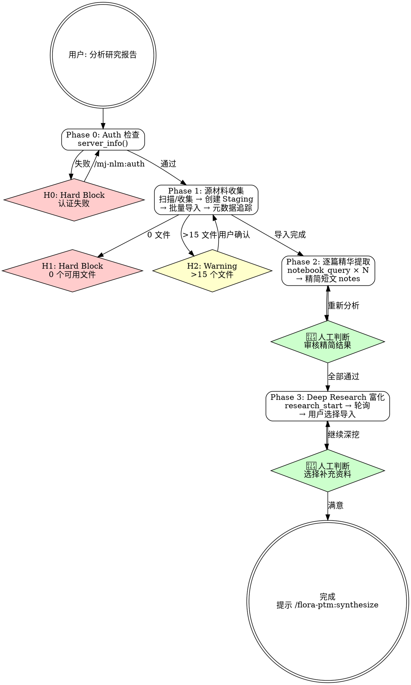

# flora-ptm:digest

## Overview

将多份研究报告（PDF/URL/MD/TXT）批量导入 NotebookLM Staging notebook，逐篇进行结构化精华提取，然后通过 Deep Research 补充最新研究进展。产出一个包含原始材料 + 分析笔记 + 补充资料的 Staging notebook，作为 `/flora-ptm:synthesize` 的输入。

## Prerequisites

- NotebookLM MCP 服务已认证（认证问题参考 `/mj-nlm:auth`）
- 用户准备好研究材料（文件路径、URL 或两者混合）

## Quick Start（交互模式）

| 已知信息 | 行动 |
|---------|------|
| "帮我分析这些论文" + 给了目录 | Phase 1 目录扫描 → Phase 2 |
| "导入这几个 URL" | Phase 1 URL 导入 → Phase 2 |
| "继续上次的分析" | 检查 staging notebook → Phase 2 或 3 |
| 未提供任何材料 | 询问主题 + 材料来源 |

---

## Workflow



---

### Phase 0: Auth 检查

调用 `server_info()` 验证 MCP 连接。

- 成功 → Phase 1
- 失败 → **H0**: 提示用户执行 `nlm login` 或 `/mj-nlm:auth`，终止工作流

---

### Phase 1: 源材料收集

**输入交互**（须明确询问用户）:

1. **研究主题名称** — 用于 notebook 命名和后续 tag
2. **材料来源**，支持：
   - **目录扫描**: 用户给出目录路径 → Glob 扫描 `*.pdf`, `*.md`, `*.txt` 文件
   - **文件列表**: 用户逐个列出文件路径
   - **URL 列表**: 用户提供网页/博客 URL
   - **混合**: 以上组合
3. 展示发现的文件列表，**用户确认后**才开始导入

**H-points**:
- **H1**: 0 个可用文件 → 终止，提示用户检查路径
- **H2**: >15 个文件 → 警告，询问用户：分批处理 / 继续（可能超出 NLM 50-source 限制）
- **H3**: 包含敏感文件（`.env`, `credentials*`, `*secret*`）→ 自动排除并告知

**创建 Staging notebook**:
- `notebook_create(title="FLORA-{topic}-Staging-{YYYYMMDD}")`
- `tag(notebook_id, action="add", tags="flora,staging,{topic}")`

**批量导入 + 元数据追踪**:

逐个 `source_add(wait=True)`:
- PDF → `source_add(source_type="file", file_path=...)`
- URL → `source_add(source_type="url", url=...)`
- MD/TXT → `source_add(source_type="file", file_path=...)`

创建元数据追踪 note: `note(action="create", title="元数据-源材料清单", content=sources_manifest)`
- 内容为 JSON，记录每个 source 的 `{source_id, original_path_or_url, source_type, filename}`
- 此 note 是 synthesize 分库时重新导入的依据（格式详见 `→ ../flora-ptm-shared/naming-reference.md`）

**错误处理**: L1 重试（5s 后）→ L2 降级（file→text）→ L3 跳过并记录（详见 `→ references/digest-workflow-detail.md`）

**Source ID 映射**: 导入完成后 `notebook_get(notebook_id)` 获取所有 source_id，更新元数据 note。

---

### Phase 2: 逐篇精华提取

对每个 source_id 调用 `notebook_query(notebook_id, query=analysis_prompt, source_ids=[source_id])`。

- 默认使用通用分析 prompt（`→ ../flora-ptm-shared/prompt-templates.md` §1）
- 根据文件类型自动推荐变体（`→ ../flora-ptm-shared/analysis-prompts.md`）
- 每篇结果存为 note: `note(notebook_id, action="create", title="精简-{source_name}", content=response)`

**👤 人工判断点**: 展示所有精简短文的摘要表格（标题 + 关键词 + 一句话核心价值），用户可以：
- **全部通过** → Phase 3
- **标记某篇重新分析** → 换 prompt 变体重新查询
- **手动编辑某篇** → 用户口述修改，调用 `note(action="update")` 更新

---

### Phase 3: Deep Research 迭代富化

**主题提取**: `notebook_query(notebook_id, query="基于所有「精简-*」笔记，提取 5-8 个最重要的研究主题关键词，用逗号分隔，不要解释")`

**执行 Deep Research**:
- `research_start(query="{extracted_themes} 最新研究进展", notebook_id=staging_id, source="web", mode="deep")`
- 轮询 `research_status(notebook_id)` 直至完成（间隔 30s，超时 10min）

**👤 人工判断点**: Deep Research 完成后，展示补充资料列表（标题 + 来源 + 相关性），用户选择：
- **选择导入哪些** → `research_import(notebook_id, task_id, source_indices=[user_selected])`
- **全部导入** → `research_import(notebook_id, task_id)`
- **不导入，直接进入下一阶段**

**迭代选项**: 导入后询问用户：
- 继续深挖其他角度 → 用户提供新查询方向，重复 Phase 3
- 满意 → 提示用户调用 `/flora-ptm:synthesize`

---

## H-point 表格

| ID | 类型 | 触发条件 | 行为 |
|----|------|---------|------|
| **H0** | Hard Block | `server_info()` 失败 | 引导 `nlm login` 或 `/mj-nlm:auth`，终止 |
| **H1** | Hard Block | 0 个可用文件 | 终止，提示用户检查路径 |
| **H2** | Warning | >15 个文件 | 警告，用户选择分批/继续 |
| **H3** | Auto | 敏感文件检测 | 自动排除并告知用户 |

---

## Handoff

digest 完成后输出：

```
Digest 完成

Staging notebook: {notebook_name}
导入报告: {count} 篇
精简短文: {count} 篇
Deep Research 补充: {count} 篇（如有）

下一步:
  - 生成跨文献综述和分库 → /flora-ptm:synthesize
  - 继续补充 Deep Research → 重新执行 Phase 3
```

---

## Examples

### 示例 1：目录扫描批量导入

```
用户：帮我分析 D:/papers/llm-safety/ 目录下的论文，主题是"LLM安全"
→ Glob 扫描发现 6 个 PDF + 2 个 MD
→ 展示文件列表，用户确认
→ notebook_create("FLORA-LLM安全-Staging-20260319")
→ source_add × 8，创建元数据 note
→ 逐篇 notebook_query → 8 个精简短文
→ 展示摘要表格，用户全部通过
→ Deep Research: "RLHF,对齐,红队测试,越狱攻击 最新研究进展"
→ 用户选择导入 3 篇补充资料
→ 提示: /flora-ptm:synthesize
```

### 示例 2：混合来源 + 重新分析

```
用户：分析这些资料 [3个URL + 2个PDF路径]
→ 主题: "多模态AI"
→ source_add × 5
→ 逐篇分析，用户发现第 2 篇（博客）分析太浅
→ 用户: "第 2 篇用博客版重新分析"
→ 换用博客/观点文章版 prompt 重新查询
→ 更新精简 note → 用户通过
→ 跳过 Deep Research → 提示 /flora-ptm:synthesize
```

---

## Reference Files

- **`→ references/digest-workflow-detail.md`** — 文件分类规则、错误处理三级策略、元数据 note 格式详情
- **`→ ../flora-ptm-shared/prompt-templates.md`** — 分析 prompt 模板（§1 通用版、§2 主题提取）
- **`→ ../flora-ptm-shared/analysis-prompts.md`** — 按报告类型的 prompt 变体（学术/行业/博客）
- **`→ ../flora-ptm-shared/naming-reference.md`** — 命名规范和元数据格式
