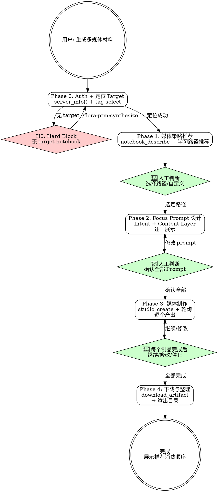

# flora-ptm:produce

## Overview

基于 synthesize 阶段产出的 Target notebooks，推荐学习路径、设计 Focus Prompt、通过 NLM Studio 生成多媒体学习材料（音频/视频/幻灯片/报告/信息图/思维导图/闪卡/测验），并下载整理到本地输出目录。

**前置 skill**: 跨文献综述和分库使用 `/flora-ptm:synthesize`。

## Prerequisites

- 已有 Target notebook（通过 `/flora-ptm:synthesize` 创建，tagged: `flora,target`）
- NLM MCP 服务已认证（认证问题参考 `/mj-nlm:auth`）

## Quick Start（交互模式）

| 已知信息 | 行动 |
|---------|------|
| "生成学习材料" | Phase 0 定位 target → Phase 1 推荐路径 |
| "做个播客" | Phase 0 → Phase 2（audio Focus Prompt） |
| "下载刚才的幻灯片" | 跳到 Phase 4 Download |
| 无 target notebook | 引导执行 `/flora-ptm:synthesize` |

---

## Workflow



---

### Phase 0: Auth 检查 + 定位 Target Notebooks

1. `server_info()` 验证 MCP 连接，失败 → `/mj-nlm:auth`
2. `tag(action="select", query="flora,target")` 查找所有 target notebook
3. 结果处理：
   - **0 个** → **H0**: 提示用户先运行 `/flora-ptm:synthesize`，终止
   - **1+ 个** → 展示列表，**用户确认**对哪些 notebook 生成媒体

读取用户设置（若存在 `.claude/flora-ptm.local.md` → 使用其中的默认偏好）。

---

### Phase 1: 媒体策略推荐

对每个选定的 target notebook 调用 `notebook_describe(notebook_id)` 分析内容。

推荐 4 种预设学习路径（详细参数见 `→ references/learning-paths.md`）：

| 路径 | 制品组合 | 适合场景 |
|------|----------|----------|
| 快速消化 | audio(brief) + mind_map + report(Briefing Doc) | 通勤路上快速了解 |
| 深度学习 | audio(deep_dive) + report(Study Guide) + quiz + flashcards | 系统掌握+自测 |
| 视觉优先 | slide_deck + infographic + video(explainer) | 视觉化理解 |
| 全覆盖 | audio + slides + report + mind_map + infographic | 重要课题全面吸收 |

**👤 人工判断点**: 用户选择预设路径或自定义组合。若有多个 notebook，可为每个分别选择。

---

### Phase 2: Focus Prompt 设计

对每个选定的 artifact_type × 每个 notebook：

1. 从 `notebook_describe()` 提取关键主题词
2. 构建两层 Focus Prompt（模板见 `→ references/focus-prompt-templates.md`）：
   - **Intent Layer**: 基于 artifact_type 的角色+任务模板
   - **Content Layer**: 动态引导 NLM 利用 meta-knowledge sources

**👤 人工判断点（核心交互）**: 逐一展示设计好的 prompt，每个 prompt 用户可以：
- 直接采用
- 修改措辞或侧重点
- 调整 artifact 参数（audio_format, visual_style, slide_format 等）
- 移除此制品
- 追加新制品类型

**明确门控**: 用户说"确认全部 prompt，开始制作"后才进入 Phase 3。

---

### Phase 3: 媒体制作

按 notebook → artifact_type 顺序逐个生产：

```
studio_create(
    notebook_id="{id}",
    artifact_type="{type}",
    focus_prompt="{组合后的 prompt}",
    language="zh",
    confirm=True,
    ...sub_params
)
```

轮询 `studio_status(notebook_id)` 直至完成（间隔 15s）。

**👤 人工判断点（每个制品完成后）**:
- 展示制品状态（成功/失败）
- 用户可选：继续下一个 / 修改 prompt 重新生成 / 停止制作

**失败处理**: 重试 1 次 → 换参数重试 → **询问用户**：跳过 / 换类型 / 放弃后续

---

### Phase 4: 下载与整理

`download_artifact()` 下载所有成功产物。

**输出目录**（可在 settings 中自定义，命名见 `→ ../flora-ptm-shared/naming-reference.md`）：

```
{output_directory}/{topic}-{YYYYMMDD}/
├── audio/          # MP3/MP4
├── slides/         # PDF/PPTX
├── reports/        # Markdown
├── visual/         # PNG (infographic, mind_map)
└── study/          # JSON/MD (flashcards, quiz)
```

**生成完成报告**: 列出所有产物路径 + 推荐消费顺序。

---

## H-point 表格

| ID | 类型 | 触发条件 | 行为 |
|----|------|---------|------|
| **H0** | Hard Block | Auth 失败或无 target notebook | 引导 `/mj-nlm:auth` 或 `/flora-ptm:synthesize` |
| **H1** | Warning | `studio_create` 失败 | 重试 → 换参数 → 询问用户 |
| **H2** | Warning | 下载失败 | 提示用户检查网络或手动下载 |

---

## Handoff

produce 完成后输出：

```
Produce 完成

产物目录: {output_directory}/{topic}-{YYYYMMDD}/
  - audio/: {count} 个文件
  - slides/: {count} 个文件
  - reports/: {count} 个文件
  - visual/: {count} 个文件
  - study/: {count} 个文件

推荐消费顺序：
1. 先听 audio/ 中的音频（通勤消化）
2. 看 visual/ 中的思维导图（建立知识结构）
3. 读 reports/ 中的报告（系统深入）
4. 用 study/ 中的闪卡/测验自测巩固
```

---

## Examples

### 示例 1：快速消化路径

```
用户：把之前的分析做成学习材料，我想通勤时听
→ tag select 找到 FLORA-LLM安全-对齐技术-20260319
→ 推荐"快速消化"路径: audio(brief) + mind_map + report(Briefing Doc)
→ 用户确认
→ 设计 3 个 Focus Prompt → 用户确认
→ studio_create × 3 → download × 3
→ 输出到 flora-output/LLM安全-20260319/
```

### 示例 2：自定义组合

```
用户：只要音频和幻灯片，音频要长版的
→ 自定义组合: audio(deep_dive, long) + slide_deck(detailed_deck)
→ 设计 2 个 Focus Prompt → 用户修改音频 prompt 侧重点
→ studio_create × 2 → download × 2
```

---

## Reference Files

- **`→ references/learning-paths.md`** — 4 种学习路径的详细参数表（artifact_type + sub-params）
- **`→ references/focus-prompt-templates.md`** — Intent/Content Layer 完整模板 + 组合示例
- **`→ ../flora-ptm-shared/naming-reference.md`** — 输出目录命名规范
