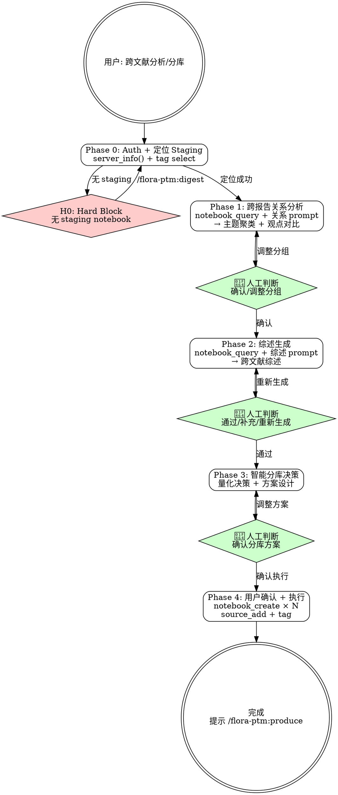

# flora-ptm:synthesize

## Overview

基于 digest 阶段产出的 Staging notebook，执行跨报告关系分析、生成综合文献综述，然后按主题智能分库到 1-3 个 Target notebooks。每个 Target notebook 包含对应主题的原始报告、精简短文、综述和关系分析作为 meta-knowledge，为后续媒体制作提供结构化输入。

**前置 skill**: 导入分析使用 `/flora-ptm:digest`。

## Prerequisites

- 已有 Staging notebook（通过 `/flora-ptm:digest` 创建，tagged: `flora,staging`）
- NLM MCP 服务已认证（认证问题参考 `/mj-nlm:auth`）

## Quick Start（交互模式）

| 已知信息 | 行动 |
|---------|------|
| "帮我生成综述" | Phase 0 定位 staging → Phase 1 |
| "这些报告有什么关系" | Phase 0 → Phase 1 关系分析 |
| "按主题分库" | Phase 0 → Phase 1 → Phase 3 分库 |
| 无 staging notebook | 引导执行 `/flora-ptm:digest` |

---

## Workflow



---

### Phase 0: Auth 检查 + 定位 Staging Notebook

1. `server_info()` 验证 MCP 连接，失败 → `/mj-nlm:auth`
2. `tag(action="select", query="flora,staging")` 查找所有 staging notebook
3. 结果处理：
   - **0 个** → **H0**: 提示用户先运行 `/flora-ptm:digest`，终止
   - **1 个** → 展示名称，**用户确认**是否使用
   - **多个** → 展示列表，**用户选择**目标 notebook

---

### Phase 1: 跨报告关系分析

调用 `notebook_query()` + 关系分析 prompt（`→ ../flora-ptm-shared/prompt-templates.md` §3）。

输出包含：主题聚类（带强制格式: 组名+报告列表）、观点对比、方法论对比、信息缺口。

存为 note: `note(notebook_id, action="create", title="关系分析-{topic}", content=response)`

**👤 人工判断点**: 展示聚类结果，用户可以：
- **确认分组** → Phase 2
- **调整分组** → 指定哪些报告归入哪组，重新生成
- **增加/减少组数** → 调整 prompt 约束后重新查询

---

### Phase 2: 综述生成

调用 `notebook_query()` + 综述 prompt（`→ ../flora-ptm-shared/prompt-templates.md` §4）。

输出包含：领域全景概述、研究流派分类、共识与争议、发展趋势、综合结论。

存为 note: `note(notebook_id, action="create", title="综述-{topic}", content=response)`

**👤 人工判断点**: 展示综述内容，用户选择：
- **通过** → Phase 3
- **要求补充** → 用户指出遗漏部分，追加查询后更新 note
- **重新生成** → 换 prompt 角度（如侧重趋势 vs 侧重争议）

---

### Phase 3: 智能分库决策

**量化决策标准**（基于 Phase 1 聚类结果）:

取聚类结果中的实际组数 N：
- N = 1 → 1 个 notebook
- N = 2 → 2 个 notebook
- N ≥ 3 → 3 个 notebook（合并最相似的组至 3 组以内）

**Source 数量校验**（**H1**）: 每个目标 notebook 的 source 总数（原始 + meta-knowledge）不得超过 45（留 5 余量给 NLM 50 限制）。超出 → 自动拆分或提示用户精简。

详细分库逻辑见 `→ references/partition-logic.md`。

**读取元数据**: 获取 `元数据-源材料清单` note 中的原始路径/URL 信息。

**每个目标 notebook 包含**:
- 对应主题的原始 source（通过 file_path/url 重新导入）
- 精简短文（转为 text source: `00a-精简-{name}`）
- 综述（转为 text source: `00b-综述-{topic}`）
- 关系分析（转为 text source: `00c-关系-{topic}`）
- 导航笔记（内容索引 + 推荐阅读顺序 + source 来源映射）

---

### Phase 4: 用户确认 + 执行

**👤 人工判断点（关键门控）**: 展示完整分库方案，格式如下：

```
建议创建 2 个 notebook:

Notebook 1: FLORA-{topic}-{subtopic_a}-{date}
   原始报告 (5): report_1, report_3, ...
   Meta-knowledge (3): 精简短文×5, 综述, 关系分析
   Source 总数: 13/45

Notebook 2: FLORA-{topic}-{subtopic_b}-{date}
   原始报告 (4): report_2, report_4, ...
   Meta-knowledge (3): 精简短文×4, 综述, 关系分析
   Source 总数: 11/45
```

用户必须明确确认后才执行。可以调整分组。

**执行流程**:
1. `notebook_create()` × N
2. 从元数据 note 读取原始 file_path/url，逐个 `source_add()` 重新导入
3. 精简短文 + 综述 + 关系分析 → `source_add(source_type="text")` 作为 meta-knowledge
4. `note(action="create")` 创建导航笔记（模板见 `→ ../flora-ptm-shared/prompt-templates.md` §5）
5. `tag(action="add")` 打标签: `flora,target,{topic},{subtopic}`

---

## H-point 表格

| ID | 类型 | 触发条件 | 行为 |
|----|------|---------|------|
| **H0** | Hard Block | Auth 失败或无 staging notebook | 引导 `/mj-nlm:auth` 或 `/flora-ptm:digest` |
| **H1** | Warning | 某个目标 notebook source 超 45 | 自动拆分或提示精简 |

---

## Handoff

synthesize 完成后输出：

```
Synthesize 完成

Target notebooks:
  1. {notebook_1_name} — {subtopic_a}（{count} sources）
  2. {notebook_2_name} — {subtopic_b}（{count} sources）

Staging notebook 已保留（可用 /mj-nlm:manage 清理）

下一步:
  - 生成多媒体学习材料 → /flora-ptm:produce
  - 管理 notebook → /mj-nlm:manage
```

---

## Examples

### 示例 1：单主题综述 + 单一 notebook

```
用户：帮我生成这些论文的综述
→ tag select 找到 FLORA-LLM安全-Staging-20260319
→ 用户确认使用
→ 关系分析: 聚类为 1 组（所有报告围绕 LLM 安全）
→ 用户确认单一分组
→ 生成综述 → 用户通过
→ 分库方案: 1 个 notebook，FLORA-LLM安全-综合-20260319
→ 用户确认 → 执行创建 + source 导入 + tag
```

### 示例 2：多主题分库

```
用户：按主题分组这些报告
→ tag select 找到 staging notebook
→ 关系分析: 聚类为 3 组（对齐技术/攻击方法/评估基准）
→ 用户: "对齐技术和评估基准合并吧"
→ 重新生成: 2 组（对齐与评估/攻击方法）
→ 综述生成 → 用户通过
→ 分库方案: 2 个 notebook（各 source 数量 < 45）
→ 用户确认 → 执行
```

---

## Reference Files

- **`→ references/partition-logic.md`** — 分库逻辑详情（source 计算、合并策略、边界情况）
- **`→ ../flora-ptm-shared/prompt-templates.md`** — 关系分析 prompt（§3）、综述 prompt（§4）、导航模板（§5）
- **`→ ../flora-ptm-shared/naming-reference.md`** — Notebook/Source/Note/Tag 命名规范
