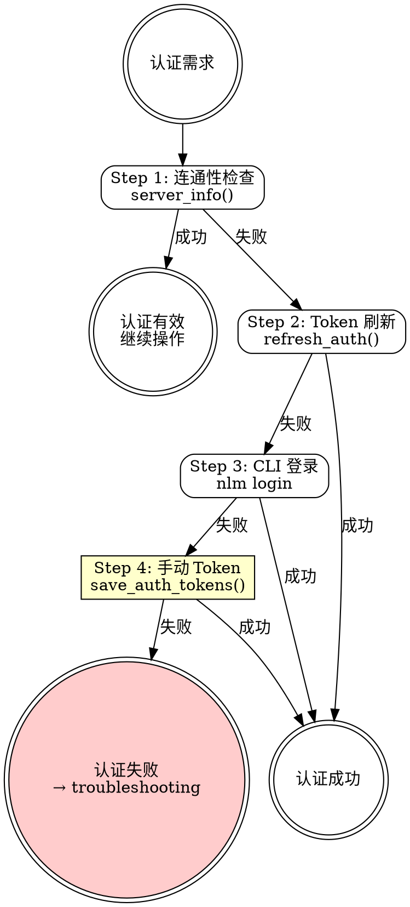

# mj-nlm:auth

## Overview

NotebookLM MCP 服务的认证生命周期管理。覆盖首次登录、token 刷新、账号切换和故障排查。所有 NLM 技能的前置认证保障。

**依赖者**：`/mj-nlm:build`、`/mj-nlm:studio`、`/mj-nlm:query`、`/mj-nlm:manage` 的 Phase 0 认证检查均引用此技能。

## Prerequisites

- NotebookLM MCP 服务已在 Claude Code 中配置
- Google 账号可用

## Quick Start（交互模式）

| 已知信息 | 行动 |
|---------|------|
| "NLM 连不上" | 三级认证路径 |
| "切换 Google 账号" | `nlm login switch {profile}` |
| "token 过期了" | `refresh_auth()` → 失败则 `nlm login` |
| 首次使用 NLM | 完整首次登录流程 |

---

## Workflow



---

## 三级认证路径

认证按优先级逐级降级，每级失败后尝试下一级。

### Level 1: Token 刷新（最快）

```
refresh_auth()
```

适用：token 过期但 session 仍有效。通常几秒内完成。

### Level 2: CLI 登录（推荐）

```bash
nlm login
```

通过 Bash 工具执行。会打开浏览器进行 Google OAuth 登录。

**Windows 注意**：需设置 `PYTHONIOENCODING=utf-8`：
```bash
PYTHONIOENCODING=utf-8 nlm login
```

### Level 3: 手动 Token（备选）

```
save_auth_tokens(cookies="{浏览器 Cookie 字符串}")
```

当 CLI 登录无法使用时的最后手段。需要用户从浏览器开发者工具手动复制 Cookie。

**获取 Cookie 步骤**：
1. 浏览器打开 `notebooklm.google.com` 并登录
2. F12 → Application → Cookies → `notebooklm.google.com`
3. 复制所有 cookie 值

详见 `→ auth-troubleshooting.md`。

---

## 账号切换

```bash
nlm login switch {profile}
```

MCP 服务立即使用新的活动 profile。无需重启 MCP 服务。

**查看可用 profile**：
```bash
nlm login list
```

---

## 连通性验证

```
server_info()
```

返回 MCP 服务状态。用于其他技能的 Phase 0 认证检查。

**判断逻辑**：
- 返回正常 → 认证有效
- 返回错误 → 进入三级认证路径

---

## H-point 表格

| ID | 类型 | 触发条件 | 行为 |
|----|------|---------|------|
| **H1** | Hard Block | 三级认证路径全部失败 | 引导到 `auth-troubleshooting.md` 排查 |

---

## Examples

### 示例 1：首次登录

```
用户：我第一次用 NLM，怎么登录？
→ 检查 server_info() → 失败
→ 执行 nlm login → 浏览器 OAuth
→ 验证 server_info() → 成功
```

### 示例 2：Token 过期

```
用户：NLM 说认证过期了
→ refresh_auth() → 若成功则完成
→ 失败 → nlm login
```

### 示例 3：切换账号

```
用户：我要换一个 Google 账号
→ nlm login switch {profile}
→ 验证 server_info()
```

---

## Reference Files

- **`→ auth-troubleshooting.md`** — 认证错误对照 + 降级路径 + Cookie 获取详细步骤
