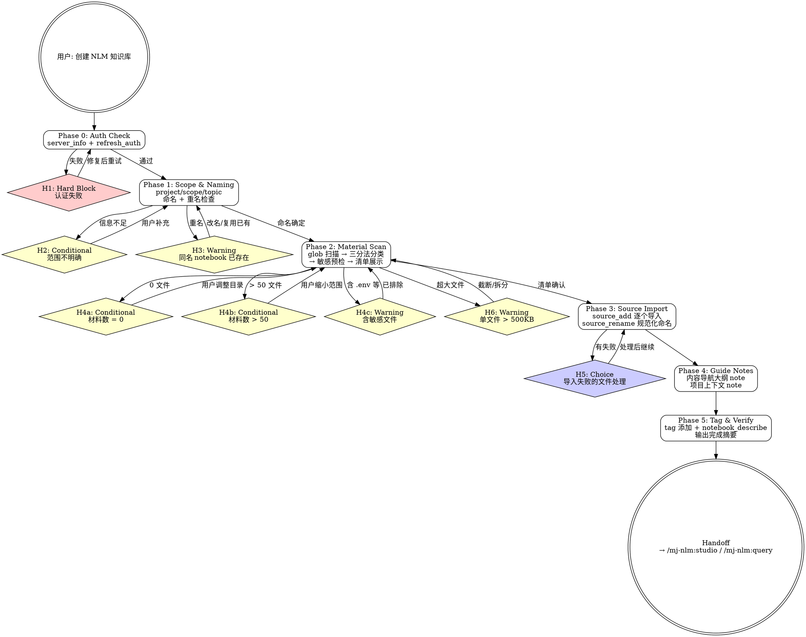

# mj-nlm:build

## Overview

创建 NotebookLM 知识库的一站式技能：创建 notebook → 扫描项目材料 → 导入 source → 创建引导 note → 打标签。将 MJ System 项目知识自动转化为 NLM 知识库，为后续 Studio 制品生成和知识问答提供基础。

**互补 skill**：制品生成使用 `/mj-nlm:studio`，知识问答使用 `/mj-nlm:query`，生命周期管理使用 `/mj-nlm:manage`。

## Prerequisites

- NotebookLM MCP 服务已配置（`mcp__notebooklm-mcp__*` 工具可用）
- Google 账号已登录（认证在 Phase 0 检查，失败时引导修复）

## Quick Start（交互模式）

用户触发此技能时，先判断已有信息是否充足，再决定从哪个 Phase 开始。

| 已知信息 | 行动 |
|---------|------|
| "创建知识库"但未说明范围 | Phase 0 → H2 追问 |
| 指定了具体服务（如"DQV"） | 推断 scope=mod，Phase 0 |
| 已有 notebook，需追加 source | Phase 0 → 跳 Phase 1 → Phase 2 |
| "重建知识库" | 确认删旧 notebook → Phase 1 |

---

## Workflow



---

### Phase 0: Auth Check

**验证 NLM MCP 连通性。** 认证失败会阻断后续所有操作，必须在最前面确认。

1. 调用 `server_info()` 检查 MCP 服务状态
2. 若失败 → 调用 `refresh_auth()` 刷新 token
3. 仍失败 → **H1** 阻断

---

### Phase 1: Scope & Naming

**确定知识库范围并创建 notebook。** 范围决定材料扫描目录，命名决定后续可检索性。

**收集信息**（用户已提供则跳过）：

| 参数 | 说明 | 可选值 |
|------|------|--------|
| `project` | 项目域 | `system`（MJ System 主项目）/ `agent`（AgentLab）/ `intel`（情报系统）/ `multi`（跨项目） |
| `scope` | 范围类型 | `mod`（单模块）/ `pipe`（管道链路）/ `layer`（数据层）/ `cross`（全局/跨域） |
| `topic` | 主题名 | 如 `DQV`、`collection-pipeline`、`ops-etl` |
| `purpose` | 用途（可选） | 如 `培训`、`架构评审`、`知识沉淀` |

信息不足 → 触发 **H2**（AskUserQuestion 收集范围信息）。

**Notebook 命名**：`MJ-{project}-{scope}-{topic}-{YYYYMMDD}`

**示例**：`MJ-system-mod-DQV-20260315`

**重名检查**：`notebook_list()` 查重 → 重名触发 **H3**（复用已有 / 改名 / 删除重建）

**创建**：`notebook_create(title="{命名}")` → 获取 `notebook_id`

**Scope → 默认扫描范围映射**（概述，详见 `→ ../mj-nlm-shared/naming-reference.md`）：

| scope | 扫描目录 |
|-------|---------|
| mod | `src/{NodeType}/{Service}/` + `docs/design/{Service}/` + `.claude/skills/mj-{相关skill}/` |
| pipe | `src/` 涉及模块 + `sql/` 相关 + `docs/design/` 多服务 + `.claude/skills/mj-{相关skill}/` |
| layer | `sql/{层号}-{域}/` + `docs/infrastructure/database/` + `.claude/skills/mj-etl-*/` |
| cross | `docs/` + `CLAUDE.md` + `components/` + `.claude/skills/` (全量) + 用户指定 |

> scope 边界模糊时（如"DQV 的数据库部分"），优先按主要目的选择（关注 DQV 服务代码 → mod，关注 DQV 数据层 → layer），并在材料清单确认时让用户调整。

---

### Phase 2: Material Scan

**扫描目录并分类材料。** 三分法确保每种文件类型都有明确的处理路径，敏感预检防止凭据泄漏。

1. 根据 Phase 1 确定的 scope，使用 glob 扫描目标目录
2. 按三分法分类（概述，详见 `→ ../mj-nlm-shared/material-classification.md`）：

| 类别 | 扩展名 | 处理方式 |
|------|--------|---------|
| 直传 | `.md`, `.txt`, `.pdf` | `source_add(source_type="file", file_path=...)` |
| 需转换 | `.py`, `.sql`, `.yaml`, `.json`, `.toml`, `.sh` | Read → 敏感过滤 → `source_add(source_type="text", text=...)` |
| 不导入 | `.pyc`, `.log`, `.env`, `.git/*`, `__pycache__/*` | 跳过 |

3. 敏感预检：扫描结果中的 `.env`、`credentials*`、`*secret*` 文件 → 自动排除并告知
4. 大文件检查：text 类文件 > 500KB → 触发 **H6**（截断前 N 行 / 拆分为多个 source / 跳过）
5. 展示材料清单：按类别分组，显示文件名、大小、处理方式
6. 异常处理：
   - 0 文件 → **H4a**（确认目录是否正确）
   - 超过 50 文件 → **H4b**（建议缩小范围或分批导入）
   - 含敏感文件 → **H4c**（已自动排除，告知用户）
7. 用户确认清单后进入 Phase 3

---

### Phase 3: Source Import

**逐个导入材料到 notebook。** 使用 `wait=True` 参数让工具内置等待，无需手动 sleep。

**导入流程**（逐文件）：

1. **直传文件**：`source_add(notebook_id, source_type="file", file_path="{绝对路径}", wait=True)`
2. **需转换文件**：
   - Read 文件内容
   - 敏感过滤：行级正则 `password|secret|token|api_key` → `[REDACTED]`
   - 添加文件头元数据：

     ```
     === 文件信息 ===
     路径: {相对路径}
     类型: {Python 代码 / SQL 脚本 / YAML 配置 / ...}
     说明: {基于路径推断的简要描述}
     ================

     {过滤后的文件内容}
     ```

   - `source_add(notebook_id, source_type="text", text="{带元数据的内容}", title="{Source 名称}", wait=True)`

3. **Source 命名规范**：`[序号]-[类别标签]-[描述]`（概述，详见 `→ ../mj-nlm-shared/naming-reference.md`）
   - 类别标签：`架构` / `代码` / `数据库` / `配置` / `规范` / `测试` / `接口`
   - 示例：`01-架构-DQV技术规范`、`05-代码-validation_service`、`08-数据库-dqv_etl_functions`
4. 导入后调用 `source_rename(notebook_id, source_id, new_title="{规范名称}")` 规范化命名

**三级降级错误处理**：

| 级别 | 触发条件 | 行为 |
|------|---------|------|
| L1 重试 | `source_add` 返回瞬时错误（超时、网络抖动） | 等待 5 秒后重试 1 次 |
| L2 降级 | file 模式重试仍失败 | Read 文件内容 → 改用 `source_type="text"` 重新导入 |
| L3 跳过 | text 模式也失败 | 记录到失败列表，继续下一个文件 |

所有文件处理完毕后，若有失败文件 → **H5**（展示失败列表，选择：重试 / 忽略 / 手动替代方案）

---

### Phase 4: Guide Notes

**创建导航和上下文 note。** Note 为人类提供导航地图，为 AI（NLM 问答）提供上下文锚点。

创建 2 个标准 note（通过 `note(notebook_id, action="create", content=..., title=...)`）：

**Note 1 — 内容导航大纲**：

```markdown
# {notebook 名称} — 内容导航

## 材料清单

| 序号 | Source 名称 | 类型 | 内容概述 |
|------|-----------|------|---------|
| 1 | {source_name} | {架构/代码/...} | {一句话描述} |
| ... | ... | ... | ... |

## 推荐阅读顺序

1. 先阅读架构/规范类文档，建立全局理解
2. 再阅读核心代码，理解实现细节
3. 最后阅读配置/数据库，了解运行环境

## 知识域覆盖

- 架构设计: {N} 份
- 代码实现: {N} 份
- 数据库: {N} 份
- 配置/规范: {N} 份
```

**Note 2 — 项目上下文**：

```markdown
# MJ System 项目上下文

## 项目概述

MJ System（明鉴系统）是企业级数据处理与分析平台，聚焦自动化数据采集、质量管理、指标计算和智能分发。

## 本 Notebook 范围

- **项目域**: {project}
- **范围**: {scope}
- **主题**: {topic}
- **目的**: {purpose}
- **涉及服务**: {服务列表}
- **技术栈**: Python 3.13+, FastAPI, PostgreSQL, Pandas, SQLAlchemy

## 架构背景

- DDD 分层架构（Components → Application → Presentation）
- 数据仓库四层模型（ODS → DWD → DWS → ADS）
- 双域设计（ops 运维追踪域 + biz 业务指标域）
```

#### Note 转 Source（元知识提升）

将刚创建的 2 个 Note 内容同时作为 text Source 导入，使 NLM Studio 在生成制品时能检索到导航结构和项目上下文。

**操作步骤**（在 2 个 note 创建完成后执行）：

1. Note 1 → Source：
   ```
   source_add(
     notebook_id, source_type="text",
     text="{Note 1 完整内容}",
     title="00a-导航-内容导航大纲",
     wait=True
   )
   ```

2. Note 2 → Source：
   ```
   source_add(
     notebook_id, source_type="text",
     text="{Note 2 完整内容}",
     title="00b-导航-项目上下文",
     wait=True
   )
   ```

**命名规则**：
- 序号 `00` 表示元知识（排在内容 Source 01+ 之前）
- 子序号 `a/b` 区分多个导航 Source
- 类型标识 `导航` 区别于内容类型（规范/架构/代码等）

**Note 保留**：原始 Note 保留不删除（Note 为人类导航，Source 为 AI 检索）

---

### Phase 5: Tag & Verify

**打标签并验证知识库完整性。** 标签提升可检索性，验证确保导入无遗漏。

1. **添加标签**：`tag(notebook_id, action="add", tags="{标签列表}")`

   标签体系（详见 `→ ../mj-nlm-shared/naming-reference.md`）：

   | 类型 | 格式 | 示例 | 必选 |
   |------|------|------|------|
   | 必选 | `mj-system` | `mj-system` | 是 |
   | 必选 | `{project}` | `system` | 是 |
   | 必选 | `{scope}` | `mod` | 是 |
   | 推荐 | `{topic}` | `dqv` | 推荐 |
   | 推荐 | `{service}` | `data-quality-validator` | 推荐 |
   | 可选 | `{purpose}` | `培训` / `架构评审` | 可选 |

2. **验证（信息展示，非门控）**：
   - `notebook_describe(notebook_id)` → 展示 AI 生成的摘要，确认覆盖目标主题
   - `notebook_get(notebook_id)` → 确认 source 数量与预期一致（内容 source 数 + 2 个元知识 source）
   - 若 source 数量不一致，展示差异但不阻断（Phase 3 已处理失败文件）

3. 输出完成摘要 → 进入 Handoff

---

## H-point 表格

| ID | 类型 | 触发条件 | 行为 |
|----|------|---------|------|
| **H1** | Hard Block | `server_info()` + `refresh_auth()` 均失败 | 阻断。指引 `nlm login` CLI 重新认证；备选 `save_auth_tokens()` 手动 Cookie。详见 `/mj-nlm:auth` |
| **H2** | Conditional | project / scope / topic 信息不足 | AskUserQuestion 收集范围信息，提供 scope 选项和示例 |
| **H3** | Warning | `notebook_list()` 返回同名 notebook | 展示已有 notebook 信息，选择：复用已有 / 改名 / 删除重建 |
| **H4a** | Conditional | 材料扫描结果为 0 个文件 | 提示确认目录是否正确，展示 scope 对应的默认扫描目录 |
| **H4b** | Conditional | 材料数超过 50 个文件 | 建议缩小 scope 范围或分批创建多个 notebook |
| **H4c** | Warning | 扫描结果中含 `.env`、`credentials*` 等敏感文件 | 告知已自动排除，展示被排除的文件列表 |
| **H5** | Choice | 三级降级后仍有导入失败的文件 | 展示失败列表（文件名 + 失败原因），选择：重试 / 忽略 / 手动提供替代内容 |
| **H6** | Warning | 单个 text 类文件 > 500KB | 提示文件过大，选择：截断前 N 行 / 拆分为多个 source / 跳过 |

---

## Handoff

构建完成后输出：

```
知识库构建完成

Notebook:
  名称: MJ-{project}-{scope}-{topic}-{YYYYMMDD}
  ID:   {notebook_id}
  Source 数: {count} / {total}（成功/总计）
  Tag:  {tag_list}
  摘要: {notebook_describe 摘要前 2 行}

下一步:
  - 生成制品 → /mj-nlm:studio
  - 知识问答 → /mj-nlm:query
  - 管理维护 → /mj-nlm:manage
```

---

## Examples

### 示例 1：单模块知识库（scope=mod）

```
用户：把 DQV 的代码和文档导入 NLM
→ 推断 project=system, scope=mod, topic=DQV
→ 扫描：src/CollectionNodes/DataQualityValidator/ + docs/design/DataQualityValidator/ + .claude/skills/mj-doc-*/（如有 DQV 相关）
→ 命名：MJ-system-mod-DQV-20260315
→ 材料约 15-20 个文件
→ 完成后展示 Handoff
```

### 示例 2：跨管道知识库（scope=pipe）

```
用户：帮我建一个数据收集到验证全链路的知识库
→ 推断 project=system, scope=pipe, topic=collection-pipeline
→ 扫描：src/CollectionNodes/AutoEmailCollector/ + src/CollectionNodes/DataQualityValidator/ + sql/ 相关 + docs/design/ 多服务
→ 命名：MJ-system-pipe-collection-pipeline-20260315
→ 材料可能较多，注意 H4b
→ 完成后展示 Handoff
```

### 示例 3：已有 notebook 追加 source

```
用户：已有 notebook，帮我再导入 ETL 相关的 SQL
→ Phase 0 认证检查（不可跳过）
→ 用户提供 notebook_id 或从 notebook_list() 选择
→ 跳过 Phase 1（已有 notebook），直接进入 Phase 2，扫描 sql/10-ops/ + sql/20-biz/ 中的 ETL 相关文件
→ Phase 3 导入，Phase 4 跳过（已有 note），Phase 5 更新 tag
```

---

## Reference Files

- **`→ ../mj-nlm-shared/naming-reference.md`** — Notebook/Source/Tag 命名规范 + Scope 扫描映射详表（Phase 1, 3, 5 参考）
- **`→ ../mj-nlm-shared/material-classification.md`** — 三分法分类规则 + 敏感过滤正则 + 文件大小限制（Phase 2 参考）
