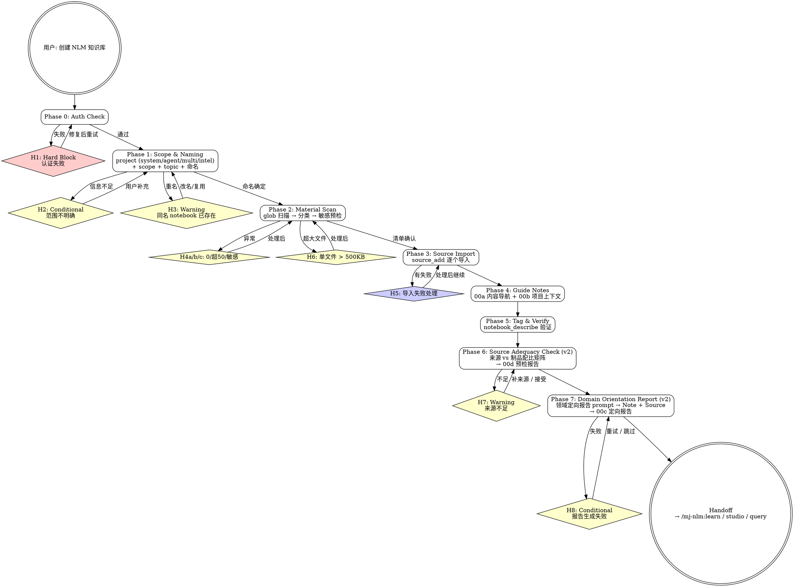

# mj-nlm:build

## Overview

创建 NotebookLM 知识库的一站式技能：创建 notebook → 扫描项目材料 → 导入 source → 创建导航 note → 来源充足性预检 → 生成领域定向报告 → 打标签。

v2 升级要点（相比 v1）：
- **Phase 6 新增「来源充足性预检」**：评估已有 source 量与可生成的制品长度匹配度，输出 `00d-预检-来源充足性报告`
- **Phase 7 新增「领域定向报告」**：基于来源生成学习地图（含术语翻译、概念图、成功失败案例、学习路线），输出 `00c-定向-{topic}领域定向报告`，作为后续 studio 制品的锚
- **双项目支持**：`project=agent`（MJ-AgentLab）与 `project=system` 并列，各自独立 scope→扫描路径映射

**互补 skill**：制品生成使用 `/mj-nlm:studio`；知识问答 / 错题反馈 / 来源核查 / 理解度自检使用 `/mj-nlm:query`；学习闭环编排使用 `/mj-nlm:learn`；生命周期管理使用 `/mj-nlm:manage`。

## Prerequisites

- NotebookLM MCP 服务已配置（`mcp__notebooklm-mcp__*` 工具可用）
- Google 账号已登录（认证在 Phase 0 检查，失败时引导修复）

## Quick Start（交互模式）

用户触发此技能时，先判断已有信息是否充足，再决定从哪个 Phase 开始。

| 已知信息 | 行动 |
|---|---|
| "创建知识库"但未说明范围 | Phase 0 → H2 追问 |
| 指定了具体服务（如"DQV"或"EmailAgent"） | 推断 project + scope，Phase 0 |
| 指定了 mj-agent 项目 | project=agent，参考 naming-reference.md 选 scope |
| 已有 notebook，需追加 source | Phase 0 → 跳 Phase 1 → Phase 2 |
| 已有 notebook，需补领域定向报告 | Phase 0 → 跳到 Phase 7 |
| "重建知识库" | 确认删旧 notebook → Phase 1 |

---

## Workflow


```dot
digraph nlm_build {
    rankdir=TB;
    node [shape=box, style=rounded];

    start [label="用户: 创建 NLM 知识库", shape=doublecircle];

    P0 [label="Phase 0: Auth Check"];
    H1 [label="H1: Hard Block\n认证失败", shape=diamond, style=filled, fillcolor="#ffcccc"];

    P1 [label="Phase 1: Scope & Naming\nproject (system/agent/multi/intel)\n+ scope + topic + 命名"];
    H2 [label="H2: Conditional\n范围不明确", shape=diamond, style=filled, fillcolor="#ffffcc"];
    H3 [label="H3: Warning\n同名 notebook 已存在", shape=diamond, style=filled, fillcolor="#ffffcc"];

    P2 [label="Phase 2: Material Scan\nglob 扫描 → 分类 → 敏感预检"];
    H4abc [label="H4a/b/c: 0/超50/敏感", shape=diamond, style=filled, fillcolor="#ffffcc"];
    H6 [label="H6: 单文件 > 500KB", shape=diamond, style=filled, fillcolor="#ffffcc"];

    P3 [label="Phase 3: Source Import\nsource_add 逐个导入"];
    H5 [label="H5: 导入失败处理", shape=diamond, style=filled, fillcolor="#ccccff"];

    P4 [label="Phase 4: Guide Notes\n00a 内容导航 + 00b 项目上下文"];

    P5 [label="Phase 5: Tag & Verify\nnotebook_describe 验证"];

    P6 [label="Phase 6: Source Adequacy Check (v2)\n来源 vs 制品配比矩阵\n→ 00d 预检报告"];
    H7 [label="H7: Warning\n来源不足", shape=diamond, style=filled, fillcolor="#ffffcc"];

    P7 [label="Phase 7: Domain Orientation Report (v2)\n领域定向报告 prompt → Note + Source\n→ 00c 定向报告"];
    H8 [label="H8: Conditional\n报告生成失败", shape=diamond, style=filled, fillcolor="#ffffcc"];

    DONE [label="Handoff\n→ /mj-nlm:learn / studio / query", shape=doublecircle];

    start -> P0;
    P0 -> H1 [label="失败"];
    H1 -> P0 [label="修复后重试"];
    P0 -> P1 [label="通过"];

    P1 -> H2 [label="信息不足"];
    H2 -> P1 [label="用户补充"];
    P1 -> H3 [label="重名"];
    H3 -> P1 [label="改名/复用"];
    P1 -> P2 [label="命名确定"];

    P2 -> H4abc [label="异常"];
    P2 -> H6 [label="超大文件"];
    H4abc -> P2 [label="处理后"];
    H6 -> P2 [label="处理后"];
    P2 -> P3 [label="清单确认"];

    P3 -> H5 [label="有失败"];
    H5 -> P3 [label="处理后继续"];
    P3 -> P4;
    P4 -> P5;
    P5 -> P6;
    P6 -> H7 [label="不足"];
    H7 -> P6 [label="补来源 / 接受"];
    P6 -> P7;
    P7 -> H8 [label="失败"];
    H8 -> P7 [label="重试 / 跳过"];
    P7 -> DONE;
}
```

---

### Phase 0: Auth Check

**验证 NLM MCP 连通性。** 认证失败会阻断后续所有操作，必须在最前面确认。

1. 调用 `server_info()` 检查 MCP 服务状态
2. 若失败 → 调用 `refresh_auth()` 刷新 token
3. 仍失败 → **H1** 阻断

---

### Phase 1: Scope & Naming

**确定知识库范围并创建 notebook。** 范围决定材料扫描目录，命名决定后续可检索性。

**收集信息**（用户已提供则跳过）：

| 参数 | 说明 | 可选值 |
|---|---|---|
| `project` | 项目域 | `system` / `agent` / `multi` / `intel` |
| `scope` | 范围类型 | 按 project 取对应集合（详见 `→ ../mj-nlm-shared/naming-reference.md`） |
| `topic` | 主题名 | kebab-case，如 `DQV`、`collection-pipeline`、`EmailAgent`、`langgraph-orchestration` |
| `purpose` | 用途（可选） | 如 `培训`、`架构评审`、`知识沉淀`、`学习`（v2） |

信息不足 → 触发 **H2**（AskUserQuestion 收集范围信息）。

**Notebook 命名**：`MJ-{project}-{scope}-{topic}-{YYYYMMDD}`

**示例**：
- `MJ-system-mod-DQV-20260505`
- `MJ-agent-agent-EmailAgent-20260505`
- `MJ-multi-cross-architecture-20260505`

**重名检查**：`notebook_list()` 查重 → 重名触发 **H3**（复用已有 / 改名 / 删除重建）

**创建**：`notebook_create(title="{命名}")` → 获取 `notebook_id`

**Scope → 默认扫描范围映射**（按 project 区分，详见 `→ ../mj-nlm-shared/naming-reference.md`）：

| project | scope | 概要 |
|---|---|---|
| `system` | `mod` | `src/{NodeType}/{Service}/` + `docs/design/{Service}/` |
| `system` | `pipe` | `src/` 涉及模块 + `sql/` 相关 + `docs/design/` 多服务 |
| `system` | `layer` | `sql/{层号}-{域}/` + `docs/infrastructure/database/` |
| `system` | `cross` | `docs/` + `CLAUDE.md` + `components/` + `.claude/skills/` |
| `agent` | `agent` | `agents/{AgentName}/` + `docs/agents/{AgentName}/` (占位符) |
| `agent` | `tool` | `tools/{ToolName}/` + `mcp/{ToolName}/` (占位符) |
| `agent` | `workflow` | `workflows/{WorkflowName}/` 或 `langgraph/{WorkflowName}/` (占位符) |
| `agent` | `cross` | `docs/` + `prompts/shared/` + `agents/_base/` (占位符) |
| `multi` | `cross` | mj-system + mj-agent 双 docs/ + `docs/cross/` |

> mj-agent 路径在 `naming-reference.md` 中明确标注为占位符，待真实目录确认后修正。

> scope 边界模糊时（如"DQV 的数据库部分"），优先按主要目的选择，并在 Phase 2 材料清单确认时让用户调整。

---

### Phase 2: Material Scan

**扫描目录并分类材料。** 三分法 + 多源类型扩展（详见 `→ ../mj-nlm-shared/material-classification.md`），敏感预检防止凭据泄漏。

1. 根据 Phase 1 确定的 project + scope，使用 glob 扫描目标目录
2. 按三分法分类：
   - 直传：`.md`, `.txt`, `.pdf` → `source_add(source_type="file", ...)`
   - 需转换：`.py`, `.sql`, `.yaml`, `.json`, `.toml`, `.sh` → Read → 敏感过滤 → `source_add(source_type="text", ...)`
   - 不导入：`.pyc`, `.log`, `.env`, `.git/*`, `__pycache__/*`
3. **v2 多源支持**：用户可在交互中追加 url / youtube / drive 源（详见 `→ ../mj-nlm-shared/material-classification.md#多源类型分类`）
4. 敏感预检：扫描结果中的 `.env`、`credentials*`、`*secret*` 文件 → 自动排除并告知
5. 大文件检查：text 类文件 > 500KB → 触发 **H6**
6. 展示材料清单：按类别分组，显示文件名、大小、处理方式
7. 异常处理：
   - 0 文件 → **H4a**（确认目录是否正确）
   - 超过 50 文件 → **H4b**（建议缩小范围或分批导入）
   - 含敏感文件 → **H4c**（已自动排除，告知用户）
8. 用户确认清单后进入 Phase 3

---

### Phase 3: Source Import

**逐个导入材料到 notebook。** 使用 `wait=True` 让工具内置等待。

**导入流程**（逐文件）：

1. **直传文件**：`source_add(notebook_id, source_type="file", file_path="{绝对路径}", wait=True)`
2. **需转换文件**：
   - Read 文件内容
   - 敏感过滤：行级正则 `password|secret|token|api_key` → `[REDACTED]`
   - 添加文件头元数据（详见 `→ ../mj-nlm-shared/material-classification.md`）
   - `source_add(notebook_id, source_type="text", text=..., title=..., wait=True)`
3. **多源类型（v2）**：
   - url：`source_add(source_type="url", url="...")`（批量用 `urls="<u1>, <u2>"`）
   - youtube：`source_add(source_type="url", url="https://www.youtube.com/...")`（仅取字幕）
   - drive：`source_add(source_type="drive", document_id="...")`
4. **Source 命名规范**：`[序号]-[类别标签]-[描述]`（v2 扩展：新增 `Agent` / `工具` / `工作流` 类别，详见 `→ ../mj-nlm-shared/naming-reference.md`）
5. 导入后调用 `source_rename(notebook_id, source_id, new_title="{规范名称}")` 规范化命名

**三级降级错误处理**：

| 级别 | 触发条件 | 行为 |
|---|---|---|
| L1 重试 | 瞬时错误（超时、网络抖动） | 等待 5 秒后重试 1 次 |
| L2 降级 | file 模式重试仍失败 | Read 文件内容 → 改用 `source_type="text"` 重新导入 |
| L3 跳过 | text 模式也失败 | 记录到失败列表，继续下一个文件 |

所有文件处理完毕后，若有失败文件 → **H5**（展示失败列表，选择：重试 / 忽略 / 手动替代方案）

---

### Phase 4: Guide Notes

**创建导航和上下文 note。** Note 为人类提供导航地图，为 AI 提供上下文锚点。

创建 2 个标准 note（`note(notebook_id, action="create", content=..., title=...)`）：

**Note 1 — 内容导航大纲**：

```markdown
# {notebook 名称} — 内容导航

## 材料清单
| 序号 | Source 名称 | 类型 | 内容概述 |
| ... |

## 推荐阅读顺序
1. 先读架构 / 规范类，建立全局
2. 再读核心代码，理解实现
3. 最后读配置 / 数据库，了解运行环境

## 知识域覆盖
- 架构设计：{N} 份
- 代码实现：{N} 份
- ...
```

**Note 2 — 项目上下文**（按 project 切换模板）：

- `project=system`：MJ System 项目背景 + DDD 分层 + 数据仓库四层模型 + 双域设计
- `project=agent`：MJ-AgentLab 项目背景 + Agent / LangGraph / MCP 架构（v2 新增）
- `project=multi`：MJ System + MJ-AgentLab 联合上下文 + 跨项目对齐目标

#### Note 转 Source（元知识提升）

将刚创建的 2 个 Note 内容同时作为 text Source 导入：

1. Note 1 → Source `00a-导航-内容导航大纲`
2. Note 2 → Source `00b-导航-项目上下文`

**Note 保留**：原始 Note 不删除（Note 为人类导航，Source 为 AI 检索）。

---

### Phase 5: Tag & Verify

**打标签并验证知识库完整性。** 标签提升可检索性，验证确保导入无遗漏。

1. **添加标签**：`tag(notebook_id, action="add", tags="{标签列表}")`

   v2 标签体系（详见 `→ ../mj-nlm-shared/naming-reference.md`）：
   - 必选：`mj-system`、`{project}`、`{scope}`
   - 推荐：`{topic}`、`{service或agent全名}`
   - 可选：`{purpose}`、`{技术栈}`

2. **验证（信息展示，非门控）**：
   - `notebook_describe(notebook_id)` 展示 AI 摘要
   - `notebook_get(notebook_id)` 确认 source 数量

3. 完成后进入 Phase 6（v1 此处直接 Handoff，v2 继续）

---

### Phase 6: Source Adequacy Check（v2 新增）

**预检来源充足性，输出充足性报告。** 评估"已有 source 量"与"用户可能请求的制品长度"的匹配度，预防方法论 §10.1 风险（来源不足却生成长内容）。

1. 读取 source 总字数（不含元 source）
2. 应用配比矩阵（详见 `→ ../mj-nlm-shared/risk-control-templates.md#1`）：

   | 来源总字数 | 推荐 | 警告 | 禁止 |
   |---|---|---|---|
   | < 5K | flashcards / mind_map / data_table | infographic / quiz / audio_brief | audio_long / video / slide_deck_detailed |
   | 5K – 30K | 上述 + audio_brief / slide_short / Study Guide | audio_long | video_long |
   | 30K – 100K | 全部 | — | — |
   | > 100K | 全部，但建议拆分 notebook | — | — |

3. 高风险关键词扫描（医疗 / 法律 / 财务 / 合同 / 考试 / 安全），匹配则在 notebook tag 中加 `risk-class:high`

4. 生成 `00d-预检-来源充足性报告` Source（模板详见 `→ ../mj-nlm-shared/risk-control-templates.md#5`）

5. 若结果为 underloaded（来源 < 5K 字符或 < 5 个 source）→ **H7**

---

### Phase 7: Domain Orientation Report（v2 新增）

**生成「领域定向报告」，作为后续制品的学习地图锚。** 这是 v2 最重要的产物，方法论 §7 主提示词的工程化落地。

1. 调用 `notebook_query(notebook_id, query=DOMAIN_ORIENTATION_PROMPT)`
   - prompt 详见 `→ ../mj-nlm-shared/learning-loop-templates.md#§1`
   - 报告含 7 节：领域归属 / 原始困惑翻译 / 核心概念地图 / 术语翻译表 / 成功失败案例 / 学习路线 / 推荐 NLM 制品组合

2. 双形态保存：
   - Note：标题 `领域定向报告 — {topic}`
   - Source：`source_add(source_type="text", title="00c-定向-{topic}领域定向报告", text=...)`

3. 失败处理：
   - 来源不足导致报告为"建议补充来源"为主 → **H8**（提示用户补来源后重跑）
   - prompt 拒绝 / NLM 报错 → **H8**（重试 1 次 / 改 prompt / 跳过）

4. 报告生成成功后，重新执行 `notebook_describe()` 让 NLM 把新 source 纳入摘要

5. 输出完成摘要 → 进入 Handoff

---

## H-point 表格（v2 扩展）

| ID | 类型 | 触发条件 | 行为 |
|---|---|---|---|
| **H1** | Hard Block | `server_info()` + `refresh_auth()` 均失败 | 阻断。指引 `nlm login` 或 `save_auth_tokens()`。详见 `/mj-nlm:auth` |
| **H2** | Conditional | project / scope / topic 信息不足 | AskUserQuestion，提供按 project 区分的 scope 选项 |
| **H3** | Warning | `notebook_list()` 返回同名 notebook | 选择：复用已有 / 改名 / 删除重建 |
| **H4a** | Conditional | 材料扫描结果为 0 个文件 | 提示确认目录，展示 scope 默认扫描目录 |
| **H4b** | Conditional | 材料数超过 50 个 | 建议缩小 scope 或分批 |
| **H4c** | Warning | 含 `.env` 等敏感文件 | 已自动排除，展示列表 |
| **H5** | Choice | 三级降级后仍有导入失败 | 选择：重试 / 忽略 / 手动替代 |
| **H6** | Warning | 单 text 文件 > 500KB | 选择：截断 / 拆分 / 跳过 |
| **H7** | Warning（**v2 新增**） | Phase 6 预检结果为 underloaded（来源 < 5K 或 < 5 source） | 展示充足性矩阵，选择：补来源 / 接受现状但限制制品类型 / 拆分 notebook |
| **H8** | Conditional（**v2 新增**） | Phase 7 领域定向报告生成失败 | 选择：调整 prompt 重试 / 补来源后重跑 / 跳过（接受 notebook 无定向报告） |

---

## Handoff（v2 升级）

构建完成后输出：

```
知识库构建完成

Notebook:
  名称: MJ-{project}-{scope}-{topic}-{YYYYMMDD}
  ID:   {notebook_id}
  Source 数: {count} / {total}（成功/总计），含元 source: 00a/00b/00c/00d
  Tag:  {tag_list}（含 risk-class:{level} 如有）
  摘要: {notebook_describe 摘要前 2 行}

来源充足性: {ALLOW / WARN / RESTRICTED}
领域定向报告: {生成 / 跳过}
高风险标记: {none / high}

下一步:
  - 完整学习闭环 → /mj-nlm:learn （v2 推荐入口）
  - 单步生成制品 → /mj-nlm:studio
  - 知识问答 / 错题反馈 / 来源核查 → /mj-nlm:query
  - 管理维护 → /mj-nlm:manage
```

---

## Examples

### 示例 1：mj-system 单模块知识库（v2，含 P6/P7）

```
用户：把 DQV 的代码和文档导入 NLM
→ 推断 project=system, scope=mod, topic=DQV
→ Phase 1-5：扫描 src/CollectionNodes/DataQualityValidator/ + docs/design/DataQualityValidator/，导入 ~15 个文件
→ Phase 6：source 总字数 ~25K → ALLOW，无高风险标记
→ Phase 7：调 notebook_query 生成领域定向报告 → 保存 00c
→ Handoff: 推荐进入 /mj-nlm:learn
```

### 示例 2：mj-agent 单 Agent 知识库（v2 新场景）

```
用户：把 EmailAgent 导入 NLM 当作学习材料
→ 推断 project=agent, scope=agent, topic=EmailAgent
→ Phase 1-5：扫描 agents/EmailAgent/ + docs/agents/EmailAgent/（占位符路径，需用户确认）
→ Phase 6：source 总字数 ~8K → ALLOW
→ Phase 7：领域定向报告含 Agent / Tool / Workflow 三层概念
→ Handoff
```

### 示例 3：跨项目联合知识库（v2 新场景）

```
用户：建一个 mj-system 与 mj-agent 联动架构的 notebook
→ project=multi, scope=cross
→ 扫描两个项目的 docs/ + 跨项目对齐文档
→ Phase 6：来源量大，ALLOW 全部制品类型
→ Phase 7：领域定向报告聚焦"两项目交互的架构边界"
```

### 示例 4：来源不足触发 H7

```
用户：把这一页 PDF（约 2K 字符）建成 NLM 知识库
→ Phase 6：total_chars=2000 → underloaded
→ H7 警告：当前来源仅支持生成 mind_map / flashcards / data_table；audio/video/slide_detailed 不可用
→ 用户选择：再补充 3 篇相关博客 → 重跑 Phase 6 → ALLOW
→ Phase 7 继续
```

### 示例 5：已有 notebook 仅补领域定向报告（v2 新工作流）

```
用户：上次建的 DQV notebook 没有领域定向报告，能补一下吗？
→ Phase 0 认证检查
→ 跳过 Phase 1-5（已有 notebook 与 source）
→ 直接执行 Phase 6（已有则更新预检报告，没有则新建 00d）
→ Phase 7 生成 00c 领域定向报告
→ Handoff
```

---

## Reference Files

- **`→ ../mj-nlm-shared/naming-reference.md`** — Notebook/Source/Tag 命名规范 + 双项目 scope→扫描映射详表（Phase 1, 3, 5 参考）
- **`→ ../mj-nlm-shared/material-classification.md`** — 三分法 + 多源类型分类 + 敏感过滤正则 + 文件大小限制（Phase 2-3 参考）
- **`→ ../mj-nlm-shared/risk-control-templates.md`** — 来源/制品配比矩阵 + 风险类别白名单 + 充足性报告模板（Phase 6 参考）
- **`→ ../mj-nlm-shared/learning-loop-templates.md`** — 领域定向报告主提示词（Phase 7 参考）
