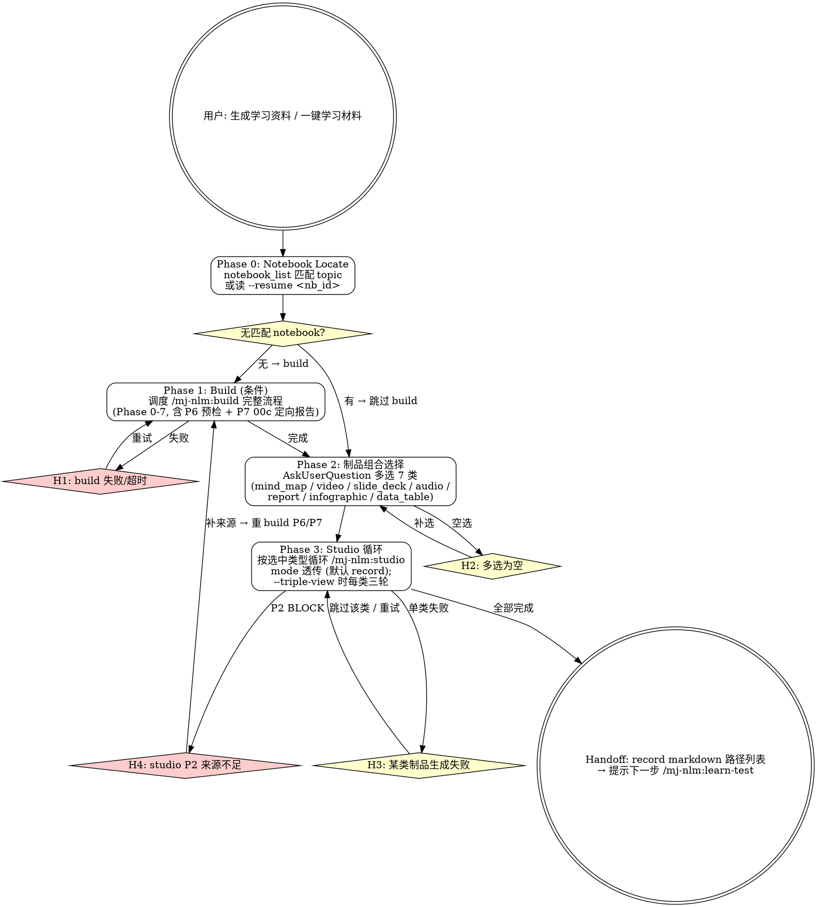

# mj-nlm:learn-make

## Overview

「生成学习资料」高层入口（v2.2 新增 wrapper 1）。一键编排 build → studio 上游学习制品生成链，对外暴露 1 个命令替代用户手动调度 build + 多次 studio。

**v2.2 升级要点**：
- 与 wrapper 2 `/mj-nlm:learn-test`（生成考察资料）对偶
- 替代 v2.0/v2.1 的 `/mj-nlm:learn` 上游编排（learn 已 deprecated）
- 默认 record mode（v2.1 记忆透传），二进制不入 git
- 内部 100% 复用 build / studio 现有 Phase，不重写底层逻辑

**前置 skill**：`/mj-nlm:auth`（认证）；`/mj-nlm:build`、`/mj-nlm:studio`（被本 skill 调度，无需用户手调）。
**互补 skill**：`/mj-nlm:learn-test`（生成完学习资料后接续的考察侧入口）；`/mj-nlm:manage`（生命周期管理）。

## 设计哲学

> wrapper 不重写底层，wrapper 只做 dispatch + 默认值 + AskUserQuestion 多选。
>
> 学习资料 = NotebookLM 在 source 之上「合成 + 表达」的输入型制品（mind_map / video / slide / audio / report / infographic / data_table）。
> 考察资料 = NotebookLM 基于 source 「检验理解」的输出型制品（quiz / flashcards），由 wrapper 2 处理。

learn-make 的角色是**学习侧编排器**，不直接调 MCP，全部通过调度 build / studio 完成。

## Prerequisites

- mj-nlm 6 个底层 skill 可用（auth / build / manage / studio / query / learn）
- NotebookLM MCP 服务已认证（auth）
- 用户准备了 ≥1 个来源材料（Phase 1 引导追加，如需 build 新建 notebook）

## Quick Start

| 命令 | 说明 |
|---|---|
| `/mj-nlm:learn-make <topic>` | 完整流程（无 notebook 时自动 build → 制品多选 → studio 循环） |
| `/mj-nlm:learn-make --resume <notebook_id>` | 已有 notebook，跳到 Phase 2 制品多选 |
| `/mj-nlm:learn-make --triple-view <topic>` | 选中制品三版连续生成（foundation / structural / challenge） |
| `/mj-nlm:learn-make --with-download <topic>` | 默认 record + 同时下载二进制（透传 studio --mode both） |
| `/mj-nlm:learn-make --download-only <topic>` | 跳过 record 仅下载（透传 studio --mode download，v2.0 兼容） |

---

## Workflow



---

## Phases

### Phase 0: Notebook Locate

**目标**：定位 topic 对应的 notebook，决定是否进入 Phase 1 (build)。

1. 解析启动参数：
   - `--resume <notebook_id>` → 直接用 notebook_id，跳到 Phase 2
   - `<topic>` → 先 `notebook_list()` 模糊匹配命名 `MJ-{project}-{scope}-{topic}-{YYYYMMDD}`
2. 匹配结果：
   - **0 个匹配** → 进入 Phase 1（build 新建）
   - **1 个匹配** → 询问用户「使用此 notebook 还是新建一个？」
   - **多个匹配** → AskUserQuestion 列出供选择，可选「都不用，新建」
3. 写入本 wrapper 的状态 tag `learn-make-phase:P0-passed`

**v2.2 兼容旧 learn 状态**：若 notebook 上有 `learn-phase:G{N}-passed`（v2.0/v2.1 旧 learn 写入），按 G1/G2/.../G4 映射跳到 wrapper 1 对应阶段，与旧 learn `--resume` 兼容。

---

### Phase 1: Build (Conditional)

**目标**：当无可用 notebook 时，触发 `/mj-nlm:build` 完整流程创建 notebook。

learn-make 不直接调 MCP，触发 build skill 完成：
- build Phase 0-5（认证 / 命名 / 扫描 / 导入 / 导航 / 验证）
- build Phase 6（来源充足性预检 → `00d-预检-来源充足性报告`）
- build Phase 7（领域定向报告 → `00c-定向-{topic}领域定向报告`）

build skill Handoff 完成后回到 learn-make，写入 tag `learn-make-phase:P1-passed`，进入 Phase 2。

**v2.2 注意**：本 wrapper 不复刻 v2.0 learn 的 Gate 1（00c 审定）——审定动作下沉到 build skill 内部 Phase 7 的 H-point；如用户希望强审定，建议直接用 `/mj-nlm:build` 单独建库后再 `learn-make --resume <nb_id>`。

**异常处理**：build 触发任意 H-point → wrapper 等待 build 完成或退出，wrapper 不绕过 build 的 H-points。build 失败 → **H1**（重试 / 取消）。

---

### Phase 2: Artifact Mix Selection

**目标**：用 AskUserQuestion 让用户多选要生成的学习制品类型。

**默认呈现**（按方法论 §11 推荐学习顺序排列）：

| # | artifact_type | 中文名 | 适用 |
|---|---|---|---|
| 1 | `mind_map` | 思维导图 | 概念地图、关系可视化（推荐首选） |
| 2 | `video` | 视频概述 | 第一遍进入主题、可视化讲解 |
| 3 | `slide_deck` | 幻灯片 | 结构化复习、可逐页修订 |
| 4 | `audio` | 音频播客 | 通勤 / 散步重复输入 |
| 5 | `report` | 报告文档 | Briefing / Study Guide / Blog 子格式 |
| 6 | `infographic` | 信息图 | 单页可读完的视觉化 |
| 7 | `data_table` | 数据表 | 结构化字段提取 |

**默认勾选**：无（用户必须主动选 ≥ 1 项）→ 空选触发 **H2**。

**子参数透传**：
- `view`：默认 `default`；`--triple-view` 启动时每个选中类型循环 foundation/structural/challenge 三轮
- `mode`：默认 `record`；`--with-download` → `both`；`--download-only` → `download`
- `language`：默认 `zh`
- `disable_guardrails`：默认 `False`，保持 v2.1 默认幻觉防护
- `audio_format` / `slide_format` / `report_format` 等类型专属子参数：保持 studio 默认（不在本 wrapper Phase 2 展开询问，避免认知负担过重）

如用户需要修改子参数，引导其单独调用 `/mj-nlm:studio`（advanced 路径）。

写入 tag `learn-make-phase:P2-passed`。

---

### Phase 3: Studio Iteration

**目标**：按 Phase 2 选中类型循环触发 `/mj-nlm:studio`。

```
for artifact_type in selected_types:
    if --triple-view:
        for view in (foundation, structural, challenge):
            studio_dispatch(notebook_id, artifact_type, view, mode, language="zh")
    else:
        studio_dispatch(notebook_id, artifact_type, view="default", mode, language="zh")
```

**dispatch 实参传给 studio 的等价命令**：
```
/mj-nlm:studio --mode <mode> --view <view> <artifact_type> on <notebook_id>
```

**配额预算**（用户启动时已告知，Phase 3 开始前再次确认）：
- 默认（无 --triple-view）：N 类 × 1 = N 次 studio_create
- `--triple-view`：N 类 × 3 = 3N 次 studio_create（mind_map / data_table 等可视化制品也三版）
- 估算耗时：单类约 1-3 分钟（audio_long 约 5 分钟）

**失败处理**：
- 单类 / 单 view 失败 → **H3**（跳过该类 / 重试一次 / 中止全流程）
- studio Phase 2 来源充足性预检 BLOCK → **H4**（提示用户补来源 → 重新触发 build P6/P7 → 重 Phase 3）

每完成一类，向用户实时报告 record markdown 路径（建议 `learning/<topic>/_nlm/<file>.md`）。

写入 tag `learn-make-phase:P3-passed`，进入 Handoff。

---

## H-points

| ID | 类型 | 触发 | 行为 |
|---|---|---|---|
| **H1** | Conditional | build 失败 / 超时 | 重试 / 切换到 advanced 单步 build / 取消 |
| **H2** | Conditional | Phase 2 制品多选为空 | 提示至少选 1 项；展示推荐组合（如「新人入门：mind_map + video + audio」） |
| **H3** | Conditional | Phase 3 单类制品生成失败 | 跳过该类继续 / 重试 1 次 / 中止全流程 |
| **H4** | Hard Block | studio P2 来源充足性预检 BLOCK | 强制补来源 → 重新触发 build P6/P7（不可直接绕过） |

learn-make 自身 H-points 较少；底层 build / studio 的 H-points 由 wrapper 透传给用户。

---

## Handoff

learn-make 完成后输出（按 mode 分形态）：

```
学习资料生成完成 — {topic}

Notebook: {notebook_name}
ID: {notebook_id}
经历 Phase: P0 → [P1] → P2 → P3
跳过的 Phase: {如有，如 --resume 跳过 P1}
输出模式: {record (默认) | both (--with-download) | download (--download-only)}

# v2.1 默认 record mode 输出（mode=record）：
学习资料 record markdown（learning/{topic}/_nlm/）:
- mind_map-default-{topic}.md
- video-default-{topic}.md
- slide_deck-default-{topic}.md
- ...（按选中类型）
+ 元 source: 00a / 00b / 00c / 00d（在 NotebookLM 上）

# 如启用 --with-download，额外本地二进制（不进 git，建议 _scratch/ 或 vault 外）：
- mind_map.json / video.mp4 / slide_deck.pdf / audio.mp3 / ...

Tag 自动添加: `learn-make-loop`

下一步:
  - 生成考察资料（quiz / flashcards / 错题归因 / 自检 / 来源核查）→ /mj-nlm:learn-test {notebook_id}
  - 单步追加某类学习制品 → /mj-nlm:studio
  - 修订幻灯片（仅 slide_deck） → /mj-nlm:studio + studio_revise
  - 补充 source 后重新触发 P6/P7 → /mj-nlm:build --resume {notebook_id}
```

---

## Examples

### 示例 1：完整流程（v2.2 默认 record）

```
用户：/mj-nlm:learn-make DQV
→ Phase 0: notebook_list 无 DQV 匹配 → 进 Phase 1
→ Phase 1: 调 /mj-nlm:build → 引导 source 上传 → 命名 MJ-system-mod-DQV-20260508 → 生成 00a/00b/00c/00d
→ Phase 2: AskUserQuestion → 用户选 mind_map + video + slide_deck + audio (4 类)
→ Phase 3: 循环调 /mj-nlm:studio (mode=record):
   - studio (mind_map, default) → learning/dqv/_nlm/mind_map-default-dqv.md
   - studio (video, default) → learning/dqv/_nlm/video-default-dqv.md
   - studio (slide_deck, default) → learning/dqv/_nlm/slide_deck-default-dqv.md
   - studio (audio, default) → learning/dqv/_nlm/audio-default-dqv.md
→ Handoff: 4 份 record markdown 进 git；提示下一步 /mj-nlm:learn-test MJ-system-mod-DQV-20260508
```

### 示例 2：--resume 复用已有 notebook

```
用户：/mj-nlm:learn-make --resume MJ-system-mod-DQV-20260506
→ Phase 0: 直接用提供的 notebook_id；跳过 P1
→ Phase 2: AskUserQuestion → 用户选 report (Briefing Doc) + infographic (2 类)
→ Phase 3: 2 次 studio_create → 2 份 record
→ Handoff
```

### 示例 3：--triple-view 三版连续

```
用户：/mj-nlm:learn-make --triple-view "Rust 所有权"
→ Phase 0-1 同示例 1（新建 notebook）
→ Phase 2: 用户选 audio + slide_deck (2 类)
→ Phase 3: 2 类 × 3 view = 6 次 studio_create
   - audio: foundation / structural / challenge → 3 份 record
   - slide_deck: foundation / structural / challenge → 3 份 record
→ Handoff: 6 份 record；耗时约 12-15 分钟
```

### 示例 4：--with-download 同时下载

```
用户：/mj-nlm:learn-make --with-download DQV
→ Phase 0-2 同示例 1
→ Phase 3: studio 子调度 mode=both
   - 每类同时输出 record markdown (进 git) + binary (本地，不进 git)
   - record 的「变更历史」段附加本地二进制路径
→ Handoff: 4 份 record + 4 份本地 binary（提示用户 binary 不应 git add）
```

### 示例 5：H4 来源不足触发回退

```
用户：/mj-nlm:learn-make 1页PDF主题
→ Phase 0-1: build 完成，但 00d 预检报告标 BLOCK (total_chars < 5K)
→ Phase 2: 用户选 audio (audio_long 模式默认)
→ Phase 3: studio P2.4 触发 BLOCK → H4
→ H4 提示用户：补来源 / 降级到 audio_brief / 改 mind_map (低门槛制品)
→ 用户选「补来源」→ 引导 /mj-nlm:build --resume 重跑 P6/P7 → 通过后重 Phase 3
```

---

## Reference Files

- **`→ ../mj-nlm-shared/artifact-type-reference.md`** — 7 类学习制品的子参数详情 + v2.1 三输出模式
- **`→ ../mj-nlm-shared/artifact-metadata-template.md`** — record markdown frontmatter schema（Phase 3 输出范式）
- **`→ ../mj-nlm-shared/focus-prompt-templates.md`** — Intent Layer 模板（studio 子调度依赖）
- **`→ ../mj-nlm-shared/risk-control-templates.md#6`** — 配额与成本估算
- **`→ ../mj-nlm-build/SKILL.md`** — Phase 1 完整调度的子 skill
- **`→ ../mj-nlm-studio/SKILL.md`** — Phase 3 循环调度的子 skill
- **`→ ../mj-nlm-learn-test/SKILL.md`** — 配对的 wrapper 2（考察侧入口）
- **`→ ../mj-nlm-learn/SKILL.md`** — v2.2 deprecated 的旧编排器（保留至 v2.3 删除）
