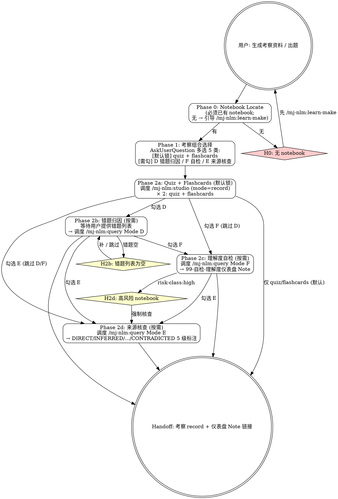

# mj-nlm:learn-test

## Overview

「生成考察资料」高层入口（v2.2 新增 wrapper 2）。一键编排 studio quiz/flashcards 生成 → 用户答题 → query Mode D 错题归因 → query Mode F 自检 → query Mode E 来源核查的考察侧链路，对外暴露 1 个命令替代用户手动调度。

**v2.2 升级要点**：
- 与 wrapper 1 `/mj-nlm:learn-make`（生成学习资料）对偶
- 替代 v2.0/v2.1 `/mj-nlm:learn` 的下游考察编排（learn 已 deprecated）
- quiz / flashcards 走 studio record mode，进 git；用户在 NotebookLM 在线答题
- 内部 100% 复用 studio / query 现有 Phase，不重写底层逻辑

**前置 skill**：`/mj-nlm:learn-make`（先有 notebook + 学习资料，再做考察）；`/mj-nlm:auth`（认证）；`/mj-nlm:studio` / `/mj-nlm:query`（被本 skill 调度，无需用户手调）。
**互补 skill**：`/mj-nlm:manage`（生命周期管理）。

## 设计哲学

> 考察 ≠ 仅出题。完整考察链路 = 出题 → 答题 → 归因 → 自检 → 核查。
>
> 默认只锁前两步（quiz + flashcards），后三步是 opt-in：因为「答题前归因」无意义，「自检」需要用户主观陈述，「来源核查」需要前置结论。
> 把全链路绑死会让简单"出个题"变重；让用户主动勾选 D/F/E 才能落地各自前置条件。

learn-test 的角色是**考察侧编排器**，按用户勾选项决定走 quiz-only 快路径还是 quiz → 答题 → D/F/E 长路径。

## Prerequisites

- 已有 notebook（`/mj-nlm:learn-make` 生成的，或单独 `/mj-nlm:build` 创建的）
- 若要走 Phase 2b（错题归因），需要用户已答完 quiz 并准备好错题列表（粘贴或文件路径）
- 若要走 Phase 2d（来源核查），通常衔接 Phase 2c 自检的关键结论；独立调用时需用户提供要核查的结论列表

## Quick Start

| 命令 | 说明 |
|---|---|
| `/mj-nlm:learn-test <notebook_id>` | 默认走 Phase 2a (quiz + flashcards 生成)，Phase 1 多选默认锁定 |
| `/mj-nlm:learn-test --full <notebook_id>` | Phase 1 多选**默认勾全 5 类**，自动连续走完 quiz → 答题等待 → D → F → E |
| `/mj-nlm:learn-test --rootcause <notebook_id>` | 仅走 Phase 2b（错题归因），跳过出题；需用户先准备错题列表 |
| `/mj-nlm:learn-test --selfcheck <notebook_id>` | 仅走 Phase 2c（7 项理解度自检 → 99- 仪表盘 Note） |
| `/mj-nlm:learn-test --sourcecheck <notebook_id>` | 仅走 Phase 2d（DIRECT/INFERRED/UNCERTAIN/CONTRADICTED 5 级核查） |

---

## Workflow



---

## Phases

### Phase 0: Notebook Locate

**目标**：定位已有 notebook，本 wrapper **不**触发 build。

1. 解析启动参数：
   - `<notebook_id>` 直接使用
   - 仅 topic 字符串 → `notebook_list()` 模糊匹配
2. 匹配结果：
   - **0 个匹配** → **H0**（引导先 `/mj-nlm:learn-make <topic>` 创建 notebook 与学习资料）
   - **1 个匹配** → 直接进入 Phase 1
   - **多个匹配** → AskUserQuestion 列出供选择
3. 检查 notebook tag：
   - 是否含 `risk-class:high` → 影响 Phase 2d 强制规则（详见 H2d）
   - 是否含 `learn-make-loop` 或 `learn-loop`（v2.0/v2.1 旧 learn）→ 提示 notebook 已有学习资料，可直接做考察

写入本 wrapper 状态 tag `learn-test-phase:P0-passed`。

---

### Phase 1: Assessment Mix Selection

**目标**：用 AskUserQuestion 让用户多选要执行的考察类型。

**默认呈现**：

| # | 项目 | 调用底层 | 默认勾选 | 说明 |
|---|---|---|---|---|
| 1 | quiz 生成 | `/mj-nlm:studio artifact_type=quiz` | ✅ **锁定** | 生成 record markdown，含 NotebookLM URL（用户在 NLM 在线答题）|
| 2 | flashcards 生成 | `/mj-nlm:studio artifact_type=flashcards` | ✅ **锁定** | 同上 |
| 3 | 错题归因（Mode D） | `/mj-nlm:query` Mode D | ⬜ | 用户在 NLM 答完 quiz 后，提供错题列表 → 归因 + 重学建议 |
| 4 | 理解度自检（Mode F） | `/mj-nlm:query` Mode F | ⬜ | 7 项指标对话式自检 → `99-自检-理解度仪表盘-{YYYYMMDD}-{HHMM}` Note |
| 5 | 来源核查（Mode E） | `/mj-nlm:query` Mode E | ⬜ | DIRECT/INFERRED/BACKGROUND/UNCERTAIN/CONTRADICTED 5 级标注 |

**默认锁定**：项目 1 + 2 不可取消（这是「考察资料」最小集）。
**勾选自由**：3/4/5 用户可任意组合（含 0 项 = 默认快路径）。

**子参数透传**：
- quiz: `question_count=10`, `difficulty=medium`, `view=default`, `mode=record`
- flashcards: `difficulty=medium`, `mode=record`
- 如用户需要修改子参数（如题数、难度），引导其单独调用 `/mj-nlm:studio`

**启动标志映射**：
- 默认 → 仅勾 1+2
- `--full` → 勾全 5 项
- `--rootcause` → **跳过 Phase 1**，仅走 Phase 2b（要求用户已有 quiz 错题）
- `--selfcheck` → **跳过 Phase 1**，仅走 Phase 2c
- `--sourcecheck` → **跳过 Phase 1**，仅走 Phase 2d

写入 tag `learn-test-phase:P1-passed`。

---

### Phase 2a: Quiz + Flashcards Generation

**目标**：调度 `/mj-nlm:studio` 生成 quiz + flashcards 两类制品。

```
/mj-nlm:studio --mode record artifact_type=quiz on <notebook_id>
/mj-nlm:studio --mode record artifact_type=flashcards on <notebook_id>
```

输出 2 份 record markdown 到 `learning/<topic>/_nlm/`：
- `quiz-default-<topic>.md`（含 NotebookLM 在线答题 URL）
- `flashcards-default-<topic>.md`（含在线复习 URL）

向用户提示：
- record markdown 路径（已进 git 暂存可提交）
- 「请打开 NotebookLM 链接在线答 quiz / 复习 flashcards」
- 「答完后回到本 wrapper，提供错题列表（如已勾选 Phase 2b）」

**特例**：`--with-download` 启动时（继承 wrapper 1 透传），quiz/flashcards 也走 `mode=both`，本地存 JSON 便于离线做题工具加载。

写入 tag `learn-test-phase:P2a-passed`。

---

### Phase 2b: Quiz Root Cause（按需）

**目标**：调度 `/mj-nlm:query` Mode D，对用户提供的错题列表做归因。

**前置**：用户已在 NotebookLM（或本地工具）做完 quiz，准备好错题列表（粘贴或文件路径）。

**输入格式**（用户提供）：
```
错题 1：
题干：<...>
我的答：<...>
正解：<...>

错题 2：
...
```

**触发**：
```
/mj-nlm:query --mode=D notebook_id=<id> errors=<错题列表>
```

输出（query Mode D 返回）：
- 每题 root cause 分类（概念误解 / 例子混淆 / 边界不清 / 考试思维 / 来源记忆错位 / 推断错误）
- 每题重学建议（推荐 source / 推荐生成新制品 / 推荐再练题）
- 综合分析（错题数 ≥ 3 时给出共性 + 薄弱概念 + 下一轮聚焦点）

**异常**：错题列表为空 → **H2b**（提示用户补提供 / 跳过本 Phase）。

写入 tag `learn-test-phase:P2b-passed`。

---

### Phase 2c: Understanding Self-Check（按需）

**目标**：调度 `/mj-nlm:query` Mode F，做 7 项理解度对话式自检。

**触发**：
```
/mj-nlm:query --mode=F notebook_id=<id>
```

依 `understanding-metrics.md` 7 项指标对话式自检：
1. 大图复述
2. 核心术语解释
3. 反例 / 不适用场景
4. 案例机制（不复述故事）
5. Quiz 命中率（自动从 Phase 2b 历史读取，如有）
6. 来源可追溯性（如启用 Phase 2d，从其结果读取通过率）
7. 24h 复述预测

**输出**：
- 仪表盘 Note：`99-自检-理解度仪表盘-{YYYYMMDD}-{HHMM}` 写入 NotebookLM
- 三级评级：入门 / 熟悉 / 掌握
- 24h 回访预约（手动触发 `/mj-nlm:query --mode=recall`）

写入 tag `learn-test-phase:P2c-passed`。

---

### Phase 2d: Source Check（按需）

**目标**：调度 `/mj-nlm:query` Mode E，对 Phase 2c 仪表盘中"指标 1-4"用户口述部分（或用户独立指定结论）做来源核查。

**触发**：
```
/mj-nlm:query --mode=E notebook_id=<id> claims=<结论列表 或 自动从 Phase 2c 抽取>
```

**输出**：每条结论标注 5 级
- DIRECT — 来源直接支持
- INFERRED — 从来源推断（弱支持）
- BACKGROUND — 背景知识（来源未明）
- UNCERTAIN — 来源模糊
- CONTRADICTED — 来源反对

最终输出"通过率"（DIRECT 条数 / 总条数），可回填 Phase 2c 指标 6。

**强制规则（H2d）**：notebook tag 含 `risk-class:high`（医疗 / 法律 / 财务 / 合同 / 考试 / 安全）→ 强制不能跳过本 Phase；如用户在 Phase 1 未勾选，本 wrapper 强制追加 Phase 2d。

写入 tag `learn-test-phase:P2d-passed`。

---

## H-points

| ID | 类型 | 触发 | 行为 |
|---|---|---|---|
| **H0** | Hard Block | Phase 0 无可用 notebook | 引导先 `/mj-nlm:learn-make <topic>`；不允许 wrapper 内部触发 build（避免 wrapper 1/2 职责混淆） |
| **H1** | Conditional | Phase 1 用户取消默认锁的 quiz/flashcards | 提示「quiz + flashcards 是考察资料最小集，不可取消；如只要 D/F/E 请用启动标志 `--rootcause` / `--selfcheck` / `--sourcecheck`」 |
| **H2a** | Conditional | studio 生成 quiz/flashcards 失败 | 重试 / 跳过该类 / 中止全流程 |
| **H2b** | Conditional | Phase 2b 错题列表为空 | 提示用户补提供错题；或跳过 Phase 2b 进 2c/2d |
| **H2d** | Hard Block | risk-class:high notebook 用户未勾 Phase 2d | 强制追加 Phase 2d（不可跳过） |

learn-test 自身 H-points 比 learn-make 多（含答题等待 + 高风险强制核查），但底层 studio/query H-points 仍由 wrapper 透传。

---

## Handoff

learn-test 完成后输出：

```
考察资料完成 — {topic}

Notebook: {notebook_name}
ID: {notebook_id}
经历 Phase: P0 → P1 → P2a → [P2b] → [P2c] → [P2d]
跳过的 Phase: {如有，方括号 [] 内为按需可选项}

# 默认 record mode 输出（mode=record）：
考察 record markdown（learning/{topic}/_nlm/）:
- quiz-default-{topic}.md
- flashcards-default-{topic}.md
+ Note (在 NotebookLM 上):
  - 99-自检-理解度仪表盘-{YYYYMMDD}-{HHMM}（如走 Phase 2c）

理解度评级: {入门 / 熟悉 / 掌握 / N/A 未自检}
来源核查通过率: {%, N/A 未核查}
24h 回访预约: {YYYY-MM-DD HH:MM, N/A 未自检}（手动触发 /mj-nlm:query --mode=recall）

Tag 自动添加: `learn-test-loop`

下一步:
  - 错题指向"边界不清" → 重生 audio(structural) + 二轮 quiz → /mj-nlm:learn-make --resume {notebook_id} 选 audio + structural view
  - 24h 后复述 → /mj-nlm:query --mode=recall {notebook_id}
  - 进入下一主题 → /mj-nlm:learn-make <new_topic>
  - 仪表盘"入门"评级建议重做学习闭环 → /mj-nlm:learn-make --resume {notebook_id} + /mj-nlm:learn-test --full {notebook_id}
```

---

## Examples

### 示例 1：默认快路径（仅 quiz + flashcards）

```
用户：/mj-nlm:learn-test MJ-system-mod-DQV-20260508
→ Phase 0: 定位 notebook
→ Phase 1: 默认锁 quiz + flashcards；用户没勾 D/F/E
→ Phase 2a: studio × 2
   - learning/dqv/_nlm/quiz-default-dqv.md（含 NLM URL）
   - learning/dqv/_nlm/flashcards-default-dqv.md
→ Handoff: 2 份 record；提示用户在 NLM 答 quiz；下一步可调 --rootcause 归因
```

### 示例 2：--full 全链路

```
用户：/mj-nlm:learn-test --full MJ-system-mod-DQV-20260508
→ Phase 0-1: 默认勾全 5 项
→ Phase 2a: 生成 quiz + flashcards
→ wrapper 暂停，等用户答完 quiz 提供错题列表
→ Phase 2b: Mode D 归因 → 3 题指向"边界不清"
→ Phase 2c: Mode F 自检 → 仪表盘评级"熟悉"
→ Phase 2d: Mode E 核查 → 通过率 80%
→ Handoff: 2 record + 1 仪表盘 Note + 24h 回访预约
```

### 示例 3：--rootcause 仅归因

```
用户：上周做的 DQV quiz 错了 5 题，分析下
→ /mj-nlm:learn-test --rootcause MJ-system-mod-DQV-20260506
→ 跳过 Phase 1；直接进 Phase 2b
→ wrapper 等用户粘错题列表
→ Mode D 归因 + 综合分析（错题 ≥ 3）
→ Handoff: 归因报告 + 推荐重学建议
```

### 示例 4：--selfcheck 学完做自检

```
用户：DQV 我学完了，做个自检
→ /mj-nlm:learn-test --selfcheck MJ-system-mod-DQV-20260506
→ Phase 0 → 跳过 Phase 1/2a/2b → Phase 2c
→ Mode F 7 项对话
→ 99-自检 仪表盘 Note 写入
→ Handoff: 评级"掌握"
```

### 示例 5：高风险 notebook 强制核查（H2d）

```
用户：/mj-nlm:learn-test 医疗合规-2026
→ Phase 0: notebook tag 含 risk-class:high → 标记
→ Phase 1: 用户只勾 quiz + flashcards
→ Phase 2a: 生成 → 用户答题
→ wrapper 检测高风险 → H2d 强制追加 Phase 2d Mode E 核查（不可跳过）
→ 用户被告知核查通过率必须 > 70% 才视为合格学习闭环
```

---

## Reference Files

- **`→ ../mj-nlm-shared/artifact-type-reference.md`** — quiz / flashcards 子参数详情
- **`→ ../mj-nlm-shared/artifact-metadata-template.md`** — record markdown frontmatter schema（Phase 2a 输出范式）
- **`→ ../mj-nlm-shared/learning-loop-templates.md#§3`** — 错题 root cause 提示词（Phase 2b 用）
- **`→ ../mj-nlm-shared/learning-loop-templates.md#§7`** — 7 项理解度自检对话提示词（Phase 2c 用）
- **`→ ../mj-nlm-shared/risk-control-templates.md#4`** — Source Check 5 级标注体系（Phase 2d 用）
- **`→ ../mj-nlm-shared/risk-control-templates.md#3`** — 高风险类别白名单（H2d 触发）
- **`→ ../mj-nlm-shared/understanding-metrics.md`** — 7 项指标定义 + 仪表盘 Note 模板
- **`→ ../mj-nlm-studio/SKILL.md`** — Phase 2a 调度的子 skill
- **`→ ../mj-nlm-query/SKILL.md`** — Phase 2b/2c/2d 调度的子 skill
- **`→ ../mj-nlm-learn-make/SKILL.md`** — 配对的 wrapper 1（学习侧入口）
- **`→ ../mj-nlm-learn/SKILL.md`** — v2.2 deprecated 的旧编排器（保留至 v2.3 删除）
