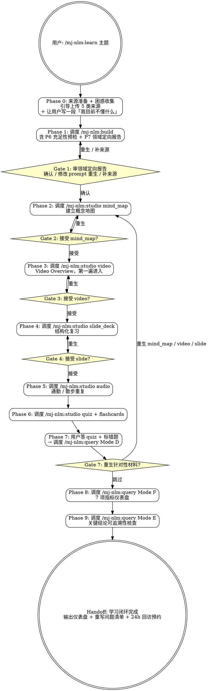

# mj-nlm:learn

## Overview

「学习闭环编排器」—— 一个分阶段交互的 top-level orchestrator，按方法论 §11 推荐流程把 build / studio / query 三类 skill 串成可重复的学习工作流：

```
来源准备 → 充足性预检 → 领域定向报告 → Mind Map → Video → Slide → Audio → Quiz → 错题 root cause → 来源核查 → 理解度仪表盘
```

10 个 Phase + 5 个 Gate（关键关口插入用户确认 / 修改 / 跳过选项）。learn skill **本身不调用 MCP**，全部通过调度 build / studio / query 三个 skill 完成。

**前置 skill**：build / studio / query（v2 已升级）。**互补 skill**：manage（生命周期管理）。

## 设计哲学（来自方法论 §11/§12）

> 不要让 NotebookLM 替你学习；要让它把新内容拆成更容易学习、复习、提问和验证的形态。
>
> Video 负责进入，Slide 负责结构，Audio 负责重复，Mind Map 负责关系，Quiz 负责检验，原文负责查证。

learn skill 的角色是**编排者**，不是**学习者**。它不做新的判断，只确保用户按方法论顺序走完每一步、不漏掉关键关口。

## Prerequisites

- mj-nlm 全部 6 个 skill 可用（auth / build / manage / query / studio / learn）
- NotebookLM MCP 服务已认证（auth）
- 用户准备了 ≥1 个来源材料（learn Phase 0 引导追加）

## Quick Start

| 命令 | 说明 |
|---|---|
| `/mj-nlm:learn <topic>` | 完整闭环（10 Phase + 5 Gate） |
| `/mj-nlm:learn --resume <notebook_id>` | 从某个 Gate 恢复（learn 把当前 Phase 写入 notebook tag） |
| `/mj-nlm:learn --quiz-only <notebook_id>` | 仅走 P6/P7（已有 notebook 时复测） |
| `/mj-nlm:learn --triple-view <topic>` | 三版生成（mind_map / video / slide / audio 各 3 版，配额 ×3） |
| `/mj-nlm:learn --lite <topic>` | 跳过 video（或更耗时制品），适合配额有限或快速场景 |

---

## Workflow（10 Phase + 5 Gate）



---

## Phases

### Phase 0: Source Preparation & Confusion Capture

**引导用户准备 5 类来源 + 写一段"我目前不懂什么"。** 这是方法论 §5「准备来源，不要只上传一个材料」的落地。

1. AskUserQuestion 引导用户提供 5 类来源（详见 `→ ../mj-nlm-shared/material-classification.md#多源类型分类`）：
   - 原始材料（必有）
   - 入门材料（可选但强烈推荐）
   - 案例材料（社区讨论 / 论文 / 博客）
   - 反例 / 批评材料
   - 自己的困惑笔记（让 skill 引导用户写）

2. **困惑笔记引导**（关键）：

```
请用日常语言写一段你目前的困惑：
- 你看过的一些材料是什么？
- 哪里没看懂？（具体描述场景，不要用术语）
- 你想达到的理解程度是什么？（能解释给同事 / 能在工作中应用 / 能与专家讨论）
- 你之前学相关主题时遇到过什么坑？
```

困惑笔记会作为 text source 入库（命名 `01-困惑-用户初始困惑笔记`）。

3. 告知用户预计耗时与配额（详见 `→ ../mj-nlm-shared/risk-control-templates.md#6`）

4. 用户确认后进入 Phase 1。

---

### Phase 1: Build with Domain Orientation

**调度 `/mj-nlm:build`，含 v2 的 P6 充足性预检 + P7 领域定向报告。**

learn 不直接调用 MCP，而是触发 build skill 完成：
- Phase 0-5（认证 / 命名 / 扫描 / 导入 / 导航 / 验证）
- Phase 6（来源充足性预检 → `00d-预检-来源充足性报告`）
- Phase 7（领域定向报告 → `00c-定向-{topic}领域定向报告`）

build skill 的 Handoff 完成后回到 learn 进入 Gate 1。

**异常处理**：build 触发任意 H1-H8 → learn 等待 build 完成或退出，learn 不绕过 build 的 H-points。

---

### Gate 1: Review Domain Orientation Report

**让用户审定 00c 领域定向报告。** 这是 learn 闭环最重要的关口——后续所有制品都以这份报告为锚。

1. 展示 Note `领域定向报告 — {topic}` 内容（前 80 行）
2. AskUserQuestion 让用户决定：
   - **确认**：继续 Phase 2
   - **修改 prompt 重生**：让用户提示哪里不准 / 哪里漏了，learn 调整 prompt 重新触发 build Phase 7
   - **补来源后重生**：跳回 Phase 0 让用户追加 source

**通过线**：用户回答"确认"。

**写入 notebook tag**：`learn-phase:G1-passed`，便于 `--resume` 恢复。

---

### Phase 2: Mind Map（建立概念地图）

**调度 `/mj-nlm:studio` 生成 mind_map。**

learn 触发：

```
/mj-nlm:studio
  notebook_id={从 Phase 1 获取}
  artifact_type=mind_map
  view=default（除非 --triple-view，则三版连续）
  language=zh
```

studio Phase 1-4 跑完后回到 learn 进入 Gate 2。

---

### Gate 2/3/4: Accept Each Artifact

**对 mind_map / video / slide 各设一个 Gate。**

每个 Gate AskUserQuestion：
- **接受**：进入下一 Phase
- **重生**：返回该 Phase，可让用户提供新的 prompt 提示词或换 view（如 default → structural）
- **跳过**：直接跳到下一 Phase（不影响后续 Quiz）

> audio（Phase 5）不设 Gate，因为 audio 是"低摩擦重复输入"性质，不必每次审定。如果想跳过 audio，用 `--lite` 启动。

---

### Phase 3: Video Overview

调度 `/mj-nlm:studio` 生成 video。

`--triple-view` 模式下三版连续。`--lite` 模式下跳过本 Phase。

→ Gate 3

---

### Phase 4: Slide Deck

调度 `/mj-nlm:studio` 生成 slide_deck。

`--triple-view` 模式下三版连续。

→ Gate 4

---

### Phase 5: Audio Overview

调度 `/mj-nlm:studio` 生成 audio。

默认 `audio_format=brief, audio_length=default`。`--triple-view` 模式下三版连续。

无 Gate，直接进入 Phase 6。

---

### Phase 6: Quiz + Flashcards

**调度 `/mj-nlm:studio` 连续生成 quiz 和 flashcards。**

```
quiz: question_count=10, difficulty=medium, view=default
flashcards: difficulty=medium
```

下载后展示给用户，告知"请认真做完 quiz 再继续 Phase 7"。

learn 等待用户提供错题列表（粘贴或文件路径）才进入 Phase 7。

---

### Phase 7: Quiz Root Cause + Decision

**调度 `/mj-nlm:query` Mode D。**

输入用户错题列表 → NLM 输出 root cause + 重学建议。

→ Gate 7：

| 选项 | 行为 |
|---|---|
| **重生针对性材料**（推荐当 ≥3 错题指向同概念） | 跳回 Phase 2/3/4，按 Mode D 建议的 view 与 prompt 重生 |
| **跳过，直接进入自检** | 进入 Phase 8 |
| **重做一轮 Quiz** | 跳回 Phase 6，生成新一组 quiz 验证 |

---

### Phase 8: Understanding Self-Check

**调度 `/mj-nlm:query` Mode F（带 `--no-write-note` 参数）。**

7 项指标自检 → query 返回结构化结果（不写 Note，避免与 learn 双写）。

learn 在 Phase 8 末尾**统一写 Note**：`note(notebook_id, action="create", title="99-自检-理解度仪表盘-{YYYYMMDD}-{HHMM}", content=...)`，把 7 项指标 + Phase 9 来源核查通过率 + 24h 回访预约一并汇总。

指标 5（Quiz 命中率）从 Phase 7 历史读取自动填写。
指标 7（24h 复述）安排回访时间，由 learn 写入 Note。

---

### Phase 9: Source Check

**调度 `/mj-nlm:query` Mode E。** 对 Phase 8 仪表盘中"指标 1-4"用户口述部分做来源核查。

输出"通过率"作为指标 6 回填仪表盘。

**high-risk notebook 强制不能跳过本 Phase。**

---

### Handoff

learn 完成后输出：

```
学习闭环完成 — {topic}

Notebook: {notebook_name}
ID: {notebook_id}
经历 Phase: P0 → P1 → G1 → P2 → G2 → P3 → G3 → P4 → G4 → P5 → P6 → P7 → G7 → P8 → P9
跳过的 Phase: {如有}

制品清单:
- mind_map.json
- video.mp4
- slide_deck.pdf
- audio.mp3
- quiz.json
- flashcards.json
+ 元 source: 00a / 00b / 00c / 00d
+ Note: 99-自检-理解度仪表盘-{YYYYMMDD}-{HHMM}

理解度评级: {入门 / 熟悉 / 掌握}
24h 回访预约: {YYYY-MM-DD HH:MM}（手动触发 /mj-nlm:query --mode=recall {notebook_id}）

Tag 自动添加: `learn-loop`

下一步:
  - 重读源材料 / 重写自己的问题（方法论 §11 闭环最后一步）
  - 24h 后复述 → /mj-nlm:query --mode=recall
  - 进入下一主题 → /mj-nlm:learn <new_topic>
  - 如发现领域定向报告需修订 → /mj-nlm:build --resume {notebook_id}（仅跑 P7）
```

---

## H-point 表格

learn skill 不直接产生 H-point（所有交互通过 Gate 进行），但会传递子 skill 的 H-point：

| 来源 skill | H-point | learn 行为 |
|---|---|---|
| build H1 (auth) | Hard Block | 等待 build 完成或退出 |
| build H4-H8 | 各类 | 等待 build 完成 |
| studio H4 (来源不足) | Hard Block | 提示用户补来源后重启 Phase 1 |
| query H4 (高风险强制 Mode E) | Warning | learn 在 Phase 9 自动应用 |

learn 自身的关键决策都通过 Gate 1-4/7 处理。

---

## --resume 恢复机制

learn 在每次 Gate 通过时写入 notebook tag：
- `learn-phase:G1-passed`
- `learn-phase:G2-passed`
- ...
- `learn-phase:G7-passed`
- `learn-phase:done`

`--resume <notebook_id>` 时读取最新 `learn-phase:G{N}-passed` tag → 跳到 Phase {N+1}。

例：用户中断在 Gate 3（接受 video 之前）→ tag 最高 `learn-phase:G2-passed` → resume 跳到 Phase 3 重生 video 或继续。

---

## 配额与成本

完整一次 `/mj-nlm:learn`（默认）触发约：
- 1 次 build（含 P7 = 1 次 notebook_query）
- 6 次 studio_create（mind_map / video / slide / audio / quiz / flashcards）
- 1 次 query Mode D（视错题数 1-N 次内部调用）
- 1 次 query Mode E
- 1 次 query Mode F（7 题约 1-7 次）

**总计**：12-15 分钟（不含用户审定与答题时间）。

`--triple-view` 模式：约翻倍至 25-30 分钟（mind_map / video / slide / audio 各 3 版）。

`--lite` 模式：跳过 video，约 8-10 分钟。

---

## Examples

### 示例 1：完整闭环（默认）

```
用户：/mj-nlm:learn DQV
→ Phase 0：引导上传 DQV 设计文档 + 代码 + 1 篇社区博客 + 用户写一段困惑
→ Phase 1：调度 build（命名 MJ-system-mod-DQV-20260505），生成 00a/00b/00c/00d
→ Gate 1：用户审 00c 定向报告 → 确认
→ Phase 2：mind_map.json
→ Gate 2：接受
→ Phase 3：video.mp4
→ Gate 3：重生（用户嫌太快） → 重生 → 接受
→ Phase 4：slide_deck.pdf → 接受
→ Phase 5：audio.mp3
→ Phase 6：quiz.json + flashcards.json
→ 用户做 quiz，错 5 题，粘贴错题
→ Phase 7：Mode D root cause → 3 题指向"边界不清"
→ Gate 7：重生 audio(structural)
→ 重做 Phase 5 → Phase 6 quiz 二轮 → Phase 7 二轮（错题降到 1 题）
→ Phase 8：Mode F 自检 → 仪表盘评级"熟悉"
→ Phase 9：Mode E 来源核查 → 通过率 80%
→ Handoff：tag 加 learn-loop
```

### 示例 2：--resume

```
用户：昨天 learn DQV 中断了，能恢复吗？
→ /mj-nlm:learn --resume MJ-system-mod-DQV-20260504
→ 检查 tag：最高 learn-phase:G2-passed
→ 跳到 Phase 3 重生 video → 继续
```

### 示例 3：--triple-view（深度学习）

```
用户：/mj-nlm:learn --triple-view "Rust 所有权"
→ Phase 0-1 同
→ Gate 1 确认
→ Phase 2-5 各 3 版：mind_map ×3, video ×3, slide ×3, audio ×3
→ Phase 6 默认（quiz 不分版）
→ 后续同
→ 总耗时约 30 分钟
```

### 示例 4：--quiz-only

```
用户：上周学的 DQV，今天想再测一轮
→ /mj-nlm:learn --quiz-only MJ-system-mod-DQV-20260505
→ 跳过 P0-P5
→ Phase 6 生成新 quiz
→ Phase 7 错题归因
→ 跳过 Phase 8/9
→ Handoff
```

### 示例 5：高风险类别强制 Source Check

```
用户：/mj-nlm:learn 医疗合规
→ Phase 0 上传政策文件 + 法规
→ Phase 1 build：tag 自动加 risk-class:high
→ Gate 1 / Phase 2-7 同
→ Phase 9 强制不能跳过
→ Handoff
```

---

## Reference Files

- **`→ ../mj-nlm-shared/risk-control-templates.md#6`** — 配额与成本估算
- **`→ ../mj-nlm-shared/learning-loop-templates.md`** — 各 Phase 调用 query/studio 时使用的 prompt 模板（§1 领域定向 / §2 三版 / §3 错题 / §4 案例机制 / §5 来源核查 / §6 术语 / §7 自检）
- **`→ ../mj-nlm-shared/understanding-metrics.md`** — Phase 8 仪表盘 Note 模板
- **`→ ../mj-nlm-shared/material-classification.md#多源类型分类`** — Phase 0 引导的 5 类来源对应表
