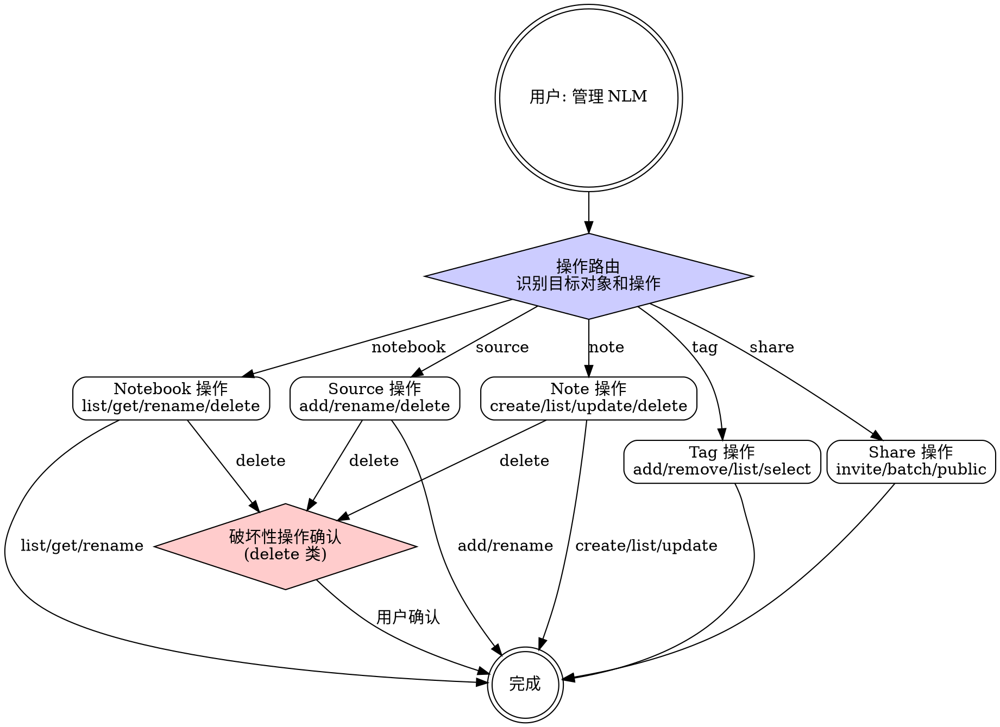

# mj-nlm:manage

## Overview

NotebookLM 知识库的日常生命周期管理：Notebook/Source/Tag 的 CRUD 操作 + 分享功能。覆盖知识库创建后的维护场景。

**互补 skill**：创建知识库使用 `/mj-nlm:build`，生成制品使用 `/mj-nlm:studio`。

## Prerequisites

- NLM MCP 服务已认证（认证问题参考 `/mj-nlm:auth`）

## Quick Start（交互模式）

| 已知信息 | 行动 |
|---------|------|
| "列出所有知识库" | `notebook_list()` |
| "删除旧的 notebook" | `notebook_list()` → 确认 → `notebook_delete()` |
| "给 notebook 加个标签" | 定位 notebook → `tag(action="add")` |
| "分享 notebook 给同事" | 定位 notebook → `notebook_share_invite()` |
| "删掉某个 source" | 定位 notebook → 列出 source → `source_delete()` |
| "创建/更新/删除 note" | 定位 notebook → `note(action="create\|update\|delete")` |

---

## Workflow



---

## Notebook 操作

### 列出

```
notebook_list()
```

展示所有 notebook 的名称、ID、创建时间。

### 查看详情

```
notebook_get(notebook_id)
```

展示 notebook 的 source 列表、tag、创建时间等详细信息。

### 重命名

```
notebook_rename(notebook_id, new_title="{新名称}")
```

建议遵循命名规范 `MJ-{project}-{scope}-{topic}-{YYYYMMDD}`（详见 `→ ../mj-nlm-shared/naming-reference.md`）。

### 删除

```
notebook_delete(notebook_id, confirm=True)
```

**破坏性操作** — 必须先展示 notebook 详情，确认用户意图后再执行。`confirm=True` 需用户二次确认。

---

## Source 操作

### 添加

```
source_add(notebook_id, source_type="file|text|url|drive", ...)
```

- `file`: `file_path="{路径}"` — 本地文件
- `text`: `text="{内容}", title="{标题}"` — 文本内容
- `url`: `url="{网址}"` — 单个网页；批量导入用 `urls="{url1}, {url2}"` 逗号分隔
- `drive`: `document_id="{Google Drive ID}"` — Google Drive 文件

### 重命名

```
source_rename(notebook_id, source_id, new_title="{新名称}")
```

### 删除

```
source_delete(source_id="{source_id}", confirm=True)
```

批量删除：`source_delete(source_ids=["{id1}", "{id2}"], confirm=True)`

**破坏性操作** — 确认后执行。注意：`source_delete` 不需要 `notebook_id` 参数。

---

## Tag 操作

### 添加标签

```
tag(notebook_id, action="add", tags="{逗号分隔的标签}")
```

### 移除标签

```
tag(notebook_id, action="remove", tags="{逗号分隔的标签}")
```

### 列出标签

```
tag(notebook_id, action="list")
```

### 按标签筛选 notebook

```
tag(action="select", query="{搜索词}")
```

通过标签匹配查找相关 notebook。`query` 支持逗号分隔的多个关键词（如 `"ai,mcp"`）。

---

## Share 操作

### 邀请单人

```
notebook_share_invite(notebook_id, email="{邮箱}", role="viewer|editor")
```

`role` 默认为 `"viewer"`（只读），可选 `"editor"`（可编辑）。

### 批量邀请

```
notebook_share_batch(
    notebook_id,
    recipients=[
        {"email": "user1@example.com", "role": "viewer"},
        {"email": "user2@example.com", "role": "editor"}
    ],
    confirm=True
)
```

每个 recipient 可指定不同的 role。`confirm=True` 必填。

### 公开分享

```
notebook_share_public(notebook_id, is_public=True)
```

`is_public=True` 启用公开链接（返回链接 URL），`is_public=False` 禁用。

### 查看分享状态

```
notebook_share_status(notebook_id)
```

---

## Note 操作

### 创建 note

```
note(notebook_id, action="create", content="{内容}", title="{标题}")
```

### 列出 note

```
note(notebook_id, action="list")
```

### 更新 note

```
note(notebook_id, action="update", note_id="{note_id}", content="{新内容}", title="{新标题}")
```

### 删除 note

```
note(notebook_id, action="delete", note_id="{note_id}", confirm=True)
```

**破坏性操作** — `confirm=True` 必填。

---

## H-point 表格

| ID | 类型 | 触发条件 | 行为 |
|----|------|---------|------|
| **H1** | Hard Block | 执行 delete 操作前 | 展示将删除的对象详情，AskUserQuestion 确认 |

---

## Examples

### 示例 1：清理过期 notebook

```
用户：帮我清理一下过期的知识库
→ notebook_list() 展示所有 notebook
→ 用户指出哪些要删
→ 逐个确认后 notebook_delete()
```

### 示例 2：给 notebook 添加标签

```
用户：给 DQV 知识库加上"培训"标签
→ notebook_list() 找到 DQV notebook
→ tag(action="add", tags="培训")
```

### 示例 3：分享 notebook 给团队

```
用户：把 DQV 知识库分享给张三和李四
→ notebook_share_batch(recipients=[{"email": "zhangsan@...", "role": "viewer"}, {"email": "lisi@...", "role": "viewer"}], confirm=True)
```

---

## Reference Files

- **`→ ../mj-nlm-shared/naming-reference.md`** — Notebook/Source/Tag 命名规范（重命名时参考）
