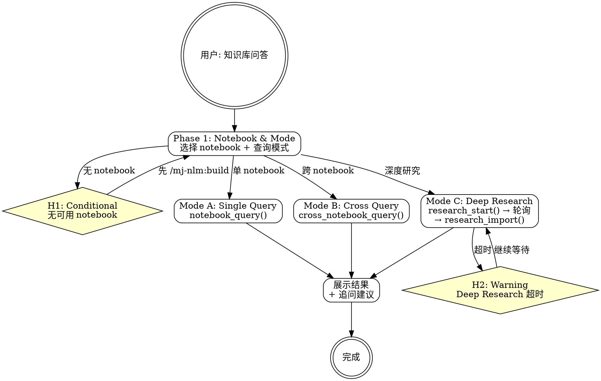

# mj-nlm:query

## Overview

对 NotebookLM notebook 进行 AI 问答。支持三种模式：单 notebook 问答、跨 notebook 查询、Deep Research 深度研究。

**前置 skill**：知识库构建使用 `/mj-nlm:build`。

## Prerequisites

- 已有 notebook（通过 `/mj-nlm:build` 创建或已有）
- NLM MCP 服务已认证（认证问题参考 `/mj-nlm:auth`）

## Quick Start（交互模式）

| 已知信息 | 行动 |
|---------|------|
| "问一下 DQV 的验证策略" | 定位 notebook → 单 notebook 查询 |
| "跨所有知识库搜索 ETL 模式" | 跨 notebook 查询 |
| "深入研究一下 DQV 的架构演进" | Deep Research 模式 |
| 未指定 notebook | Phase 1 列出 notebook 供选择 |

---

## Workflow



---

### Phase 1: Notebook & Mode Selection

**确定查询目标和模式。** 不同模式适用于不同场景。

1. **选择 notebook**：`notebook_list()` → 用户选择或自动匹配
2. **选择查询模式**：

   | 模式 | 工具 | 适用场景 |
   |------|------|---------|
   | **Single** | `notebook_query()` | 针对特定 notebook 的具体问题 |
   | **Cross** | `cross_notebook_query()` | 需要从多个 notebook 综合信息 |
   | **Deep Research** | `research_start()` | 需要深入分析的复杂问题 |

3. 无可用 notebook → **H1**

**模式选择建议**：
- 问题涉及单一主题 → Single
- 问题需要对比或综合多个模块 → Cross
- 问题需要深入分析、证据链、或长篇报告 → Deep Research

---

### Mode A: Single Notebook Query

**对单个 notebook 进行问答。** 最常用的模式。

```
notebook_query(notebook_id, query="{用户问题}")
```

可选参数：
- `conversation_id` — 传入上一轮返回的 conversation_id 实现多轮追问
- `source_ids` — 限定查询范围到指定 source（逗号分隔的 source ID）

可选：先调用 `chat_configure(notebook_id, goal="{目标}")` 设定对话目标：
- `goal="default"` — 默认通用问答模式
- `goal="learning_guide"` — 适合培训/学习场景
- `goal="custom"` — 自定义目标，需配合 `custom_prompt="{具体指令}"` 和可选的 `response_length="default|longer|shorter"`

展示查询结果，并建议追问方向。

---

### Mode B: Cross Notebook Query

**跨多个 notebook 综合查询。** 适合需要对比或综合信息的场景。

```
cross_notebook_query(query="{用户问题}", notebook_names="{名称1}, {名称2}")
```

筛选方式（三选一）：
- `notebook_names` — 逗号分隔的 notebook 名称或 ID（如 `"AI Research, Dev Tools"`）
- `tags` — 逗号分隔的标签（如 `"mj-system,dqv"`）
- `all=True` — 查询所有 notebook（谨慎使用，有频率限制）

若均未指定，工具会自动搜索所有可用 notebook。

展示查询结果，标注信息来源（哪个 notebook）。

---

### Mode C: Deep Research

**启动深度研究。** 异步执行，适合需要长篇分析的复杂问题。

1. `research_start(query="{研究问题}")` → 返回 `task_id`
   - 可选 `notebook_id` — 指定研究的 notebook（不指定则自动选择）
   - 可选 `source` — `"web"`（搜索网络）| `"drive"`（搜索 Google Drive）
   - 可选 `mode` — `"fast"`（~30 秒，~10 个来源）| `"deep"`（~5 分钟，~40 个来源）
2. 轮询 `research_status(notebook_id)` 直到 `status="completed"`
   - 轮询间隔：每 30 秒
   - 超时：10 分钟 → **H2**（选择继续等待或取消）
3. 研究完成后 → `research_import(notebook_id, task_id="{task_id}")` 将研究报告导入为 notebook source
   - 可选 `source_indices=[0, 1, ...]` 选择导入哪些发现的 source（默认全部）
4. 展示研究结果摘要

---

## H-point 表格

| ID | 类型 | 触发条件 | 行为 |
|----|------|---------|------|
| **H1** | Conditional | `notebook_list()` 为空或无匹配 | 引导先执行 `/mj-nlm:build` 创建知识库 |
| **H2** | Warning | Deep Research 轮询超时（10 分钟） | 选择：继续等待 / 检查 research_status / 取消 |

---

## Examples

### 示例 1：单 notebook 问答

```
用户：DQV 的验证策略有哪些？
→ 定位 MJ-system-mod-DQV-20260315
→ notebook_query(query="DQV 有哪些验证策略？每种策略的职责是什么？")
→ 展示结果 + 建议追问："想深入了解某个具体策略吗？"
```

### 示例 2：跨 notebook 查询

```
用户：MJ System 中所有服务的错误处理模式有什么共同点？
→ cross_notebook_query(query="各服务的错误处理模式")
→ 展示跨 notebook 的综合回答
```

### 示例 3：Deep Research

```
用户：深入分析 DQV 从 v1 到 v3 的架构演进
→ research_start(query="DQV 架构演进分析：v1 到 v3 的设计变化、动机和影响")
→ 轮询 → research_import() → 展示研究报告
```

---

## Reference Files

- 无独立支撑文件。查询模式和工具参数参考 NLM MCP 工具 schema。
