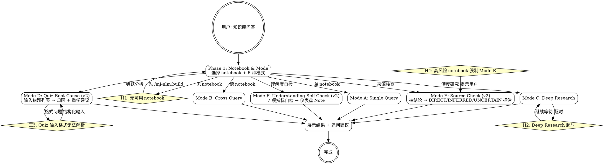

# mj-nlm:query

## Overview

对 NotebookLM notebook 进行 AI 问答。v2 在 v1 三种基础模式（Single / Cross / Deep Research）之上新增三个学习闭环模式：

| 模式 | v 版本 | 用途 |
|---|---|---|
| **A: Single Query** | v1 | 针对单 notebook 的具体问题 |
| **B: Cross Query** | v1 | 多 notebook 综合问答 |
| **C: Deep Research** | v1 | 异步深度研究 |
| **D: Quiz 错题 Root Cause**（v2 新） | v2 | 错题归因 + 重学建议 |
| **E: Source Check**（v2 新） | v2 | 关键结论可追溯性核查 |
| **F: Understanding Self-Check**（v2 新） | v2 | 7 项理解度量化指标自检 |

**前置 skill**：知识库构建使用 `/mj-nlm:build`；制品生成使用 `/mj-nlm:studio`；学习闭环编排使用 `/mj-nlm:learn`。

## Prerequisites

- 已有 notebook（推荐 v2 build 创建，含 `00c-定向-` 报告 + `00d-预检-` 报告）
- NLM MCP 服务已认证（认证问题参考 `/mj-nlm:auth`）
- Mode D 需要先有 Quiz 制品（`/mj-nlm:studio` artifact_type=quiz）+ 用户答题记录
- Mode E 需要有"上一轮回答"或用户提供的"待核查结论清单"

## Quick Start（交互模式）

| 已知信息 | 行动 |
|---|---|
| "问一下 DQV 的验证策略" | 定位 notebook → Mode A |
| "跨所有知识库搜索 ETL 模式" | Mode B |
| "深入研究 DQV 的架构演进" | Mode C |
| **"我的 quiz 错了 5 道，分析一下"**（v2） | Mode D |
| **"刚才的回答靠谱吗，能找到来源吗"**（v2） | Mode E |
| **"做一次理解度自检"**（v2） | Mode F |
| 未指定 notebook | Phase 1 列表选择 |

---

## Workflow


```dot
digraph nlm_query {
    rankdir=TB;
    node [shape=box, style=rounded];

    start [label="用户: 知识库问答", shape=doublecircle];

    P1 [label="Phase 1: Notebook & Mode\n选择 notebook + 6 种模式"];
    H1 [label="H1: 无可用 notebook", shape=diamond, style=filled, fillcolor="#ffffcc"];

    A [label="Mode A: Single Query"];
    B [label="Mode B: Cross Query"];
    C [label="Mode C: Deep Research"];
    H2 [label="H2: Deep Research 超时", shape=diamond, style=filled, fillcolor="#ffffcc"];

    D [label="Mode D: Quiz Root Cause (v2)\n输入错题列表 → 归因 + 重学建议"];
    H3 [label="H3: Quiz 输入格式无法解析", shape=diamond, style=filled, fillcolor="#ffffcc"];

    E [label="Mode E: Source Check (v2)\n抽结论 → DIRECT/INFERRED/UNCERTAIN 标注"];
    H4 [label="H4: 高风险 notebook 强制 Mode E", shape=diamond, style=filled, fillcolor="#ffffcc"];

    F [label="Mode F: Understanding Self-Check (v2)\n7 项指标自检 → 仪表盘 Note"];

    result [label="展示结果 + 追问建议"];
    DONE [label="完成", shape=doublecircle];

    start -> P1;
    P1 -> H1 [label="无 notebook"];
    H1 -> P1 [label="先 /mj-nlm:build"];

    P1 -> A [label="单 notebook"];
    P1 -> B [label="跨 notebook"];
    P1 -> C [label="深度研究"];
    P1 -> D [label="错题分析"];
    P1 -> E [label="来源核查"];
    P1 -> F [label="理解度自检"];

    C -> H2 [label="超时"];
    H2 -> C [label="继续等待"];

    D -> H3 [label="格式问题"];
    H3 -> D [label="结构化输入"];

    A -> result;
    B -> result;
    C -> result;
    D -> result;
    E -> result;
    F -> result;

    H4 -> E [label="提示用户"];

    result -> DONE;
}
```

---

### Phase 1: Notebook & Mode Selection

**确定查询目标和模式。** 不同模式适用于不同场景。

1. **选择 notebook**：`notebook_list()` → 用户选择或自动匹配
2. **选择查询模式**：

| 模式 | 工具 | 适用场景 |
|---|---|---|
| **A: Single** | `notebook_query()` | 针对特定 notebook 的具体问题 |
| **B: Cross** | `cross_notebook_query()` | 多 notebook 综合 |
| **C: Deep Research** | `research_start()` | 复杂问题深度分析 |
| **D: Quiz Root Cause** | `notebook_query()` + 错题 prompt | 错题归因（v2） |
| **E: Source Check** | `notebook_query()` + 结论标注 prompt | 可追溯性（v2） |
| **F: Self-Check** | `notebook_query()` + 7 项指标 prompt | 理解度（v2） |

3. 无可用 notebook → **H1**

**v2 模式选择建议**：
- 直接事实性问题 → Mode A
- 跨主题对比 / 综合 → Mode B
- 长篇研究、需要外部 Web 来源 → Mode C
- 答完 quiz 想知道为什么错 → Mode D
- 决策前确认依据 / 高风险类别 → Mode E（强制建议）
- 学习闭环结尾 / 想自评学到了多少 → Mode F

**高风险 notebook 自动提示 Mode E**：检测 `notebook_get(notebook_id)` 返回的 tag 含 `risk-class:high` → 在 Mode A/B/C 完成后弹窗 **H4**「该 notebook 含高风险类别，建议立即跑 Mode E 核查关键结论」。

---

### Mode A: Single Notebook Query（v1 沿用）

**对单个 notebook 进行问答。** 最常用模式。

```python
notebook_query(notebook_id, query="{用户问题}")
```

可选参数：
- `conversation_id` — 多轮追问
- `source_ids` — 限定 source 范围

`chat_configure(notebook_id, goal="{目标}")` 可设对话目标：
- `goal="default"` — 通用问答
- `goal="learning_guide"` — 学习场景
- `goal="custom"` — 自定义目标，配合 `custom_prompt`

展示查询结果，建议追问方向。

---

### Mode B: Cross Notebook Query（v1 沿用）

**跨多个 notebook 综合查询。**

```python
cross_notebook_query(query="{问题}", notebook_names="{名1}, {名2}")
```

筛选方式三选一：
- `notebook_names` — 名称或 ID
- `tags` — 逗号分隔标签
- `all=True` — 谨慎使用，有频率限制

---

### Mode C: Deep Research（v1 沿用）

**异步深度研究。**

1. `research_start(query="{研究问题}", source="web|drive", mode="fast|deep")`
2. 轮询 `research_status(notebook_id)` 直到 completed
3. `research_import(notebook_id, task_id)` 导入研究报告
4. 超时（10 分钟）→ **H2**

---

### Mode D: Quiz Error Root Cause（v2 新增）

**输入 Quiz 错题列表，输出每题的 root cause 归因 + 重学建议。** 实施方法论 §3.2 PMP 案例的"错题反馈"环节。

#### 输入格式

用户提供错题列表（任一形式）：

A. **粘贴文本**（推荐）：

```
错题 1
题干: ...
我的答案: ...
正确答案: ...
（可选）解析: ...

错题 2
...
```

B. **文件路径**：用户提供 quiz JSON / Markdown / HTML 路径，skill 自动解析

C. **AskUserQuestion 引导**：用户没有结构化错题时，让 skill 引导逐题录入

格式无法解析 → **H3**（提示用结构化格式）。

#### 调用 NLM

```python
notebook_query(
    notebook_id=...,
    query=QUIZ_ROOT_CAUSE_PROMPT,  # 详见 learning-loop-templates.md §3
)
```

prompt 详见 `→ ../mj-nlm-shared/learning-loop-templates.md#§3`。

#### 输出

每错题输出：
- root cause 分类（概念误解 / 例子混淆 / 边界不清 / 考试思维 / 来源记忆错位 / 推断错误）
- 关键失分点
- 重学建议（具体 source + 章节 + 建议生成的新制品 prompt）

错题数 ≥ 3 时附"综合分析"段。

#### 后续动作

skill 在结果末尾建议：
- 重生成针对性制品（call `/mj-nlm:studio` 用建议的 prompt）
- 重做 quiz（生成新一组 quiz 验证已学）
- 回到 `/mj-nlm:learn` 重启闭环（如多个错题指向同一概念）

---

### Mode E: Source Check（v2 新增）

**对结论列表逐条标注来源依据等级。** 实施方法论 §10.2 风险防护。

#### 输入

任一形式：

A. **从最近 conversation 抽取**（默认）：

```python
notebook_query(
    notebook_id=...,
    conversation_id="{上一轮 ID}",
    query=SOURCE_CHECK_PROMPT_AUTO_EXTRACT,  # 让 NLM 自抽结论再标注
)
```

B. **用户提供清单**：用户粘贴一段总结 / 解释，让 NLM 提取关键结论

#### 调用 NLM

prompt 详见 `→ ../mj-nlm-shared/risk-control-templates.md#4` + `learning-loop-templates.md#§5`。

#### 输出

每条结论一行：

```
[编号] [等级] | 来源章节 / 推断说明
等级：DIRECT | INFERRED | BACKGROUND | UNCERTAIN | CONTRADICTED
```

末尾给"通过率"= DIRECT 数 / 总结论数。

#### 高风险强制提示（H4）

检测 notebook tag 含 `risk-class:high` 且当前对话已超过 5 轮 → 主动建议跑 Mode E。

---

### Mode F: Understanding Self-Check（v2 新增）

**对 7 项理解度指标做交互式自检，输出「理解度仪表盘」Note。** 实施方法论 §9。

#### 流程

1. 读取 notebook 历史的 quiz 命中率（Mode D 的输出，如有）→ 自动填写指标 5
2. 读取 Mode E 历史的 Source Check 通过率 → 自动填写指标 6
3. 启动 7 题对话（详见 `→ ../mj-nlm-shared/learning-loop-templates.md#§7`）：

```
1) 你能在 10 分钟内说出本主题的大图吗？
2) 你能列出 ≥5 个核心术语并解释吗？
3) 你能说出 ≥3 个反例 / 不适用场景吗？
4) 你能解释成功 / 失败案例的机制吗？
5) [自动] 上次 Quiz 命中率？
6) [自动] 来源核查通过率？
7) 24h 后能否复述？（仅安排回访）
```

每答完一题：
- NLM 对比 source 给「一致性评分」（1-5）+ 简要反馈
- 评分 ≤ 3 时给"需要回看 source 的具体章节"

4. 综合输出仪表盘（详见 `→ ../mj-nlm-shared/understanding-metrics.md`）

5. 写 Note：`note(notebook_id, action="create", title="99-自检-理解度仪表盘-{YYYYMMDD}-{HHMM}", content=...)`

**写 Note 责任边界**：
- 用户**直接**调用 `/mj-nlm:query --mode=self-check` → 由 query 写 Note
- 通过 `/mj-nlm:learn` 编排（learn 的 Phase 8）调用 → query 仅返回结构化结果（dict / JSON），由 learn 统一汇总并写 Note（避免双写）
- query 通过环境标识 `LEARN_ORCHESTRATED=1` 或显式参数 `--no-write-note` 区分两种调用

#### 24h 回访（指标 7）

仪表盘 Note 中写入预约时间。用户可手动触发：

```
/mj-nlm:query --mode=recall <notebook_id>
```

skill 检测到 `--mode=recall` 时跳过指标 1-6，仅评估指标 7（不查材料的复述能力）。

#### 综合评级

依 7 项通过数：
- 入门（1-3 通过）
- 熟悉（4-6 通过）
- 掌握（7 项全通过，需 24h 回访确认）

详见 `→ ../mj-nlm-shared/understanding-metrics.md`。

---

## H-point 表格（v2 扩展）

| ID | 类型 | 触发 | 行为 |
|---|---|---|---|
| **H1** | Conditional | `notebook_list()` 为空或无匹配 | 引导先 `/mj-nlm:build` |
| **H2** | Warning | Deep Research 轮询超时（10 分钟） | 选择：继续等待 / 检查 status / 取消 |
| **H3** | Warning（**v2 新增**） | Mode D 错题输入格式无法解析 | 引导用户用结构化格式（题干 / 我的答案 / 正解）或上传 quiz 制品文件 |
| **H4** | Warning（**v2 新增**） | 高风险 tag notebook 完成 Mode A/B/C 但未跑 Mode E | 主动建议跑 Mode E 核查关键结论 |

---

## Examples

### 示例 1：Mode A 单 notebook 问答（v1 沿用）

```
用户：DQV 的验证策略有哪些？
→ 定位 MJ-system-mod-DQV-20260505
→ Mode A: notebook_query(query="DQV 有哪些验证策略？每种的职责？")
→ 展示结果 + 建议追问
```

### 示例 2：Mode D Quiz 错题归因（v2 新场景）

```
用户：我刚做完 DQV quiz，错了 5 道，帮我分析下
→ Mode D
→ 用户粘贴 5 道错题（题干 / 我的答案 / 正解）
→ NLM root cause 分析：
   错题 1: 概念误解（混淆"验证"与"清洗"）→ 重读 01-架构-DQV技术规范 §3
   错题 2: 边界不清（认为 DQV 处理无效字符）→ 重读 03-接口-DQV-router定义 §scope
   ...
   综合分析：3 道错指向"概念边界"，建议重生 audio(structural) 重学边界部分
→ 用户接受建议 → 转入 /mj-nlm:studio
```

### 示例 3：Mode E 来源核查（v2 新场景）

```
用户：刚才你说"DQV 默认丢弃所有无效行"，靠谱吗？
→ Mode E：抽取结论"DQV 默认丢弃所有无效行" + 上下文中其他结论
→ NLM 标注：
   [1] DIRECT | 来源 03-接口-router定义 §reject_invalid 默认 True
   [2] UNCERTAIN | 来源中没说所有无效行，仅 schema 错误的会丢弃
   [3] CONTRADICTED | 来源 06-代码-validation_service line 145 显示有 retry 逻辑
→ 通过率 1/3 (33%)，建议重新追问明确条件
```

### 示例 4：Mode F 理解度自检（v2 新场景）

```
用户：DQV 我学了 3 天，想看看自己理解到什么程度
→ Mode F
→ 7 题对话（用户答 + NLM 评分）
→ 仪表盘 Note 99-自检-理解度仪表盘-20260505-1430:
   1) 大图: 4/5 ✅
   2) 术语: 6/8 准确 ✅
   3) 反例: 3 valid ✅
   4) 案例: mechanistic ✅
   5) Quiz: 7/10 ❌（需 ≥7/10 中等）
   6) Source Check: 80% ✅
   7) 24h 回访: 预约 2026-05-06 14:30
→ 总评：熟悉（6/6 已评估通过；7 待回访）
→ 建议：补一轮 quiz 提升指标 5
```

### 示例 5：高风险 notebook 自动提示 Mode E（v2）

```
用户：（在 medical-compliance notebook 内）这种用药剂量是不是符合标准？
→ Mode A 回答完毕
→ 检测 tag risk-class:high → H4 提示：
   "⚠️ 该 notebook 含高风险类别（医疗），建议立即跑 Mode E 核查关键结论"
→ 用户接受 → Mode E 标注 4 条结论
   [1] DIRECT (来源明确)
   [2] BACKGROUND (来源中无依据)
   [3] UNCERTAIN
   [4] DIRECT
→ 通过率 50%，建议把 [2] 与 [3] 直接标记为不可作为决策依据
```

### 示例 6：Mode F 24h 复述（v2 新场景）

```
用户（24h 后）：/mj-nlm:query --mode=recall MJ-system-mod-DQV-20260505
→ 检测 --mode=recall → 跳过指标 1-6，仅评估指标 7
→ "请不查材料，向我复述 DQV 的核心架构"
→ 用户口述
→ NLM 评分 4/5（保留率高）
→ 更新 Note 99-自检-理解度仪表盘-20260505-1430 的指标 7：4/5 ✅
→ 总评：掌握（7 项全通过）
```

---

## Reference Files

- **`→ ../mj-nlm-shared/learning-loop-templates.md`** — Mode D/E/F 的 prompt 模板（§3 错题 root cause / §5 来源核查 / §7 理解度自检）
- **`→ ../mj-nlm-shared/risk-control-templates.md`** — Source Check 等级体系（DIRECT / INFERRED / BACKGROUND / UNCERTAIN / CONTRADICTED） + 高风险类别白名单
- **`→ ../mj-nlm-shared/understanding-metrics.md`** — 7 项指标定义、自评量表、仪表盘 Note 模板
