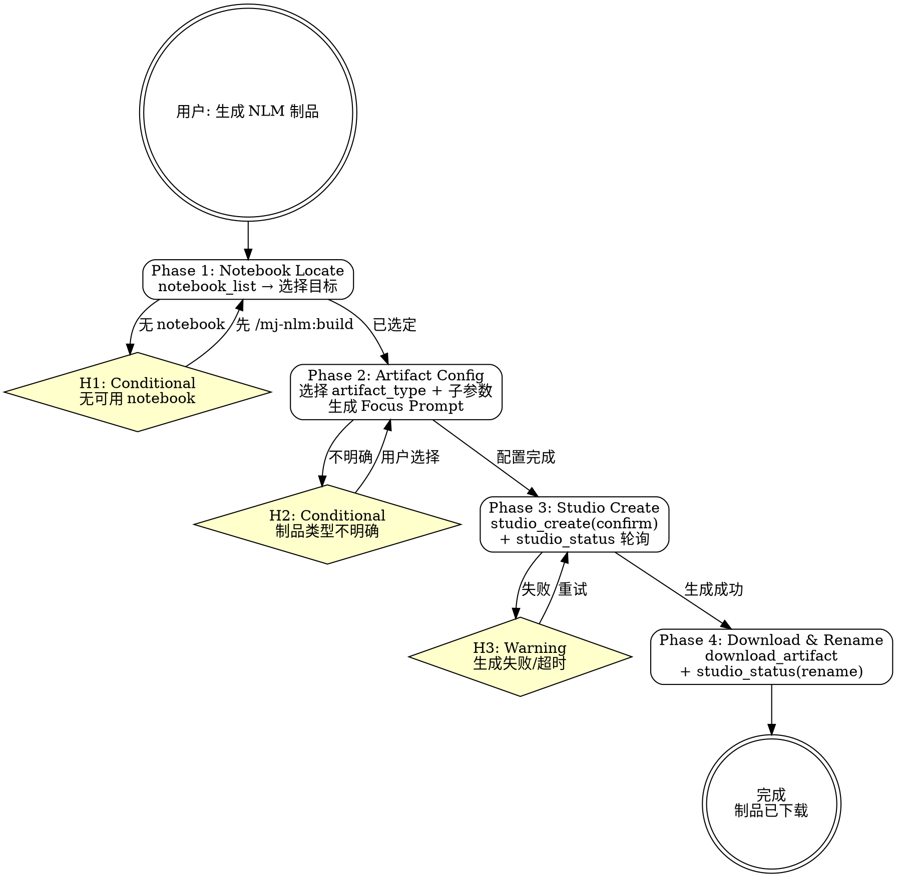

# mj-nlm:studio

## Overview

基于已有 NotebookLM notebook 生成 Studio 制品（音频/视频/信息图/幻灯片/报告/闪卡/测验/数据表/思维导图共 9 种类型）并下载到本地。通过 Focus Prompt 两层拼接策略控制制品内容方向。

**前置 skill**：知识库构建使用 `/mj-nlm:build`。

## Prerequisites

- 已有 notebook（通过 `/mj-nlm:build` 创建或已有）
- NLM MCP 服务已认证（认证问题参考 `/mj-nlm:auth`）

## Quick Start（交互模式）

| 已知信息 | 行动 |
|---------|------|
| "给 DQV 知识库生成音频" | 定位 notebook → 选 audio → Phase 2 |
| "生成幻灯片" 但未说明 notebook | Phase 1 列出 notebook 供选择 |
| "下载上次生成的视频" | 跳到 Phase 4（Download） |
| "修改幻灯片第 3 页" | 使用 `studio_revise()` 修订 |

---

## Workflow



---

### Phase 1: Notebook Locate

**定位目标 notebook。** 制品生成必须基于已有 notebook，需先确定目标。

1. `notebook_list()` → 获取所有 notebook
2. 若用户已提供 notebook 名称或 ID → 直接匹配
3. 若未指定 → 展示列表，AskUserQuestion 让用户选择
4. 无可用 notebook → **H1**（引导先执行 `/mj-nlm:build`）

---

### Phase 2: Artifact Config

**选择制品类型、子参数并生成 Focus Prompt。** artifact_type 决定输出格式，子参数控制风格细节，Focus Prompt 决定内容方向。

1. **选择 artifact_type**（9 种，详见 `→ ../mj-nlm-shared/artifact-type-reference.md`）：

   | artifact_type | 说明 | 输出格式 | 子参数 |
   |--------------|------|---------|--------|
   | `audio` | 音频播客 | MP4/MP3 | `audio_format`, `audio_length` |
   | `video` | 视频概述 | MP4 | `video_format`, `visual_style` |
   | `infographic` | 信息图 | PNG | `orientation`, `detail_level`, `infographic_style` |
   | `slide_deck` | 幻灯片 | PDF/PPTX | `slide_format`, `slide_length` |
   | `report` | 报告文档 | Markdown | `report_format`, `custom_prompt` |
   | `flashcards` | 闪卡 | JSON/MD/HTML | `difficulty` |
   | `quiz` | 测验 | JSON/MD/HTML | `question_count`, `difficulty` |
   | `data_table` | 数据表 | CSV | `description`（必填） |
   | `mind_map` | 思维导图 | JSON | `title` |

2. **选择子参数**（根据 artifact_type）：

   - **audio**：`audio_format` = `deep_dive`（默认）| `brief` | `critique` | `debate`；`audio_length` = `short` | `default` | `long`
   - **video**：`video_format` = `explainer`（默认）| `brief` | `cinematic`；`visual_style` = `auto_select`（默认）| `classic` | `whiteboard` 等
   - **slide_deck**：`slide_format` = `detailed_deck`（默认）| `presenter_slides`；`slide_length` = `short` | `default`
   - **report**：`report_format` = `Briefing Doc`（默认）| `Study Guide` | `Blog Post` | `Create Your Own`
   - **data_table**：`description` 必填，描述要提取的数据

   > 用户说"生成简报"→ `report` + `report_format="Briefing Doc"`。用户说"生成学习指南"→ `report` + `report_format="Study Guide"`。

3. **Focus Prompt 两层拼接**（详见 `→ ../mj-nlm-shared/focus-prompt-templates.md`）：

   - **Intent Layer** — 基于 artifact_type 选模板：
     - audio: `"面向{audience}的{topic}技术播客"`
     - slide_deck: `"面向{audience}的{topic}技术演示"`
     - report(Study Guide): `"帮助{audience}学习{topic}的系统指南"`
     - ...（每种类型有专属模板）

   - **Content Layer** — 从 `notebook_describe(notebook_id)` 提取 3-5 关键主题词，补充到 prompt

   - **元知识引导** — 追加引导句，引用导航大纲和项目上下文（详见 focus-prompt-templates.md「元知识引导句」）

   - **组合示例**：`"面向新人开发者的 DQV 三阶段验证管道技术播客，重点覆盖解压、验证、分发三个核心阶段，参考内容导航大纲理解材料间的逻辑关系和推荐阅读顺序，参考项目上下文理解知识库的定位和背景"`

4. **语言**：`language="zh"`（BCP-47 代码，中文输出）

---

### Phase 3: Studio Create

**创建制品并等待完成。** Studio 制品生成是异步的，需要轮询状态直到完成。

1. 调用 `studio_create`：

   ```
   studio_create(
       notebook_id="{id}",
       artifact_type="{type}",
       focus_prompt="{组合后的 prompt}",
       language="zh",
       confirm=True,
       # 附加子参数（如 audio_format="deep_dive"）
   )
   ```

   - `confirm=True` — 需用户确认后才真正开始生成
   - `source_ids` — 可选，限定使用的 source 范围

2. 轮询 `studio_status(notebook_id)` 直到状态为 `completed`
   - 轮询间隔：每 15 秒检查一次
   - 超时：5 分钟无进展 → **H3**
3. 生成失败 → **H3**（展示错误信息，选择重试或更换 artifact_type）

---

### Phase 4: Download & Rename

**下载制品到本地并重命名。** 下载确保制品在本地可用，重命名提升可读性。

1. 下载制品：

   ```
   download_artifact(
       notebook_id="{id}",
       artifact_type="{type}",
       output_path="{本地路径}"
   )
   ```

   - 默认下载路径：项目根目录下 `nlm-artifacts/`
   - 可选参数：
     - `artifact_id` — 指定制品 ID（默认下载最新）
     - `slide_deck_format` — slide_deck 专用：`"pdf"`（默认）| `"pptx"`
     - `output_format` — quiz/flashcards 专用：`"json"`（默认）| `"markdown"` | `"html"`

2. 重命名：`studio_status(notebook_id, action="rename", new_title="{中文标题}")`
   - 如 `"DQV 三阶段管道技术概述"`

---

### slide_deck 修订

`studio_revise()` 仅限 slide_deck 类型，支持逐页修订（注意：修订会创建新的 artifact）。

```
studio_revise(
    notebook_id="{id}",
    artifact_id="{从 studio_status 获取的 artifact ID}",
    slide_instructions=[
        {"slide": 3, "instruction": "添加 DQV 验证策略的流程图描述"},
        {"slide": 5, "instruction": "补充错误处理的三级降级说明"}
    ],
    confirm=True
)
```

修订后需重新 `studio_status()` 轮询 + `download_artifact()` 下载新版本。

---

## H-point 表格

| ID | 类型 | 触发条件 | 行为 |
|----|------|---------|------|
| **H1** | Conditional | `notebook_list()` 为空或无匹配 | 引导先执行 `/mj-nlm:build` 创建知识库 |
| **H2** | Conditional | 用户未指定 artifact_type 或需求不明确 | 展示 9 种类型的简要说明，AskUserQuestion |
| **H3** | Warning | `studio_create` 失败或轮询超时 | 展示错误信息，选择：重试 / 更换类型 / 检查 notebook 内容 |

---

## Handoff

制品生成完成后输出：

```
制品生成完成

Notebook: {notebook_name}
制品类型: {artifact_type}（{子参数}）
标题: {中文标题}
下载路径: {output_path}

下一步:
  - 继续生成其他制品 → /mj-nlm:studio
  - 知识问答 → /mj-nlm:query
  - 修订幻灯片（仅 slide_deck） → studio_revise
```

---

## Examples

### 示例 1：生成音频播客

```
用户：给 DQV 知识库生成一个音频概述
→ notebook_list() 找到 MJ-system-mod-DQV-20260315
→ artifact_type = audio, audio_format = brief
→ Focus Prompt: "面向开发者的 DQV 数据质量验证管道技术播客，重点覆盖解压、验证、分发三个核心阶段"
→ studio_create(artifact_type="audio", audio_format="brief", confirm=True) → 轮询 → download
```

### 示例 2：生成幻灯片并修订

```
用户：帮我做一个 DQV 的技术分享幻灯片
→ artifact_type = slide_deck, slide_format = detailed_deck
→ studio_create(confirm=True) → download
→ 用户："第 3 页太简单了，加点细节"
→ 从 studio_status 获取 artifact_id
→ studio_revise(artifact_id="{id}", slide_instructions=[{"slide": 3, "instruction": "展开 DQV 验证策略的详细流程"}], confirm=True)
→ 重新 download 新版本
```

### 示例 3：生成简报文档（report 子类型）

```
用户：给 DQV 生成一个简报文档
→ artifact_type = report, report_format = "Briefing Doc"
→ Focus Prompt: "面向管理层的 DQV 数据质量验证简报，提炼关键架构决策和运行状态要点"
→ studio_create(artifact_type="report", report_format="Briefing Doc", confirm=True)
→ download_artifact(artifact_type="report", output_path="nlm-artifacts/dqv-briefing.md")
```

---

## Reference Files

- **`→ ../mj-nlm-shared/artifact-type-reference.md`** — 9 种 artifact_type 参数速查 + 子参数详情 + 推荐组合（Phase 2 参考）
- **`→ ../mj-nlm-shared/focus-prompt-templates.md`** — Intent/Content 模板 + 组合示例（Phase 2 参考）
