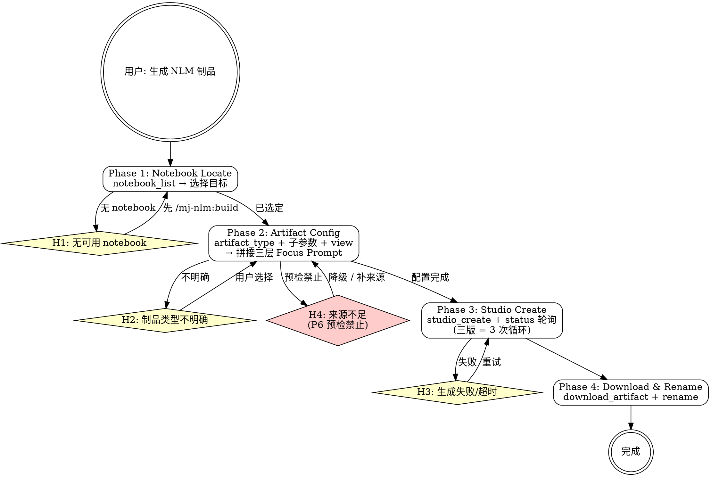

# mj-nlm:studio

## Overview

基于已有 NotebookLM notebook 生成 Studio 制品（音频/视频/信息图/幻灯片/报告/闪卡/测验/数据表/思维导图共 9 种类型）并下载到本地。通过 Focus Prompt 三层拼接策略 + 学习视角（view）控制制品内容方向。

v2 升级要点（相比 v1）：
- **学习导向 prompt**：focus-prompt-templates.md v2 全部重写为「学习闭环」导向（少术语 / 多类比 / 概念地图 / 反例 / 案例机制），不再仅服务 MJ 内部技术分享
- **三版生成（view 子参数）**：同 notebook 同 artifact_type 可生成 foundation / structural / challenge 三个难度版本（来自方法论 §8 同一内容三版）
- **默认幻觉防护**：所有 studio_create 调用自动追加固定约束句（来源引用、不编造案例、不足时明说）；可通过 `disable_guardrails=True` 关闭
- **优先引用 00c 定向报告**：v2 起 prompt 中强制引用 build skill Phase 7 生成的「领域定向报告」作为锚

**前置 skill**：知识库构建使用 `/mj-nlm:build`（v2 起包含 Phase 6 预检 + Phase 7 领域定向报告）。

## Prerequisites

- 已有 notebook（推荐通过 v2 `/mj-nlm:build` 创建，包含 `00c-定向-` 报告）
- NLM MCP 服务已认证（认证问题参考 `/mj-nlm:auth`）

## Quick Start（交互模式）

| 已知信息 | 行动 |
|---|---|
| "给 DQV 知识库生成音频" | 定位 notebook → 选 audio → Phase 2 |
| "生成幻灯片" 但未说明 notebook | Phase 1 列出 notebook 供选择 |
| "下载上次生成的视频" | 跳到 Phase 4（Download） |
| "修改幻灯片第 3 页" | 使用 `studio_revise()` 修订 |
| **"生成同主题的三版" / "零基础版+结构版+挑战版"**（v2） | Phase 2 选 view 模式 → 触发三次 studio_create |
| **"内部技术分享，不要约束句"**（v2 慎用） | Phase 2 设 `disable_guardrails=True`（高风险标签 notebook 强制忽略） |

---

## Workflow


```dot
digraph nlm_studio {
    rankdir=TB;
    node [shape=box, style=rounded];

    start [label="用户: 生成 NLM 制品", shape=doublecircle];

    P1 [label="Phase 1: Notebook Locate\nnotebook_list → 选择目标"];
    H1 [label="H1: 无可用 notebook", shape=diamond, style=filled, fillcolor="#ffffcc"];

    P2 [label="Phase 2: Artifact Config\nartifact_type + 子参数 + view\n→ 拼接三层 Focus Prompt"];
    H2 [label="H2: 制品类型不明确", shape=diamond, style=filled, fillcolor="#ffffcc"];
    H4 [label="H4: 来源不足\n(P6 预检禁止)", shape=diamond, style=filled, fillcolor="#ffcccc"];

    P3 [label="Phase 3: Studio Create\nstudio_create + status 轮询\n(三版 = 3 次循环)"];
    H3 [label="H3: 生成失败/超时", shape=diamond, style=filled, fillcolor="#ffffcc"];

    P4 [label="Phase 4: Download & Rename\ndownload_artifact + rename"];

    DONE [label="完成", shape=doublecircle];

    start -> P1;
    P1 -> H1 [label="无 notebook"];
    H1 -> P1 [label="先 /mj-nlm:build"];
    P1 -> P2 [label="已选定"];

    P2 -> H2 [label="不明确"];
    H2 -> P2 [label="用户选择"];
    P2 -> H4 [label="预检禁止"];
    H4 -> P2 [label="降级 / 补来源"];
    P2 -> P3 [label="配置完成"];

    P3 -> H3 [label="失败"];
    H3 -> P3 [label="重试"];
    P3 -> P4;

    P4 -> DONE;
}
```

---

### Phase 1: Notebook Locate

**定位目标 notebook。** 制品生成必须基于已有 notebook，需先确定目标。

1. `notebook_list()` → 获取所有 notebook
2. 若用户已提供 notebook 名称或 ID → 直接匹配
3. 若未指定 → 展示列表，AskUserQuestion 让用户选择
4. 无可用 notebook → **H1**（引导先执行 `/mj-nlm:build`）

**v2 附加检查**：
- 目标 notebook 是否含 `00c-定向-` source（领域定向报告）→ 没有则提示用户先跑 build Phase 7
- 目标 notebook 的 tag 中是否含 `risk-class:high` → 是则强制忽略 `disable_guardrails=True` 设置（详见 Phase 2）

---

### Phase 2: Artifact Config

**选择制品类型、子参数、view 视角，并生成三层拼接的 Focus Prompt。** v2 比 v1 多了 view 选择与 Guardrails 默认追加两个步骤。

#### Step 2.1：选择 artifact_type

9 种类型详见 `→ ../mj-nlm-shared/artifact-type-reference.md`。

#### Step 2.2：选择子参数

每个 artifact_type 有专属子参数（详见 artifact-type-reference）。v2 新增以下**横切**子参数：

| 子参数 | 取值 | 默认 | 适用 |
|---|---|---|---|
| `view` | `default` / `foundation` / `structural` / `challenge` | `default` | 所有 artifact_type |
| `disable_guardrails` | `True` / `False` | `False` | 所有 artifact_type；high-risk notebook 强制 `False` |
| `focus_prompt_template` | `legacy_*` 别名 | None | 迁移期 v1 兼容 |

**view 子参数详解**（来自方法论 §8）：

| view | 适用 | 风格 |
|---|---|---|
| `default` | 单一版本（v1 兼容） | 模板默认（学习导向但不分版本） |
| `foundation` | 第一次接触 | 少术语、多类比、多生活化例子 |
| `structural` | 建立知识框架 | 概念地图、层级、前置知识、适用边界 |
| `challenge` | 检验理解 | 反例、失败案例、迁移题、诊断题 |

#### Step 2.3：拼接 Focus Prompt（v2 三层）

```
Focus Prompt = Intent Layer + Content Layer + Guardrails Layer
```

**Intent Layer**（按 artifact_type × view 选模板，详见 `→ ../mj-nlm-shared/focus-prompt-templates.md`）

例（audio + view=foundation）：
> 面向{audience}的{topic}零基础版音频。主持人 A 与 B 用对话方式：A 假设听众没有任何背景，用日常生活类比开场...

**Content Layer**（v2 增强）：

1. 调用 `notebook_describe(notebook_id)` 获取 AI 摘要
2. **检查并读取 `00c-定向-{topic}领域定向报告` source**：
   - 存在：读取"核心概念地图"段
   - 不存在（旧 notebook 或 build 跳过 P7）：**降级**为仅用 notebook_describe 摘要 + AskUserQuestion 让用户手动输入 5-8 个关键概念词；同时提示「建议先跑 `/mj-nlm:build --resume <nbid>` 仅触发 P7 补齐 00c」
3. 提取 5-8 个关键概念词
4. 拼接到 `{topic}` 与"重点覆盖"字段

**Guardrails Layer**（v2 新增，默认追加）：

详见 `→ ../mj-nlm-shared/risk-control-templates.md#2`。约束句包括：
- 关键判断引用具体来源
- 不编造案例 / 数据 / 人名
- 来源不足时明说，不凑长度
- 参考 00c 领域定向报告
- 矛盾来源并列呈现

`disable_guardrails=True` 时跳过追加（high-risk tag 强制忽略此设置）。

#### Step 2.4：来源充足性预检（v2 新增）

读取 notebook 的 `00d-预检-来源充足性报告`（如有），按 `risk-control-templates.md §1` 的配比矩阵评估：

- ALLOW → 进入 Phase 3
- WARN → 提示用户降级建议但允许继续
- BLOCK → **H4**（强制降级或补来源）

如果 notebook 没有 00d 报告（旧 notebook 或 build Phase 6 跳过），降级为简单字数统计：< 5K 字符触发 **WARN**（不是 H4 BLOCK），允许继续但展示降级建议。仅当 00d 报告明确返回 BLOCK 时才触发 **H4** 硬阻断。

#### Step 2.5：语言

`language="zh"`（BCP-47），中文输出。其他语言需翻译模板（v2.0 仅支持中文）。

---

### Phase 3: Studio Create

**创建制品并等待完成。** 异步生成，需轮询。v2 三版模式触发 3 次循环。

#### 单版生成

```python
studio_create(
    notebook_id="{id}",
    artifact_type="{type}",
    focus_prompt="{三层拼接结果}",
    language="zh",
    confirm=True,
    view="{view 取值}",        # v2 新增
    # 其他 artifact_type 子参数
)
```

轮询 `studio_status(notebook_id)` 直到 status=`completed`：
- 间隔：每 15 秒
- 超时：5 分钟无进展 → **H3**

生成失败 → **H3**（展示错误，重试或更换类型）。

#### 三版生成（v2 新增）

当用户请求"生成三版"时，连续触发 3 次 studio_create，view 分别为 foundation / structural / challenge：

```python
for view in ("foundation", "structural", "challenge"):
    studio_create(
        notebook_id=...,
        artifact_type="audio",
        view=view,
        focus_prompt=build_prompt(view=view),
        language="zh",
        confirm=True,
    )
    studio_status(...)  # 轮询直到完成
```

**注意**：三版会触发 3 次配额消耗，长 audio 总耗时约 9-12 分钟。Phase 2 必须先告知用户成本。

#### 失败重试策略

| 级别 | 触发 | 行为 |
|---|---|---|
| L1 重试 | NLM 临时错误 | 等 30 秒重试 1 次 |
| L2 降级 view | view=challenge 失败 | 改为 view=structural 重试 |
| L3 降级 artifact | view 全失败 | 提示用户更换 artifact_type（如 video → infographic） |

---

### Phase 4: Download & Rename

**下载制品到本地并重命名。**

1. 下载制品：

```python
download_artifact(
    notebook_id="{id}",
    artifact_type="{type}",
    output_path="{本地路径}",
    # 可选 artifact_id, output_format, slide_deck_format
)
```

默认下载路径：项目根目录下 `nlm-artifacts/`。

**v2 三版命名后缀**：
- `nlm-artifacts/{title}-foundation.mp3`
- `nlm-artifacts/{title}-structural.mp3`
- `nlm-artifacts/{title}-challenge.mp3`

2. 重命名 NLM 上的制品标题：

```python
studio_status(notebook_id, action="rename", new_title="{中文标题}")
```

例：`"DQV 三阶段管道技术概述（结构版）"`

---

### slide_deck 修订（v1 沿用）

`studio_revise()` 仅限 slide_deck 类型，支持逐页修订（修订会创建新 artifact）。

```python
studio_revise(
    notebook_id="{id}",
    artifact_id="{id}",
    slide_instructions=[
        {"slide": 3, "instruction": "添加 DQV 验证策略的流程图描述"},
    ],
    confirm=True,
)
```

修订后重新 `studio_status()` 轮询 + `download_artifact()` 下载新版。

---

## H-point 表格（v2 扩展）

| ID | 类型 | 触发 | 行为 |
|---|---|---|---|
| **H1** | Conditional | `notebook_list()` 为空或无匹配 | 引导先 `/mj-nlm:build` |
| **H2** | Conditional | 用户未指定 artifact_type 或需求不明确 | 展示 9 种类型 + view 选项 |
| **H3** | Warning | studio_create 失败或轮询超时 | 重试 / 更换类型 / 检查 notebook 内容 |
| **H4** | Hard Block（**v2 新增**） | 来源充足性预检 BLOCK（如 1 页 PDF 请求 audio_long） | 强制降级 artifact_type 或提示先 `/mj-nlm:build` 补来源 |

---

## Handoff

制品生成完成后输出：

```
制品生成完成

Notebook: {notebook_name}
制品类型: {artifact_type}（view={view}, 子参数={...}）
标题: {中文标题}
下载路径: {output_path}
约束句: {applied / disabled / forced（high-risk 强制开）}

下一步:
  - 完整学习闭环 → /mj-nlm:learn
  - 继续生成其他制品 → /mj-nlm:studio
  - Quiz 错题 root cause / 来源核查 / 理解度自检 → /mj-nlm:query
  - 修订幻灯片（仅 slide_deck） → studio_revise
```

---

## Examples

### 示例 1：三版音频生成（v2 新场景）

```
用户：给 DQV 生成三版深度学习音频
→ Phase 1：定位 MJ-system-mod-DQV-20260505
→ Phase 2：artifact_type=audio, audio_format=brief（foundation） / default（structural & challenge）, view 三轮
→ Phase 2.3：三个 Intent Layer 模板分别填充，Content Layer 抽 00c 定向报告概念，Guardrails 默认追加
→ Phase 3：循环 3 次 studio_create（约 9 分钟）
→ Phase 4：下载 3 个文件 → DQV-foundation.mp3 / DQV-structural.mp3 / DQV-challenge.mp3
```

### 示例 2：内部技术分享关闭约束句（v2 慎用）

```
用户：给团队做 DQV 架构评审，简报里的约束句太啰嗦了
→ 检查 notebook tag：无 risk-class:high → 允许 disable_guardrails
→ Phase 2：artifact_type=report, report_format="Briefing Doc", disable_guardrails=True
→ Guardrails Layer 跳过，prompt 仅含 Intent + Content
→ Phase 3：生成 → Phase 4：下载
→ Handoff 标注 "约束句: disabled"
```

### 示例 3：高风险 notebook 强制开约束（v2）

```
用户：给医疗合规 notebook 生成 audio_long，关闭约束
→ 检查 tag：发现 risk-class:high → 忽略 disable_guardrails=True
→ Phase 2：Guardrails Layer 强制追加
→ Phase 3：生成
→ Handoff 标注 "约束句: forced（high-risk 强制开）"
```

### 示例 4：来源不足触发 H4

```
用户：给 1 页 PDF（约 2K 字符）的 notebook 生成 audio_long
→ Phase 2.4 预检：total_chars=2000 → BLOCK audio_long
→ H4 阻断，提示降级到 audio_brief 或 mind_map
→ 用户选择降级到 mind_map → 继续 Phase 3
```

### 示例 5：v1 兼容（legacy 模板）

```
用户：用旧的"技术播客"模板生成 audio
→ Phase 2：focus_prompt_template="legacy_audio_tech_podcast"
→ 直接使用 v1 旧模板，不走 v2 重写后的 Intent Layer
→ Guardrails 仍默认追加（除非显式 disable）
→ v2.3 此选项弃用，v2.4 移除
```

---

## Reference Files

- **`→ ../mj-nlm-shared/artifact-type-reference.md`** — 9 种 artifact_type 子参数详情 + v2 横切子参数（view / disable_guardrails / focus_prompt_template）
- **`→ ../mj-nlm-shared/focus-prompt-templates.md`** — Intent Layer 模板（v2 学习导向，按 artifact_type × view 组合）
- **`→ ../mj-nlm-shared/risk-control-templates.md`** — Guardrails Layer 约束句 + 预检矩阵 + 高风险类别
- **`→ ../mj-nlm-shared/learning-loop-templates.md`** — 三版提示词、Glossary 模板、机制分析模板
