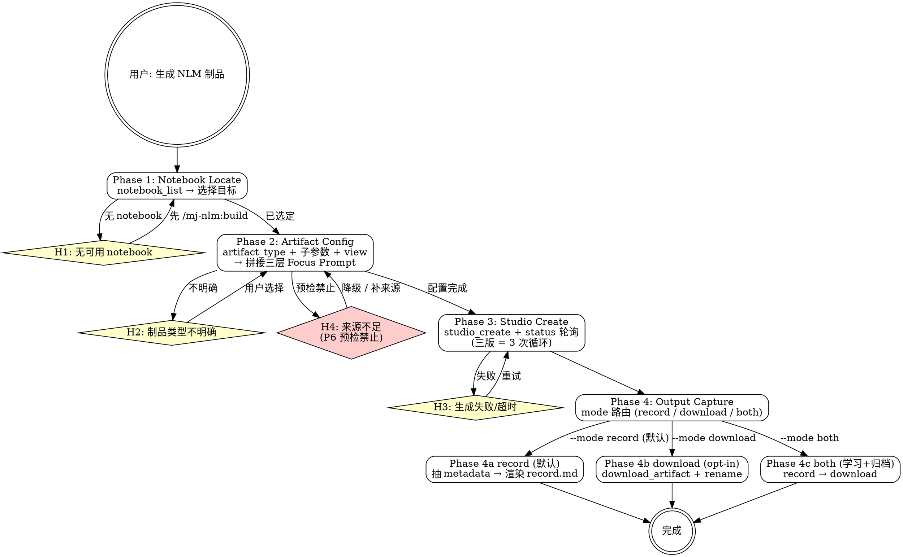

# mj-nlm:studio

## Overview

基于已有 NotebookLM notebook 生成 Studio 制品（音频/视频/信息图/幻灯片/报告/闪卡/测验/数据表/思维导图共 9 种类型）。通过 Focus Prompt 三层拼接策略 + 学习视角（view）控制制品内容方向。Phase 4 输出形态由 `--mode` 参数控制：默认渲染 record markdown 元信息（v2.1），可选下载二进制或两者并存。

v2.1 升级要点（相比 v2.0）：
- **Phase 4 三模式**：`--mode record`（默认，输出元信息 markdown）/ `--mode download`（仅下载二进制）/ `--mode both`（两者并存）
- **默认行为变更**：不再强制 `download_artifact` 到本地，对齐 mj-system / mj-agent learning 子系统「markdown 进 git，binary 永不入 git」约束
- **新增 record 模板引用**：`→ ../mj-nlm-shared/artifact-metadata-template.md` 定义 frontmatter schema + ≤ 50 行 body 范式
- **向后兼容**：现有 v2.0 用户的 download 路径仍可用（`--mode download`），仅默认值变化

v2 升级要点（相比 v1）：
- **学习导向 prompt**：focus-prompt-templates.md v2 全部重写为「学习闭环」导向（少术语 / 多类比 / 概念地图 / 反例 / 案例机制），不再仅服务 MJ 内部技术分享
- **三版生成（view 子参数）**：同 notebook 同 artifact_type 可生成 foundation / structural / challenge 三个难度版本（来自方法论 §8 同一内容三版）
- **默认幻觉防护**：所有 studio_create 调用自动追加固定约束句（来源引用、不编造案例、不足时明说）；可通过 `disable_guardrails=True` 关闭
- **优先引用 00c 定向报告**：v2 起 prompt 中强制引用 build skill Phase 7 生成的「领域定向报告」作为锚

**前置 skill**：知识库构建使用 `/mj-nlm:build`（v2 起包含 Phase 6 预检 + Phase 7 领域定向报告）。

## Prerequisites

- 已有 notebook（推荐通过 v2 `/mj-nlm:build` 创建，包含 `00c-定向-` 报告）
- NLM MCP 服务已认证（认证问题参考 `/mj-nlm:auth`）

## Quick Start（交互模式）

| 已知信息 | 行动 |
|---|---|
| "给 DQV 知识库生成音频" | 定位 notebook → 选 audio → Phase 2 → Phase 4 默认 record |
| "生成幻灯片" 但未说明 notebook | Phase 1 列出 notebook 供选择 |
| "下载上次生成的视频" | 跳到 Phase 4，`--mode download` |
| "修改幻灯片第 3 页" | 使用 `studio_revise()` 修订 |
| **"生成同主题的三版" / "零基础版+结构版+挑战版"**（v2） | Phase 2 选 view 模式 → 触发三次 studio_create → Phase 4 三份 record（或 download） |
| **"内部技术分享，不要约束句"**（v2 慎用） | Phase 2 设 `disable_guardrails=True`（高风险标签 notebook 强制忽略） |
| **"只要 metadata / 不下载 / 在线引用"**（v2.1 默认） | Phase 4 `--mode record`（默认即此） |
| **"既要 metadata 也要本地 mp3/pdf / 学习+归档"**（v2.1） | Phase 4 `--mode both` |
| **"必须本地有二进制 / 离线分享"**（v2.1 opt-in） | Phase 4 `--mode download` |

---

## Workflow


```dot
digraph nlm_studio {
    rankdir=TB;
    node [shape=box, style=rounded];

    start [label="用户: 生成 NLM 制品", shape=doublecircle];

    P1 [label="Phase 1: Notebook Locate\nnotebook_list → 选择目标"];
    H1 [label="H1: 无可用 notebook", shape=diamond, style=filled, fillcolor="#ffffcc"];

    P2 [label="Phase 2: Artifact Config\nartifact_type + 子参数 + view\n→ 拼接三层 Focus Prompt"];
    H2 [label="H2: 制品类型不明确", shape=diamond, style=filled, fillcolor="#ffffcc"];
    H4 [label="H4: 来源不足\n(P6 预检禁止)", shape=diamond, style=filled, fillcolor="#ffcccc"];

    P3 [label="Phase 3: Studio Create\nstudio_create + status 轮询\n(三版 = 3 次循环)"];
    H3 [label="H3: 生成失败/超时", shape=diamond, style=filled, fillcolor="#ffffcc"];

    P4 [label="Phase 4: Output Capture\nmode 路由 (record / download / both)"];
    P4_R [label="Phase 4a record (默认)\n抽 metadata → 渲染 record.md"];
    P4_D [label="Phase 4b download (opt-in)\ndownload_artifact + rename"];
    P4_B [label="Phase 4c both (学习+归档)\nrecord → download"];

    DONE [label="完成", shape=doublecircle];

    start -> P1;
    P1 -> H1 [label="无 notebook"];
    H1 -> P1 [label="先 /mj-nlm:build"];
    P1 -> P2 [label="已选定"];

    P2 -> H2 [label="不明确"];
    H2 -> P2 [label="用户选择"];
    P2 -> H4 [label="预检禁止"];
    H4 -> P2 [label="降级 / 补来源"];
    P2 -> P3 [label="配置完成"];

    P3 -> H3 [label="失败"];
    H3 -> P3 [label="重试"];
    P3 -> P4;

    P4 -> P4_R [label="--mode record (默认)"];
    P4 -> P4_D [label="--mode download"];
    P4 -> P4_B [label="--mode both"];
    P4_R -> DONE;
    P4_D -> DONE;
    P4_B -> DONE;
}
```

---

### Phase 0: Preflight Check (v2.4)

按 [`../mj-nlm-shared/preflight-checklist.md`](../mj-nlm-shared/preflight-checklist.md) 执行 L1 + L2（L3 在 Phase 1 锁定 notebook_id 后由 `notebook_describe()` 隐式覆盖）：

1. **L1 Auth Token** — `server_info()` → 失败走 **H0a** 引导 `/mj-nlm:auth`
2. **L2 NLM Service Health** — `notebook_list()` → `PERMISSION_DENIED` 走 **H0b** `/mj-nlm:auth`；其他错误走 **H0c** soft warn

**缓存**：5 min 内同会话同 skill 已通过 L1+L2 → 跳过本 Phase（`--force-recheck` 重跑）。

通过条件：L1 + L2 全 OK → 进 Phase 1 Notebook Locate。

---

### Phase 1: Notebook Locate

**定位目标 notebook。** 制品生成必须基于已有 notebook，需先确定目标。

1. `notebook_list()` → 获取所有 notebook
2. 若用户已提供 notebook 名称或 ID → 直接匹配
3. 若未指定 → 展示列表，AskUserQuestion 让用户选择
4. 无可用 notebook → **H1**（引导先执行 `/mj-nlm:build`）

**v2 附加检查**：
- 目标 notebook 是否含 `00c-定向-` source（领域定向报告）→ 没有则提示用户先跑 build Phase 7
- 目标 notebook 的 tag 中是否含 `risk-class:high` → 是则强制忽略 `disable_guardrails=True` 设置（详见 Phase 2）

---

### Phase 2: Artifact Config

**选择制品类型、子参数、view 视角，并生成三层拼接的 Focus Prompt。** v2 比 v1 多了 view 选择与 Guardrails 默认追加两个步骤。

#### Step 2.1：选择 artifact_type

9 种类型详见 `→ ../mj-nlm-shared/artifact-type-reference.md`。

#### Step 2.2：选择子参数

每个 artifact_type 有专属子参数（详见 artifact-type-reference）。v2 新增以下**横切**子参数：

| 子参数 | 取值 | 默认 | 适用 |
|---|---|---|---|
| `view` | `default` / `foundation` / `structural` / `challenge` | `default` | 所有 artifact_type |
| `disable_guardrails` | `True` / `False` | `False` | 所有 artifact_type；high-risk notebook 强制 `False` |
| `focus_prompt_template` | `legacy_*` 别名 | None | 迁移期 v1 兼容 |

**view 子参数详解**（来自方法论 §8）：

| view | 适用 | 风格 |
|---|---|---|
| `default` | 单一版本（v1 兼容） | 模板默认（学习导向但不分版本） |
| `foundation` | 第一次接触 | 少术语、多类比、多生活化例子 |
| `structural` | 建立知识框架 | 概念地图、层级、前置知识、适用边界 |
| `challenge` | 检验理解 | 反例、失败案例、迁移题、诊断题 |

#### Step 2.3：拼接 Focus Prompt（v2 三层）

```
Focus Prompt = Intent Layer + Content Layer + Guardrails Layer
```

**Intent Layer**（按 artifact_type × view 选模板，详见 `→ ../mj-nlm-shared/focus-prompt-templates.md`）

例（audio + view=foundation）：
> 面向{audience}的{topic}零基础版音频。主持人 A 与 B 用对话方式：A 假设听众没有任何背景，用日常生活类比开场...

**Content Layer**（v2 增强）：

1. 调用 `notebook_describe(notebook_id)` 获取 AI 摘要
2. **检查并读取 `00c-定向-{topic}领域定向报告` source**：
   - 存在：读取"核心概念地图"段
   - 不存在（旧 notebook 或 build 跳过 P7）：**降级**为仅用 notebook_describe 摘要 + AskUserQuestion 让用户手动输入 5-8 个关键概念词；同时提示「建议先跑 `/mj-nlm:build --resume <nbid>` 仅触发 P7 补齐 00c」
3. 提取 5-8 个关键概念词
4. 拼接到 `{topic}` 与"重点覆盖"字段

**Guardrails Layer**（v2 新增，默认追加）：

详见 `→ ../mj-nlm-shared/risk-control-templates.md#2`。约束句包括：
- 关键判断引用具体来源
- 不编造案例 / 数据 / 人名
- 来源不足时明说，不凑长度
- 参考 00c 领域定向报告
- 矛盾来源并列呈现

`disable_guardrails=True` 时跳过追加（high-risk tag 强制忽略此设置）。

#### Step 2.4：来源充足性预检（v2 新增）

读取 notebook 的 `00d-预检-来源充足性报告`（如有），按 `risk-control-templates.md §1` 的配比矩阵评估：

- ALLOW → 进入 Phase 3
- WARN → 提示用户降级建议但允许继续
- BLOCK → **H4**（强制降级或补来源）

如果 notebook 没有 00d 报告（旧 notebook 或 build Phase 6 跳过），降级为简单字数统计：< 5K 字符触发 **WARN**（不是 H4 BLOCK），允许继续但展示降级建议。仅当 00d 报告明确返回 BLOCK 时才触发 **H4** 硬阻断。

#### Step 2.5：语言

`language="zh"`（BCP-47），中文输出。其他语言需翻译模板（v2.0 仅支持中文）。

---

### Phase 3: Studio Create

**创建制品并等待完成。** 异步生成，需轮询。v2 三版模式触发 3 次循环。

#### 单版生成

```python
studio_create(
    notebook_id="{id}",
    artifact_type="{type}",
    focus_prompt="{三层拼接结果}",
    language="zh",
    confirm=True,
    view="{view 取值}",        # v2 新增
    # 其他 artifact_type 子参数
)
```

轮询 `studio_status(notebook_id)` 直到 status=`completed`：
- 间隔：每 15 秒
- 超时：5 分钟无进展 → **H3**

生成失败 → **H3**（展示错误，重试或更换类型）。

#### 三版生成（v2 新增）

当用户请求"生成三版"时，连续触发 3 次 studio_create，view 分别为 foundation / structural / challenge：

```python
for view in ("foundation", "structural", "challenge"):
    studio_create(
        notebook_id=...,
        artifact_type="audio",
        view=view,
        focus_prompt=build_prompt(view=view),
        language="zh",
        confirm=True,
    )
    studio_status(...)  # 轮询直到完成
```

**注意**：三版会触发 3 次配额消耗，长 audio 总耗时约 9-12 分钟。Phase 2 必须先告知用户成本。

#### 失败重试策略

| 级别 | 触发 | 行为 |
|---|---|---|
| L1 重试 | NLM 临时错误 | 等 30 秒重试 1 次 |
| L2 降级 view | view=challenge 失败 | 改为 view=structural 重试 |
| L3 降级 artifact | view 全失败 | 提示用户更换 artifact_type（如 video → infographic） |

---

### Phase 4: Output Capture

**v2.1 三模式输出。** 通过 `--mode` 参数选择制品产出形态：

| `--mode` | 输出 | 默认 | 适用场景 |
|---|---|---|---|
| `record` | 元信息 markdown（≤ 50 行 body） | ✅ | 学习闭环、团队共享、长期沉淀；二进制不入 git |
| `download` | 二进制本地文件 | — | 离线分享、外部演示、归档备份 |
| `both` | record + binary | — | 学习+归档场景 |

**模式不明确时**：默认走 `record`；如检测到用户语境含「下载」「本地」「mp3 / mp4 / pdf 文件」「离线」等关键词则提议 `download` 或 `both`，由用户确认。

#### Step 4.0：重命名 NLM 上的制品标题（所有模式通用）

无论何种 mode，都先重命名为人类可读标题，便于在 NotebookLM Studio 面板内定位：

```python
studio_status(notebook_id, action="rename", new_title="{中文标题}")
```

例：`"DQV 三阶段管道技术概述（结构版）"`

---

#### Step 4a — `--mode record`（默认）

**渲染元信息 markdown 到 vault，不调用 download_artifact。**

1. 调用 `studio_status(notebook_id)` 抽取制品元信息：
   - `artifact_id`（若 NLM 不返回 → 填 `unknown`）
   - `artifact_url`（v2.1 NLM 暂不暴露 artifact-level URL → 回退方案 B：与 `notebook_url` 同值）
   - `created_at`
   - 制品标题（Step 4.0 重命名后的值）

2. 询问用户输出路径（建议 `learning/<topic>/_nlm/<file>.md`）：
   - mj-system 项目：`<vault>/learning/<topic>/_nlm/`
   - mj-agent 项目：`<vault>/learning/<topic>/_nlm/`
   - 临时探索：`<vault>/_scratch/_nlm/`

3. 按 `→ ../mj-nlm-shared/artifact-metadata-template.md` 的 schema 渲染 markdown：
   - frontmatter 字段全填（`type: nlm-artifact-record` / `notebook_id` / `artifact_type` / `view` / `notebook_url` / `artifact_url` / `focus_prompt_summary` / `guardrails_enabled` / `created` / `state: active` / `version: v1.0`）
   - body ≤ 50 行：主题（2-3 行）/ 在线访问 / Focus Prompt 关键参数 / 与项目的关系 / 变更历史

4. 命名约定：`<artifact_type>-<view>-<short-topic>.md`
   - 例：`audio-foundation-dqv-overview.md`、`slide_deck-default-langgraph-agent-design.md`

5. 提示用户：
   - 渲染后的 record.md 路径
   - 「在线访问」段的 NotebookLM URL
   - 提醒：本 record markdown 进 git；二进制不在本地保存

**v2 三版命名后缀**：
- `audio-foundation-{topic}.md`
- `audio-structural-{topic}.md`
- `audio-challenge-{topic}.md`

---

#### Step 4b — `--mode download`（opt-in）

**沿用 v2.0 行为，下载二进制到本地。**

```python
download_artifact(
    notebook_id="{id}",
    artifact_type="{type}",
    output_path="{本地路径}",
    # 可选 artifact_id, output_format, slide_deck_format
)
```

默认下载路径：项目根目录下 `nlm-artifacts/`（用户可覆盖）。

**v2 三版命名后缀**：
- `nlm-artifacts/{title}-foundation.mp3`
- `nlm-artifacts/{title}-structural.mp3`
- `nlm-artifacts/{title}-challenge.mp3`

**重要提示**：本模式输出物（mp3 / mp4 / pdf 等）**不应**进入 git 仓库。在 mj-system / mj-agent learning 子系统场景下，二进制必须放在 vault `_scratch/` 或独立非 git 目录。

---

#### Step 4c — `--mode both`（学习+归档）

**先 record，再 download**：

1. 执行 Step 4a（渲染 record markdown 到 `learning/<topic>/_nlm/`）
2. 执行 Step 4b（下载二进制到用户指定路径，建议 `_scratch/` 或 vault 外）
3. 在 record.md 的「变更历史」段附加一行：`<YYYY-MM-DD>：本制品同时本地化为 <download_path>`

**适用场景**：学习闭环要 record（团队共享 + git 沉淀），同时本地保留二进制做离线复习/外部分享。

---

### slide_deck 修订（v1 沿用）

`studio_revise()` 仅限 slide_deck 类型，支持逐页修订（修订会创建新 artifact）。

```python
studio_revise(
    notebook_id="{id}",
    artifact_id="{id}",
    slide_instructions=[
        {"slide": 3, "instruction": "添加 DQV 验证策略的流程图描述"},
    ],
    confirm=True,
)
```

修订后重新 `studio_status()` 轮询 + `download_artifact()` 下载新版。

---

## H-point 表格（v2 扩展）

| ID | 类型 | 触发 | 行为 |
|---|---|---|---|
| **H1** | Conditional | `notebook_list()` 为空或无匹配 | 引导先 `/mj-nlm:build` |
| **H2** | Conditional | 用户未指定 artifact_type 或需求不明确 | 展示 9 种类型 + view 选项 |
| **H3** | Warning | studio_create 失败或轮询超时 | 重试 / 更换类型 / 检查 notebook 内容 |
| **H4** | Hard Block（**v2 新增**） | 来源充足性预检 BLOCK（如 1 页 PDF 请求 audio_long） | 强制降级 artifact_type 或提示先 `/mj-nlm:build` 补来源 |
| **H5** | Conditional（**v2.1 新增**） | Phase 4 mode 不明确（用户未指定且语境模糊） | 默认 `record`；如检测到「下载/本地/离线/mp3 文件」等关键词则 AskUserQuestion 在 record / download / both 三选一 |
| **H6** | Conditional（**v2.1 新增**） | Phase 4 record 模式但用户未指定输出路径 | 提议默认路径（mj-system: `learning/<topic>/_nlm/`；其他：用户输入） |

---

## Handoff

制品生成完成后输出（按 mode 分形态）：

```
制品生成完成

Notebook: {notebook_name}
制品类型: {artifact_type}（view={view}, 子参数={...}）
标题: {中文标题}
约束句: {applied / disabled / forced（high-risk 强制开）}
输出模式: {record | download | both}

# --mode record（v2.1 默认）
record markdown: {record_path}
NotebookLM URL: {notebook_url}
进 git: ✅（仅 markdown）

# --mode download
本地二进制: {output_path}
进 git: ❌（本地保留，请勿提交）

# --mode both
record markdown: {record_path}（进 git）
本地二进制: {output_path}（不进 git）

下一步:
  - 生成学习资料完整编排 → /mj-nlm:learn-make
  - 生成考察资料完整编排 → /mj-nlm:learn-test
  - 继续生成其他制品 → /mj-nlm:studio
  - Quiz 错题 root cause / 来源核查 / 理解度自检 → /mj-nlm:query
  - 修订幻灯片（仅 slide_deck） → studio_revise
```

---

## Examples

### 示例 1：三版音频生成（v2 + v2.1 默认 record）

```
用户：给 DQV 生成三版深度学习音频
→ Phase 1：定位 MJ-system-mod-DQV-20260505
→ Phase 2：artifact_type=audio, audio_format=brief（foundation） / default（structural & challenge）, view 三轮
→ Phase 2.3：三个 Intent Layer 模板分别填充，Content Layer 抽 00c 定向报告概念，Guardrails 默认追加
→ Phase 3：循环 3 次 studio_create（约 9 分钟）
→ Phase 4 (--mode record 默认)：
   渲染 3 份 record markdown 到 learning/dqv/_nlm/
     - audio-foundation-dqv-overview.md
     - audio-structural-dqv-overview.md
     - audio-challenge-dqv-overview.md
   每份含 NotebookLM URL + focus prompt 摘要 + 与 [LEARNING]_DQV.md 的双向 wikilink
   不下载任何 mp3
```

### 示例 1b：三版音频 + 离线归档（v2.1 both 模式）

```
用户：给 DQV 生成三版音频，要 metadata 也要本地 mp3
→ Phase 1-3 同示例 1
→ Phase 4 (--mode both)：
   1) 渲染 3 份 record markdown 到 learning/dqv/_nlm/
   2) 下载 3 份 mp3 到 ~/Downloads/nlm-archive/dqv/
   3) record.md 的「变更历史」追加：2026-05-08：本制品同时本地化为 ~/Downloads/nlm-archive/dqv/<title>-<view>.mp3
```

### 示例 2：内部技术分享关闭约束句（v2 慎用）

```
用户：给团队做 DQV 架构评审，简报里的约束句太啰嗦了
→ 检查 notebook tag：无 risk-class:high → 允许 disable_guardrails
→ Phase 2：artifact_type=report, report_format="Briefing Doc", disable_guardrails=True
→ Guardrails Layer 跳过，prompt 仅含 Intent + Content
→ Phase 3：生成 → Phase 4：下载
→ Handoff 标注 "约束句: disabled"
```

### 示例 3：高风险 notebook 强制开约束（v2）

```
用户：给医疗合规 notebook 生成 audio_long，关闭约束
→ 检查 tag：发现 risk-class:high → 忽略 disable_guardrails=True
→ Phase 2：Guardrails Layer 强制追加
→ Phase 3：生成
→ Handoff 标注 "约束句: forced（high-risk 强制开）"
```

### 示例 4：来源不足触发 H4

```
用户：给 1 页 PDF（约 2K 字符）的 notebook 生成 audio_long
→ Phase 2.4 预检：total_chars=2000 → BLOCK audio_long
→ H4 阻断，提示降级到 audio_brief 或 mind_map
→ 用户选择降级到 mind_map → 继续 Phase 3
```

### 示例 5：v1 兼容（legacy 模板）

```
用户：用旧的"技术播客"模板生成 audio
→ Phase 2：focus_prompt_template="legacy_audio_tech_podcast"
→ 直接使用 v1 旧模板，不走 v2 重写后的 Intent Layer
→ Guardrails 仍默认追加（除非显式 disable）
→ v2.3 此选项弃用，v2.4 移除
```

### 示例 6：v2.1 record 单制品（新场景）

```
用户：把 DQV 知识库生成一份 mind_map，但只要在线引用，不要下载 JSON
→ Phase 1：定位 MJ-system-mod-DQV-20260506
→ Phase 2：artifact_type=mind_map, view=default, language=zh
→ Phase 3：studio_create + 轮询完成
→ Phase 4 (--mode record)：
   - studio_status 抽 artifact_url（NLM 不暴露 → 回退 notebook_url）
   - 询问输出路径 → learning/dqv/_nlm/
   - 渲染 mind_map-default-dqv-overview.md（≤ 50 行 body）
   - frontmatter 含 notebook_url + 「在 notebook 内定位本制品」段
→ Handoff：本 record 进 git；二进制无；用户在 NotebookLM 在线浏览思维导图
```

### 示例 7：v2.1 download 显式离线（opt-in）

```
用户：v2.0 那种把 audio mp3 下到本地的旧行为还可以用吗？给我下一份
→ Phase 1-3 同
→ Phase 4 (--mode download)：
   - download_artifact → ~/Downloads/nlm-artifacts/<title>.mp3
   - 提示用户：本文件 5-55 MB，请勿提交到 git
→ 与 v2.0 行为一致；没有 record markdown 输出
```

---

## Reference Files

- **`→ ../mj-nlm-shared/artifact-type-reference.md`** — 9 种 artifact_type 子参数详情 + v2 横切子参数（view / disable_guardrails / focus_prompt_template）+ v2.1 三输出模式
- **`→ ../mj-nlm-shared/artifact-metadata-template.md`** — **v2.1 新增**：record markdown frontmatter schema + ≤ 50 行 body 范式 + 命名与存放规范
- **`→ ../mj-nlm-shared/focus-prompt-templates.md`** — Intent Layer 模板（v2 学习导向，按 artifact_type × view 组合）
- **`→ ../mj-nlm-shared/risk-control-templates.md`** — Guardrails Layer 约束句 + 预检矩阵 + 高风险类别
- **`→ ../mj-nlm-shared/learning-loop-templates.md`** — 三版提示词、Glossary 模板、机制分析模板
