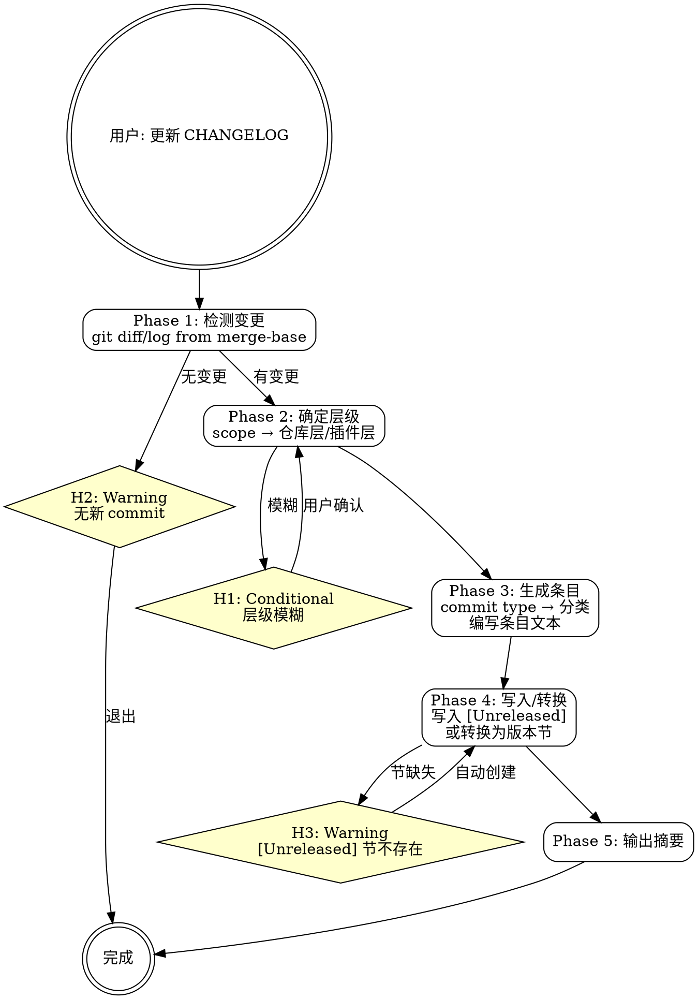

# mp-dev:changelog

## Overview

my-marketplace 个人插件市场仓库的 CHANGELOG 双层管理技能。分析 git diff/log 检测变更，自动判断目标层级（仓库层/插件层），生成符合 Keep a Changelog 格式的条目并写入 `[Unreleased]` 节。发布时支持将 `[Unreleased]` 转换为版本号节。

**互补 skill**：变更提交使用 `mp-git`，发布准备使用 `/mp-dev:release`。

## Prerequisites

- my-marketplace 仓库已 clone 到本地
- Git 已配置
- 有待记录的变更（commit 已创建或文件已修改）

## Quick Start（交互模式）

| 已知信息 | 行动 |
|---------|------|
| "更新 CHANGELOG" | Phase 1 检测变更 |
| "记录 mp-dev 的变更" | `--scope mp-dev` → 直接分析 mp-dev 相关 commit |
| "把 Unreleased 转成 1.1.0" | 直接 Phase 4（发布转换） |
| "没有新的 commit" | H2 告知无待记录变更 |

---

## Workflow



---

### Phase 1: 检测变更

**分析 git 历史，识别待记录的变更。**

1. 确定比较基准：

   ```bash
   git log --oneline $(git merge-base HEAD develop)..HEAD
   ```

   若在 develop 分支上，使用最后一个 release commit 或 tag 作为基准。

2. 获取变更文件列表：

   ```bash
   git diff --name-only $(git merge-base HEAD develop)..HEAD
   ```

3. 无新 commit → **H2**，告知无待记录变更并退出。

---

### Phase 2: 确定层级

**根据变更文件路径判断目标 CHANGELOG 层级。** 参考 `→ changelog-format.md` 的 scope 映射表。

使用 P2 范围确认模式。

**Scope → Layer 映射**：

| 变更路径模式 | Scope | 目标层级 |
|-------------|-------|---------|
| `plugins/mj-nlm/**` | `mj-nlm` | 插件层：`plugins/mj-nlm/CHANGELOG.md` |
| `plugins/mp-git/**` | `mp-git` | 插件层：`plugins/mp-git/CHANGELOG.md` |
| `plugins/mp-dev/**` | `mp-dev` | 插件层：`plugins/mp-dev/CHANGELOG.md` |
| `.claude-plugin/marketplace.json` | `marketplace` | 仓库层：`CHANGELOG.md` |
| `scripts/**` | `scripts` | 仓库层：`CHANGELOG.md` |
| `.github/**` | `ci` | 仓库层：`CHANGELOG.md` |
| `README.md`, `VERSION` | `docs` | 仓库层：`CHANGELOG.md` |

**跨层变更**：一次变更可能同时影响多个层级。例如新增插件时：
- 插件层记录 "初始发布"
- 仓库层记录 "新增 xxx 插件注册"

层级模糊时 → **H1**，通过 AskUserQuestion 确认。

---

### Phase 3: 生成条目

**将 commit 信息转换为 CHANGELOG 条目。** 参考 `→ changelog-format.md` 的 commit type 映射。

**Commit Type → Category 映射**：

| Commit Type | CHANGELOG Category |
|-------------|-------------------|
| `feat` | **Added** |
| `enhance` | **Changed** |
| `fix` | **Fixed** |
| `refactor` | **Changed** |
| `BREAKING CHANGE` | **Changed**（标注破坏性） |
| 删除功能 | **Removed** |
| 废弃预告 | **Deprecated** |
| 安全修复 | **Security** |
| `docs` / `chore` / `test` | 通常不记录，重要的记录为 **Changed** |

**条目编写规则**：
- 以 `- ` 开头
- 使用中文描述
- 面向用户视角，一句话说清一件事
- 关联 skill 时用反引号：`` `mp-dev:validate` ``

**生成方式**：
1. 逐个 commit 分析 type 和 scope
2. 合并同类变更（同一 skill 的多个 commit 合并为一条）
3. 按 Category 分组（Added → Changed → Fixed → Removed → ...）

展示生成的条目供用户确认和编辑。

---

### Phase 4: 写入或转换

**将条目写入 CHANGELOG 或执行发布转换。**

#### 常规写入（[Unreleased]）

1. 读取目标 CHANGELOG.md
2. 定位 `## [Unreleased]` 节
3. `[Unreleased]` 节不存在 → **H3**，自动创建
4. 将条目按 Category 插入到 `[Unreleased]` 下
5. 保持已有条目不变（追加新条目）

#### 发布转换

当用户明确要求"转换为版本号"或在 release 流程中：

1. 将 `[Unreleased]` 节内容剪切
2. 创建新版本节 `## [x.y.z] - YYYY-MM-DD`
3. 粘贴内容到新版本节
4. 保留空的 `[Unreleased]` 节标题

---

### Phase 5: 输出摘要

**展示 CHANGELOG 更新结果。** 使用 P4 结果展示模式。

```
CHANGELOG 更新完成

  目标:    <CHANGELOG 文件路径>
  层级:    <仓库层/插件层>
  新增条目: N 条
  分类:
    Added:   N 条
    Changed: N 条
    Fixed:   N 条

下一步:
  - 校验结构   → /mp-dev:validate
  - 准备发布   → /mp-dev:release
```

---

## H-point 表格

| ID | 类型 | 触发条件 | 行为 |
|----|------|---------|------|
| **H1** | Conditional | 变更层级无法自动判断（跨层或路径不在映射表中） | AskUserQuestion 确认目标层级 |
| **H2** | Warning | git log 分析无新 commit | 告知无待记录变更，建议先完成开发再更新 |
| **H3** | Warning | 目标 CHANGELOG.md 中没有 `[Unreleased]` 节 | 自动创建 `[Unreleased]` 节并告知 |

---

## Examples

### 示例 1：记录 mp-dev 插件变更

```
用户：更新 mp-dev 的 CHANGELOG
→ Phase 1: git log 发现 3 个 commit（feat: scaffold, feat: validate, fix: frontmatter）
→ Phase 2: scope=mp-dev → 插件层 plugins/mp-dev/CHANGELOG.md
→ Phase 3: 生成 2 Added + 1 Fixed 条目
→ Phase 4: 写入 [Unreleased]
→ 输出摘要
```

### 示例 2：记录仓库基础设施变更

```
用户：更新 CHANGELOG，我改了 CI 和 bump 脚本
→ Phase 1: git log 发现 2 个 commit
→ Phase 2: scope=ci,scripts → 仓库层 CHANGELOG.md
→ Phase 3: 生成 2 Changed 条目
→ Phase 4: 写入根目录 [Unreleased]
```

### 示例 3：发布时转换

```
用户：把 Unreleased 转成 1.1.0
→ Phase 4: 发布转换模式
→ [Unreleased] 内容移到 [1.1.0] - 2026-03-18
→ 保留空 [Unreleased] 节
```

---

## Reference Files

- **`→ changelog-format.md`** — 双层管理规则、scope 映射、commit type 映射、条目编写指南、转换格式
- **`→ ../mp-dev-shared/question-patterns.md`** — P2 范围确认、P4 结果展示模式
