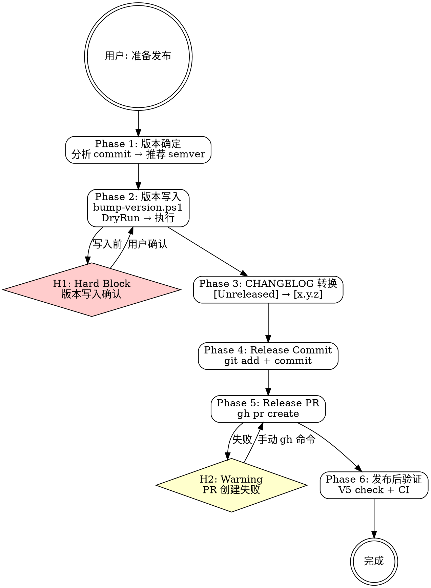

# mp-dev:release

## Overview

my-marketplace 个人插件市场仓库的发布准备技能。6 步工作流覆盖版本确定、bump 执行、CHANGELOG 转换、Release commit、Release PR 创建和发布后验证。支持自动检测受影响的 plugin 并推荐 semver 版本号。

**互补 skill**：变更记录使用 `/mp-dev:changelog`，校验使用 `/mp-dev:validate`。

## Prerequisites

- 当前在 develop 分支（或 release 分支）
- 所有目标变更已合并
- CI 全部通过
- PowerShell 可用（用于 bump-version.ps1）

## Quick Start（交互模式）

| 已知信息 | 行动 |
|---------|------|
| "准备发布" | Phase 1 分析 commit 推荐版本 |
| "发布 mp-dev 1.1.0" | 直接 Phase 2（scope=mp-dev, version=1.1.0） |
| "bump 所有版本" | Phase 1 检测所有受影响 plugin |
| "创建 release PR" | 跳到 Phase 5 |

---

## Workflow



---

### Phase 1: 版本确定

**分析 commit 历史，推荐 semver 版本号。**

1. 获取 commit 历史：

   ```bash
   git log --oneline $(git merge-base HEAD develop)..HEAD
   ```

   若在 develop 分支上，使用最近的 release tag 作为基准。

2. 分析 commit type，推荐版本级别：

   | 条件 | 推荐级别 | 示例 |
   |------|---------|------|
   | 含 `BREAKING CHANGE` | **MAJOR** | 1.0.0 → 2.0.0 |
   | 含 `feat` | **MINOR** | 1.0.0 → 1.1.0 |
   | 仅 `fix` / `enhance` / `refactor` | **PATCH** | 1.0.0 → 1.0.1 |

3. 检测受影响的 plugin（根据 commit scope 和变更路径）：

   ```bash
   git diff --name-only $(git merge-base HEAD develop)..HEAD
   ```

4. 读取各 plugin 当前版本：

   | Scope | 当前版本来源 |
   |-------|------------|
   | `marketplace` | `VERSION` 文件 |
   | `mj-nlm` | `plugins/mj-nlm/.claude-plugin/plugin.json` |
   | `mp-git` | `plugins/mp-git/.claude-plugin/plugin.json` |
   | `mp-dev` | `plugins/mp-dev/.claude-plugin/plugin.json` |

5. 展示推荐结果，等待用户确认或调整。

---

### Phase 2: 版本写入

**执行 bump-version.ps1 脚本。** 参考 `→ release-checklist.md`。

1. **DryRun 预览**（自动执行，无需确认）：

   ```powershell
   .\scripts\bump-version.ps1 -From "<current>" -To "<target>" -Scope "<scope>" -DryRun
   ```

2. 展示 DryRun 输出（将修改的文件和行）

3. **Hard Block (H1)**：版本写入确认

   使用 P3 破坏性确认模式（详见 `→ ../mp-dev-shared/question-patterns.md`）：

   ```
   即将执行版本写入：

     操作: 写入版本号 <current> → <target>
     Scope: <scope>
     影响:
       - <文件列表，来自 DryRun 输出>
     风险: 版本号写入后需要 git 操作才能回滚

   DryRun 结果已展示。请输入 "确认执行" 继续，或输入 "取消" 放弃。
   ```

4. 用户确认后执行写入：

   ```powershell
   .\scripts\bump-version.ps1 -From "<current>" -To "<target>" -Scope "<scope>"
   ```

5. **多 plugin 发布**：逐个 scope 执行 DryRun + 确认 + 写入。

---

### Phase 3: CHANGELOG 转换

**将 [Unreleased] 节转换为版本号节。**

1. 确定目标 CHANGELOG 文件（根据 scope）：
   - scope=marketplace → `CHANGELOG.md`（根目录）
   - scope=plugin → `plugins/<name>/CHANGELOG.md`

2. 读取 CHANGELOG 文件

3. 将 `[Unreleased]` 节内容转换：

   **转换前**：
   ```markdown
   ## [Unreleased]

   ### Added
   - xxx

   ### Fixed
   - xxx
   ```

   **转换后**：
   ```markdown
   ## [Unreleased]

   ## [<version>] - <YYYY-MM-DD>

   ### Added
   - xxx

   ### Fixed
   - xxx
   ```

4. 如果 `[Unreleased]` 节为空，提醒用户先使用 `/mp-dev:changelog` 生成条目。

---

### Phase 4: Release Commit

**创建版本发布 commit。**

1. 暂存受影响的文件：

   scope=marketplace：
   ```bash
   git add VERSION .claude-plugin/marketplace.json CHANGELOG.md
   ```

   scope=plugin：
   ```bash
   git add plugins/<name>/.claude-plugin/plugin.json .claude-plugin/marketplace.json plugins/<name>/CHANGELOG.md
   ```

2. 创建 commit：

   ```bash
   git commit -m "release(<scope>): v<version>

   - bump <scope> version to <version>
   - convert CHANGELOG [Unreleased] to [<version>]"
   ```

3. 推送到远端：

   ```bash
   git push origin develop
   ```

---

### Phase 5: Release PR

**创建发布 Pull Request。**

**MCP 自适应策略**：
- GitHub MCP 可用 → 使用 MCP 工具创建 PR
- GitHub MCP 不可用 → 生成 `gh` CLI 命令

**gh 命令模板**：

```bash
gh pr create \
  --title "release(<scope>): v<version>" \
  --body "$(cat <<'EOF'
## Summary
- Bump <scope> version from <old> to <new>
- Convert CHANGELOG [Unreleased] to [<version>]

## Checklist
- [ ] Version numbers consistent (V5 check)
- [ ] CHANGELOG properly formatted
- [ ] CI passes
EOF
)" \
  --base main
```

PR 创建失败 → **H2**，生成手动 `gh` 命令供用户执行。

---

### Phase 6: 发布后验证

**验证发布结果。**

| 检查项 | 方式 | 预期 |
|--------|------|------|
| 版本一致性 | `/mp-dev:validate` V5 检查 | PASS |
| CI 通过 | GitHub Actions | 全绿 |
| CHANGELOG 格式 | 阅读 CHANGELOG | `[version]` 节存在 |
| PR 状态 | `gh pr view` | Open，CI running |

输出最终摘要：

```
发布准备完成

  Scope:   <scope>
  版本:    <old> → <new>
  文件:
    ✓ plugin.json / VERSION 已更新
    ✓ marketplace.json 已更新
    ✓ CHANGELOG 已转换
  Commit:  <commit hash>
  PR:      <PR URL>

后续步骤:
  1. 等待 CI 通过
  2. Code Review
  3. 合并到 main
  4. release.yml 自动创建 tag + GitHub Release
```

---

## H-point 表格

| ID | 类型 | 触发条件 | 行为 |
|----|------|---------|------|
| **H1** | Hard Block | bump-version.ps1 执行前 | 展示 DryRun 结果，P3 破坏性确认，要求输入"确认执行" |
| **H2** | Warning | `gh pr create` 失败 | 展示错误信息，生成手动 gh 命令作为 fallback |
| **H3** | Warning | bump-version.ps1 脚本执行失败 | 中止后续步骤，展示错误信息和手动修复建议 |

---

## Examples

### 示例 1：单 plugin 发布

```
用户：发布 mp-dev 1.1.0
→ Phase 1: 确认 scope=mp-dev, current=1.0.0, target=1.1.0
→ Phase 2: DryRun → H1 确认 → 执行 bump
→ Phase 3: 转换 plugins/mp-dev/CHANGELOG.md
→ Phase 4: release(mp-dev): v1.1.0 commit
→ Phase 5: gh pr create
→ Phase 6: 验证 V5 PASS
```

### 示例 2：marketplace 级发布

```
用户：准备发布新版 marketplace
→ Phase 1: 分析 commit → 推荐 minor → marketplace 1.0.0 → 1.1.0
→ Phase 2: DryRun → 确认 → 执行
→ Phase 3: 转换根目录 CHANGELOG.md
→ Phase 4: release(marketplace): v1.1.0
→ Phase 5: PR
→ Phase 6: 验证
```

### 示例 3：多 plugin 同时发布

```
用户：mp-dev 和 mp-git 都需要发布
→ Phase 1: mp-dev 1.0.0→1.1.0 (feat), mp-git 1.0.0→1.0.1 (fix)
→ Phase 2: 逐个 DryRun + 确认 + 执行
→ Phase 3: 逐个转换 CHANGELOG
→ Phase 4: 合并为一个 release commit
→ Phase 5: 一个 PR
→ Phase 6: 验证
```

---

## Reference Files

- **`→ release-checklist.md`** — 6 步发布工作流详细定义、scope 值、bump-version.ps1 用法、多 plugin 发布
- **`→ ../mp-dev-changelog/changelog-format.md`** — CHANGELOG 转换格式（Phase 3 参考）
- **`→ ../mp-dev-shared/question-patterns.md`** — P3 破坏性确认、P4 结果展示模式
