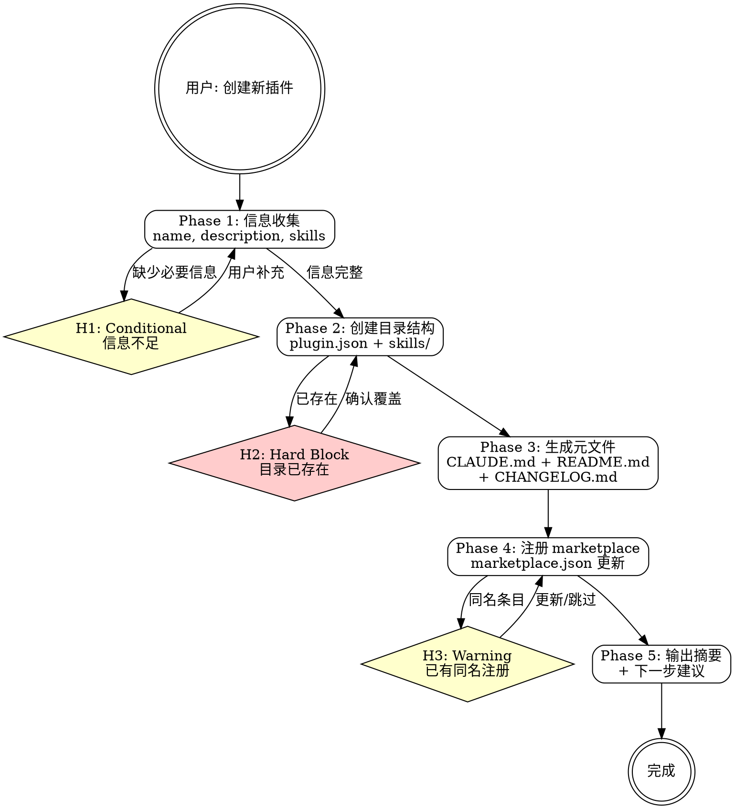

# mp-dev:scaffold

## Overview

my-marketplace 个人插件市场仓库的插件脚手架生成技能。根据用户提供的插件名称、描述和技能列表，自动创建完整的插件目录结构、元数据文件和 marketplace.json 注册条目。

**互补 skill**：脚手架创建后使用 `/mp-dev:skill-author` 编写 SKILL.md，使用 `/mp-dev:validate` 校验结构。

## Prerequisites

- my-marketplace 仓库已 clone 到本地
- 对 `plugins/` 目录有写入权限

## Quick Start（交互模式）

| 已知信息 | 行动 |
|---------|------|
| "创建一个新插件" 但未说明详情 | Phase 1 信息收集 |
| 指定了名称和描述 | 推断技能列表 → Phase 2 |
| "创建 mp-xxx 插件，包含 auth 和 query 技能" | 直接 Phase 2 |
| 目标目录已存在 | H2 确认覆盖 |

---

## Workflow



---

### Phase 1: 信息收集

**收集创建插件所需的基本信息。** 使用 P1 信息收集模式（详见 `→ ../mp-dev-shared/question-patterns.md`）。

需要收集的信息：

| 参数 | 必填 | 默认值 | 说明 |
|------|------|--------|------|
| `name` | 是 | — | 插件名称，如 `mp-xxx` |
| `description` | 是 | — | 中文描述，50-150 字符 |
| `skills` | 是 | — | 技能名称列表，逗号分隔 |
| `version` | 否 | `1.0.0` | 初始版本号 |
| `author` | 否 | `ranzuozhou` | 作者名 |
| `license` | 否 | `MIT` | 开源协议 |
| `keywords` | 否 | 从 description 提取 | 关键词列表 |
| `category` | 否 | `development` | marketplace 分类 |

信息不足 → 触发 **H1**，通过 AskUserQuestion 一次收集所有缺失信息。

---

### Phase 2: 创建目录结构

**创建插件的完整目录树。** 参考 `→ plugin-template.md` 的标准结构。

1. 检查 `plugins/<name>/` 是否已存在 → 已存在触发 **H2**
2. 创建目录结构：

```
plugins/<name>/
├── .claude-plugin/
│   └── plugin.json
├── skills/
│   ├── <name>-<skill-1>/
│   │   └── SKILL.md          (空骨架)
│   ├── <name>-<skill-2>/
│   │   └── SKILL.md          (空骨架)
│   └── <name>-shared/        (空目录)
├── CLAUDE.md
├── README.md
└── CHANGELOG.md
```

3. 生成 `plugin.json`：

```json
{
  "name": "<name>",
  "description": "<description>",
  "version": "1.0.0",
  "author": { "name": "ranzuozhou" },
  "repository": "https://github.com/ranzuozhou/my-marketplace",
  "license": "MIT",
  "keywords": ["<keyword1>", "<keyword2>"],
  "skills": "./skills/"
}
```

4. 为每个 skill 创建 SKILL.md 骨架：

```markdown
---
name: <skill-name>
description: >
  在 my-marketplace 个人插件市场仓库中，当用户提到 <待填写触发词> 时使用此技能。
  不适用于 mj-system、不适用于服务级开发、不适用于 mj-agentlab-marketplace。
---

# <plugin-name>:<skill-name>

## Overview

<待编写>

## Prerequisites

- <待编写>

## Workflow

<待编写>

## H-point 表格

| ID | 类型 | 触发条件 | 行为 |
|----|------|---------|------|

## Examples

<待编写>

## Reference Files

<待编写>
```

---

### Phase 3: 生成元文件

**生成 CLAUDE.md、README.md 和 CHANGELOG.md。** 参考 `→ plugin-template.md` 的骨架模板。

1. **CLAUDE.md** — 包含 skill 表格、MCP 依赖说明、调用约定、文件结构
2. **README.md** — 包含功能表、安装方式（`@my-marketplace`）、验证步骤、自然语言触发示例
3. **CHANGELOG.md** — 包含 `[Unreleased]` 和 `[1.0.0] - <当日日期>` 的 Added 节

---

### Phase 4: 注册 marketplace

**在 marketplace.json 中注册新插件。**

1. 读取 `.claude-plugin/marketplace.json`
2. 检查 `plugins` 数组中是否已有同名条目 → 有则触发 **H3**（选择更新或跳过）
3. 添加新条目：

```json
{
  "name": "<name>",
  "source": "./plugins/<name>",
  "description": "<description>",
  "version": "1.0.0",
  "author": { "name": "ranzuozhou" },
  "category": "<category>",
  "keywords": ["<keyword1>", "<keyword2>"],
  "license": "MIT"
}
```

4. 写回 marketplace.json（保持格式缩进一致）

---

### Phase 5: 输出摘要

**展示创建结果和下一步建议。** 使用 P4 结果展示模式。

输出模板：

```
插件脚手架创建完成

  插件名称: <name>
  目录:     plugins/<name>/
  文件:
    ✓ .claude-plugin/plugin.json
    ✓ CLAUDE.md
    ✓ README.md
    ✓ CHANGELOG.md
    ✓ skills/<name>-<skill-1>/SKILL.md
    ✓ skills/<name>-<skill-2>/SKILL.md
    ✓ skills/<name>-shared/
  注册:     marketplace.json 已更新

下一步:
  - 编写 SKILL.md  → /mp-dev:skill-author
  - 校验结构       → /mp-dev:validate
  - 开始测试       → /mp-dev:test
```

---

## H-point 表格

| ID | 类型 | 触发条件 | 行为 |
|----|------|---------|------|
| **H1** | Conditional | name / description / skills 信息不足 | AskUserQuestion 收集缺失信息，展示默认值 |
| **H2** | Hard Block | `plugins/<name>/` 目录已存在 | 展示已有内容，确认覆盖或选择新名称 |
| **H3** | Warning | marketplace.json 中已有同名条目 | 展示已有条目，选择更新或跳过 |

---

## Examples

### 示例 1：完整信息创建

```
用户：创建一个 mp-monitor 插件，包含 health 和 alert 两个技能，用于系统健康监控
→ name=mp-monitor, description="系统健康监控插件 — 提供健康检查和告警管理能力", skills=health,alert
→ 创建目录结构 + plugin.json + CLAUDE.md + README.md + CHANGELOG.md
→ 注册 marketplace.json
→ 输出创建摘要
```

### 示例 2：最小信息创建

```
用户：创建一个新插件
→ H1: 收集 name, description, skills
→ 用户补充：mp-data, "数据处理工具集", "transform, export"
→ 使用默认值（version=1.0.0, author=ranzuozhou, license=MIT）
→ 创建并注册
```

### 示例 3：目录已存在

```
用户：创建 mp-dev 插件
→ H2: plugins/mp-dev/ 已存在，包含 6 个 skill
→ 用户选择覆盖 / 改名
```

---

## Reference Files

- **`→ plugin-template.md`** — 标准目录结构、默认值表、plugin.json schema、元文件骨架模板
- **`→ ../mp-dev-shared/question-patterns.md`** — P1 信息收集、P3 破坏性确认、P4 结果展示模式
