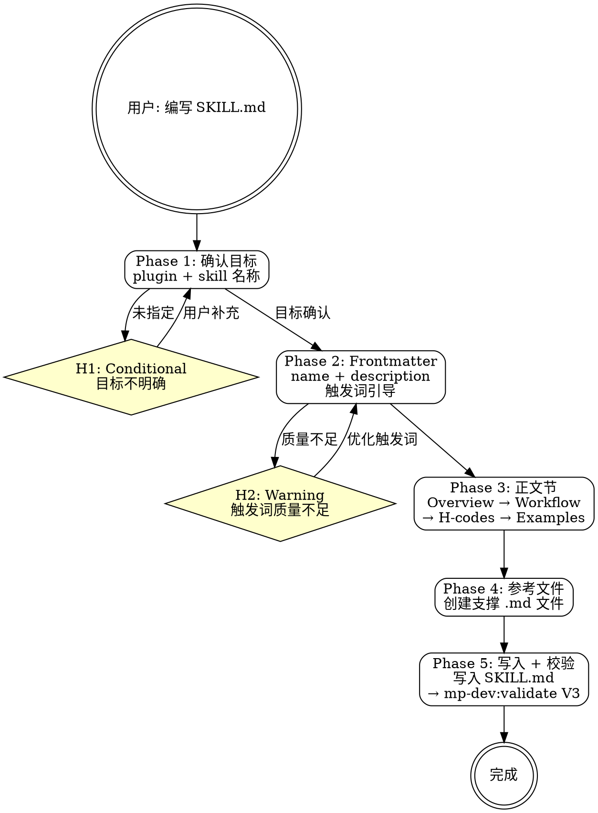

# mp-dev:skill-author

## Overview

my-marketplace 个人插件市场仓库的 SKILL.md 编写辅助技能。引导用户完成 SKILL.md 的各个节，确保 frontmatter 规范、触发词质量和结构完整性。支持创建配套的参考文件。

**互补 skill**：脚手架使用 `/mp-dev:scaffold`，编写后校验使用 `/mp-dev:validate`。

## Prerequisites

- 目标 plugin 目录已存在（通过 `/mp-dev:scaffold` 创建或手动创建）
- 目标 skill 目录已存在

## Quick Start（交互模式）

| 已知信息 | 行动 |
|---------|------|
| "帮我写 SKILL.md" 但未指定 plugin/skill | Phase 1 确认目标 |
| "给 mp-dev 的 validate 写 SKILL.md" | 直接 Phase 2 |
| "改进触发词" | 跳到 Phase 2 frontmatter 环节 |
| "添加参考文件" | 跳到 Phase 4 |

---

## Workflow



---

### Phase 1: 确认目标

**确认要编写 SKILL.md 的 plugin 和 skill。**

1. 确认目标 plugin 名称（如 `mp-dev`）
2. 确认目标 skill 名称（如 `validate`）
3. 确认 skill 目录存在：`plugins/<plugin>/skills/<plugin>-<skill>/`
4. 目标不明确 → **H1**，列出当前 marketplace 中的 plugin 和 skill 供选择

---

### Phase 2: Frontmatter 编写

**生成符合规范的 YAML frontmatter。** 参考 `→ skill-template.md` 的 frontmatter 规范。

1. **name 字段**：与 skill 目录名中 `<plugin>-` 后的部分一致

2. **description 字段**：引导生成符合质量要求的 description

   质量检查清单：
   - [ ] 包含项目标识："在 my-marketplace 个人插件市场仓库中"
   - [ ] 中文触发词 >= 3 个
   - [ ] 英文触发词 >= 3 个
   - [ ] 总长度 50-300 字符
   - [ ] 包含排除声明："不适用于 mj-system、不适用于服务级开发、不适用于 mj-agentlab-marketplace"
   - [ ] 触发词与同 plugin 内其他 skill 不重叠

3. 质量不足 → **H2**，给出改进建议

**description 模板**：

```yaml
description: >
  在 my-marketplace 个人插件市场仓库中，当用户提到 <中文触发词1>, <中文触发词2>,
  <中文触发词3>, <更多中文触发词>, 或 <英文触发词1>, <英文触发词2>,
  <英文触发词3>, <更多英文触发词> 时使用此技能。
  不适用于 mj-system、不适用于服务级开发、不适用于 mj-agentlab-marketplace。
```

---

### Phase 3: 正文节编写

**引导编写 SKILL.md 的各个正文节。** 按模板节结构逐一引导。

编写顺序：

1. **Overview** — 一句话概述 + 互补 skill
2. **Prerequisites** — 前置条件列表
3. **Quick Start** — 场景→行动映射表
4. **Workflow** — DOT 流程图 + Phase 详细步骤
5. **H-point 表格** — 每个 Phase 的控制点
6. **Handoff**（可选）— 完成后的输出模板
7. **Examples** — 2-3 个典型场景
8. **Reference Files** — 引用的支撑文件

**编写指导**：

- 使用祈使句（写给 Claude 的指令）
- Phase 步骤要具体到工具调用级别
- H-point 覆盖所有可能的异常和决策点
- 示例要体现 "用户输入 → 推断 → 执行 → 结果" 的完整链路

---

### Phase 4: 参考文件创建

**创建 SKILL.md 引用的支撑参考文件。**

1. 根据 SKILL.md 中 Reference Files 节列出的文件，逐个创建
2. 参考文件放在 skill 同级目录或 shared 目录
3. 文件格式遵循 Markdown，包含清晰的标题和分节

**命名约定**：
- 与 skill 相关的参考文件：放在 `skills/<plugin>-<skill>/` 目录
- 多 skill 共享的参考文件：放在 `skills/<plugin>-shared/` 目录

---

### Phase 5: 写入并校验

**写入 SKILL.md 并调用校验。**

1. 将完整的 SKILL.md 内容写入 `plugins/<plugin>/skills/<plugin>-<skill>/SKILL.md`
2. 调用 `/mp-dev:validate --scope <plugin>` 的 V3 检查，验证 frontmatter 格式正确
3. 展示写入结果

---

## H-point 表格

| ID | 类型 | 触发条件 | 行为 |
|----|------|---------|------|
| **H1** | Conditional | 未指定目标 plugin 或 skill | 列出现有 plugin/skill 目录供选择 |
| **H2** | Warning | description 触发词数量不足或长度不符 | 展示质量检查结果，给出改进建议 |

---

## Examples

### 示例 1：为新 skill 编写 SKILL.md

```
用户：给 mp-dev 的 validate 写 SKILL.md
→ Phase 1: 确认 plugins/mp-dev/skills/mp-dev-validate/ 存在
→ Phase 2: 生成 frontmatter（name=validate, description 含 6+ 触发词）
→ Phase 3: 逐节编写（Overview → Workflow → H-codes → Examples → References）
→ Phase 4: 创建 validation-rules.md 参考文件
→ Phase 5: 写入 SKILL.md → validate V3 PASS
```

### 示例 2：改进已有 SKILL.md 的触发词

```
用户：改进 mp-dev:scaffold 的触发词
→ Phase 1: 确认目标
→ Phase 2: 读取现有 description → 评估质量 → 建议增加触发词
→ H2: 当前只有 2 个英文触发词，建议增加到 3+
→ 写入更新后的 frontmatter
```

### 示例 3：创建完整 skill 包

```
用户：帮我写一个新的 skill，包含 SKILL.md 和参考文件
→ Phase 1: 收集 plugin 名、skill 名
→ Phase 2-3: 完整编写 SKILL.md
→ Phase 4: 创建 1-2 个参考文件
→ Phase 5: 写入并校验
```

---

## Reference Files

- **`→ skill-template.md`** — SKILL.md 完整模板、frontmatter 规范、节结构、质量要求、模式参考路径
- **`→ ../mp-dev-shared/question-patterns.md`** — P1 信息收集模式（Phase 1 参考）
