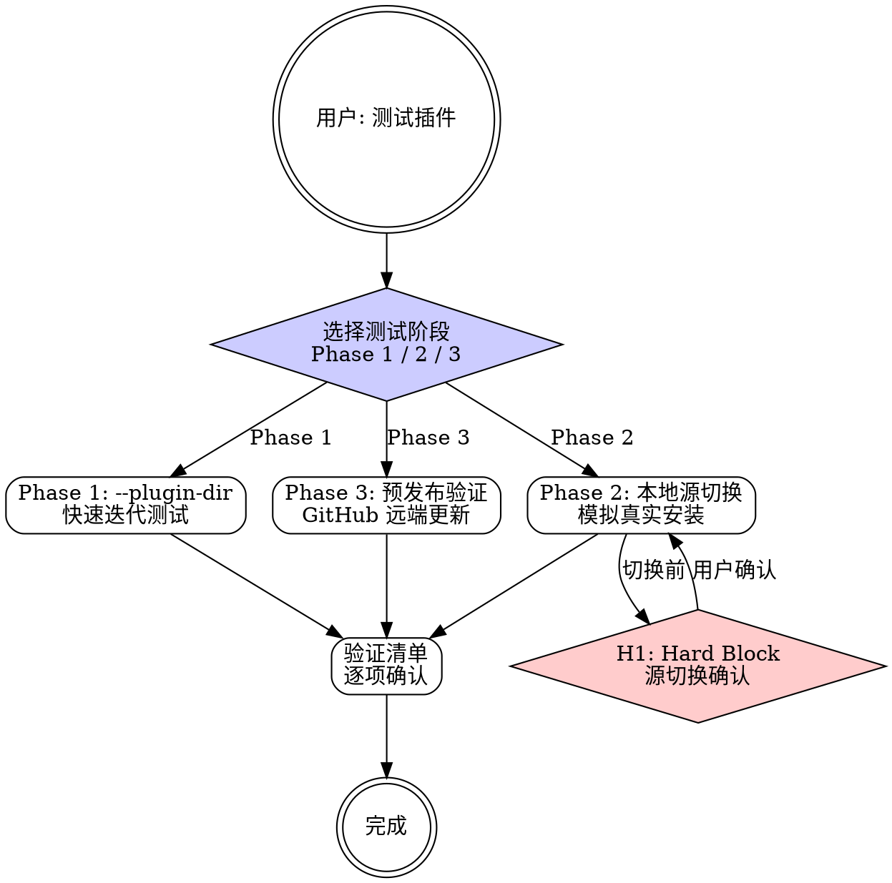

# mp-dev:test

## Overview

my-marketplace 个人插件市场仓库的 3 阶段测试工作流技能。从开发期快速迭代到预发布验证，渐进式提升测试覆盖度。支持 Bash 和 PowerShell 双平台命令。

**互补 skill**：测试前校验使用 `/mp-dev:validate`，测试后更新日志使用 `/mp-dev:changelog`。

## Prerequisites

- Claude Code v2.1+
- my-marketplace 仓库已 clone 到本地
- Git 已配置

## Quick Start（交互模式）

| 已知信息 | 行动 |
|---------|------|
| "测试一下 mp-dev 插件" | 选择测试阶段 |
| "用 plugin-dir 快速测试" | 直接 Phase 1 |
| "模拟真实安装测试" | Phase 2（需确认） |
| "发布前测试" | Phase 3 |

---

## Workflow



---

### 阶段选择

向用户展示三个阶段的说明，让用户选择：

| 阶段 | 名称 | 适用场景 | 风险 |
|------|------|---------|------|
| **Phase 1** | `--plugin-dir` 快速迭代 | 开发中的日常验证 | 低 |
| **Phase 2** | 本地源切换 | 模拟 marketplace 安装体验 | 中 |
| **Phase 3** | 预发布 GitHub 更新 | 发布前最终验证 | 低 |

用户选择后进入对应阶段。

---

### Phase 1: --plugin-dir 快速迭代

**最快的测试方式。** 直接使用 `--plugin-dir` 参数加载本地插件目录。

1. 生成启动命令：

   ```bash
   claude --plugin-dir "D:/workspace/10-software-project/projects/my-marketplace/plugins/<plugin-name>"
   ```

   多插件同时加载：

   ```bash
   claude \
     --plugin-dir "D:/workspace/10-software-project/projects/my-marketplace/plugins/mj-nlm" \
     --plugin-dir "D:/workspace/10-software-project/projects/my-marketplace/plugins/mp-git" \
     --plugin-dir "D:/workspace/10-software-project/projects/my-marketplace/plugins/mp-dev"
   ```

2. 提醒用户：修改 SKILL.md 后执行 `/reload-plugins` 重新加载

3. 输出验证清单：

   - [ ] `/plugin` 列表中出现目标 plugin
   - [ ] 各 skill 的 `/` 命令可触发
   - [ ] 自然语言触发正常工作
   - [ ] 支撑参考文件可被引用
   - [ ] H-point 在正确条件下触发

---

### Phase 2: 本地源切换

**模拟 marketplace 安装环境。** 通过切换 Claude Code 的 plugin 源到本地仓库来测试。

> 参考 `→ test-workflow-reference.md` 获取详细的平台命令。

#### 切换步骤（5 步）

**Step 1: 备份当前配置**

> **Hard Block (H1)**：执行前必须获得用户明确确认。展示将执行的操作和影响。

使用 P3 破坏性确认模式（详见 `→ ../mp-dev-shared/question-patterns.md`）：

```
即将执行破坏性操作：

  操作: 切换 Claude Code plugin 源到本地
  影响: ~/.claude/plugins/sources.json
  风险: 影响当前 Claude Code 的 plugin 加载

即将创建备份。请输入 "确认执行" 继续，或输入 "取消" 放弃。
```

用户确认后执行备份：

```bash
cp ~/.claude/plugins/sources.json ~/.claude/plugins/sources.json.bak
```

**Step 2: 切换到本地源**

```
/plugin marketplace add-local "D:/workspace/10-software-project/projects/my-marketplace"
```

**Step 3: 安装插件**

```
/plugin install <plugin-name>@my-marketplace
```

**Step 4: 执行验证清单**

- [ ] `/plugin` 列表中出现目标 plugin（来源标记为 my-marketplace）
- [ ] 所有 skill 均可通过 `/` 命令调用
- [ ] MCP 服务正常注册（如有 .mcp.json）
- [ ] 自然语言触发正常
- [ ] 交叉 skill 引用正常

**Step 5: 恢复配置**

测试完成后，必须执行恢复步骤：

```
/plugin uninstall <plugin-name>@my-marketplace
/plugin marketplace remove my-marketplace
```

```bash
cp ~/.claude/plugins/sources.json.bak ~/.claude/plugins/sources.json
```

```
/reload-plugins
```

验证恢复：
```
/plugin marketplace list
/plugin
```

**安全提醒**：恢复步骤不可跳过。如果恢复失败，使用备份文件手动恢复。

---

### Phase 3: 预发布 GitHub 更新

**发布前最终验证。** 确认 GitHub 上的最新代码安装后正常工作。

1. 确认最新代码已推送：

   ```bash
   git push origin develop
   ```

2. 更新 marketplace 注册：

   ```
   /plugin marketplace update my-marketplace
   ```

3. 更新插件：

   ```
   /plugin update <plugin-name>@my-marketplace
   ```

4. 逐一验证关键 skill：

   | 验证项 | 命令 | 预期结果 |
   |--------|------|---------|
   | Skill 列表 | `/plugin` | 所有 skill 出现 |
   | 核心功能 | `/<plugin>:<skill>` | 正确响应 |
   | 自然语言 | 自然语言触发 | 匹配正确 skill |

---

## H-point 表格

| ID | 类型 | 触发条件 | 行为 |
|----|------|---------|------|
| **H1** | Hard Block | Phase 2 源切换操作前 | P3 破坏性确认：展示操作影响，要求用户输入"确认执行" |
| **H2** | Warning | Phase 2 恢复步骤失败 | 提示使用备份文件手动恢复，展示恢复命令 |

---

## Examples

### 示例 1：Phase 1 快速测试

```
用户：快速测试一下 mp-dev
→ 选择 Phase 1
→ 生成命令：claude --plugin-dir ".../plugins/mp-dev"
→ 提醒 /reload-plugins
→ 输出验证清单
```

### 示例 2：Phase 2 完整安装测试

```
用户：模拟真实安装来测试 mp-dev
→ 选择 Phase 2
→ H1: 确认源切换操作
→ 用户输入"确认执行"
→ 备份 → 切换源 → 安装 → 验证清单 → 恢复
→ 确认恢复成功
```

### 示例 3：Phase 3 发布前测试

```
用户：发布前最后测试一下
→ 选择 Phase 3
→ git push → marketplace update → plugin update
→ 逐一验证 skill
```

---

## Reference Files

- **`→ test-workflow-reference.md`** — 3 阶段详细流程、平台命令表、验证清单
- **`→ ../mp-dev-shared/question-patterns.md`** — P2 范围确认、P3 破坏性确认模式
