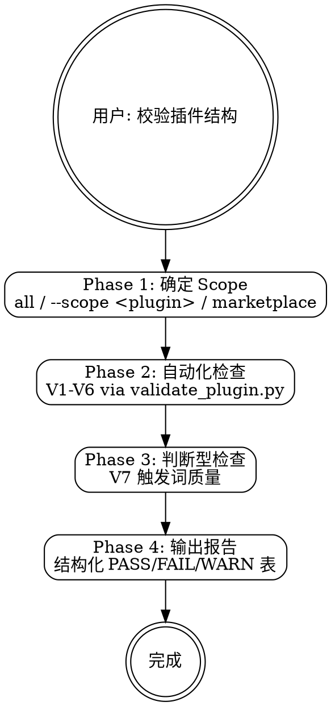

# mp-dev:validate

## Overview

my-marketplace 个人插件市场仓库的插件结构校验技能。执行 V1-V7 共 7 条规则检查，镜像 CI `.github/workflows/ci.yml` 的校验逻辑。V1-V6 通过 `validate_plugin.py` 脚本自动化执行，V7 触发词质量为判断型检查由 Claude 执行。

**互补 skill**：修复校验问题时使用 `/mp-dev:skill-author`（frontmatter 问题）或 `/mp-dev:scaffold`（结构问题）。

## Prerequisites

- Python 3.10+（用于运行 validate_plugin.py）
- my-marketplace 仓库已 clone 到本地

## Quick Start（交互模式）

| 已知信息 | 行动 |
|---------|------|
| "校验所有插件" | 无 scope，运行全部 V1-V7 |
| "校验 mp-dev" | `--scope mp-dev`，V1-V3 + V5(plugin) + V6(plugin) + V7 |
| "检查 marketplace" | `--scope marketplace`，V4 + V5(repo) + V6(root) |
| "CI 挂了" | 运行全部检查，对比 CI 日志定位问题 |

---

## Workflow



---

### Phase 1: 确定 Scope

**确定校验范围。** 使用 P2 范围确认模式（详见 `→ ../mp-dev-shared/question-patterns.md`）。

| 参数 | 行为 |
|------|------|
| 无（默认） | 校验所有 plugins 目录 + 根目录 |
| `--scope <plugin-name>` | 仅校验指定 plugin 的 V1-V3、V5(plugin)、V6(plugin) |
| `--scope marketplace` | 仅校验 V4、V5(repo)、V6(root) |

若用户说"校验 mp-dev"，自动推断 `--scope mp-dev`。
若用户说"校验所有"或未指定范围，使用默认全量校验。

---

### Phase 2: 自动化检查（V1-V6）

**运行 validate_plugin.py 执行 V1-V6 自动化检查。**

```bash
python plugins/mp-dev/skills/mp-dev-validate/scripts/validate_plugin.py --root "D:/workspace/10-software-project/projects/my-marketplace"
```

带 scope：

```bash
python plugins/mp-dev/skills/mp-dev-validate/scripts/validate_plugin.py --root "D:/workspace/10-software-project/projects/my-marketplace" --scope mp-dev
```

**V1-V6 检查内容**（详见 `→ validation-rules.md`）：

| 规则 | 检查内容 |
|------|---------|
| V1 | plugin.json 6 个必填字段 |
| V2 | 目录结构 5 项必须存在 |
| V3 | SKILL.md frontmatter name + description（跳过 *-shared） |
| V4 | marketplace.json 字段 + 目录对应 |
| V5 | VERSION ↔ marketplace.json ↔ plugin.json 版本同步 |
| V6 | CHANGELOG.md 存在性 |

解析脚本输出，提取每条规则的 PASS/FAIL/WARN 结果。

---

### Phase 3: 判断型检查（V7）

**V7 触发词质量检查。** 此检查需要 Claude 阅读 SKILL.md 内容进行判断，不由脚本自动化。

对每个非 shared 的 skill 目录中的 SKILL.md：

1. 读取 `description` 字段内容
2. 识别中文触发词（中文短语，通常以逗号分隔）
3. 识别英文触发词（英文短语，通常以逗号分隔）
4. 计算 description 总字符长度
5. 检查与同 plugin 内其他 skill 的触发词是否重叠

**判断标准**：

| 维度 | PASS | WARN |
|------|------|------|
| 中文触发词 | >= 3 个 | < 3 个 |
| 英文触发词 | >= 3 个 | < 3 个 |
| 字符长度 | 50-300 | < 50 或 > 300 |
| 独立性 | 无重叠 | 有重叠 |

---

### Phase 4: 输出报告

**输出结构化校验报告。** 使用 P4 结果展示模式。

输出格式：

```
结构校验完成

  Scope: <scope>
  结果: N PASS / N FAIL / N WARN

  V1 plugin.json schema     <PASS/FAIL>  <详情>
  V2 Directory structure     <PASS/FAIL>  <详情>
  V3 SKILL.md frontmatter   <PASS/FAIL>  <详情>
  V4 marketplace.json       <PASS/FAIL>  <详情>
  V5 Version sync           <PASS/FAIL>  <详情>
  V6 CHANGELOG existence    <PASS/FAIL>  <详情>
  V7 Trigger word quality   <PASS/WARN>  <详情>

下一步:
  - 修复 FAIL 项（如有）
  - 优化 WARN 项 → /mp-dev:skill-author
  - 开始测试     → /mp-dev:test
```

FAIL 项附带详细错误信息和修复建议。

---

## H-point 表格

| ID | 类型 | 触发条件 | 行为 |
|----|------|---------|------|
| **H1** | Warning | validate_plugin.py 脚本执行失败（Python 未安装等） | 提示安装 Python，或手动逐项检查 |

---

## Examples

### 示例 1：全量校验

```
用户：校验所有插件的结构
→ Scope: all
→ 运行 validate_plugin.py
→ V7 阅读所有 SKILL.md
→ 输出完整报告：mj-nlm 3 PASS, mp-dev 7 PASS, ...
```

### 示例 2：单 plugin 校验

```
用户：检查一下 mp-dev 的结构对不对
→ Scope: mp-dev
→ 运行 validate_plugin.py --scope mp-dev
→ V7 仅检查 mp-dev 的 skill
→ 输出报告
```

### 示例 3：CI 失败排查

```
用户：CI 的结构校验挂了，帮我看看
→ Scope: all（CI 检查全量）
→ 运行全部检查
→ 对比用户提供的 CI 日志
→ 定位具体失败项并给出修复建议
```

---

## Reference Files

- **`→ validation-rules.md`** — V1-V7 校验规则详细定义、错误信息模板、--scope 行为、输出格式
- **`→ scripts/validate_plugin.py`** — V1-V6 自动化校验 Python 脚本
- **`→ ../mp-dev-shared/question-patterns.md`** — P2 范围确认、P4 结果展示模式
